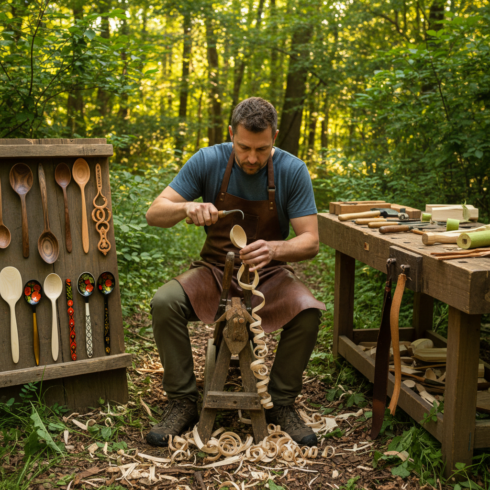

# Spoon Carving Art 匙雕艺术

> "A carved spoon is the most intimate of woodworking objects — it touches your lips, holds your food, fits your hand. The spoon carver works with green wood still full of life, splitting a log and shaping it with axe, knife, and hook knife into something that bridges the gap between craft and sculpture. Every spoon is unique because every piece of wood is unique — the grain dictates the curve, the knot suggests the handle, the species determines the finish." — Unknown

## 概述

匙雕艺术（Spoon Carving Art）是使用手工工具从原木中雕刻出勺子和匙类器具的传统木工艺术——以其与绿木（新鲜未干燥木材）的亲密互动、简单的工具需求和深厚的民间传统著称。匙雕是最古老的木工技艺之一，近年来作为一种冥想式手工艺在全球范围内复兴。

匙雕艺术的实践包括：1）绿木匙雕——使用新鲜木材的传统技法；2）瑞典匙雕——斯堪的纳维亚传统的匙雕风格；3）威尔士情匙——作为爱情信物的装饰性雕刻匙；4）俄罗斯木匙——霍赫洛马风格的彩绘木匙；5）日本匙雕——简约美学的日式木匙；6）当代匙雕——将传统技法与现代设计结合的创作。

## 核心特征

| 特征 | 描述 |
|------|------|
| 绿木 | 使用新鲜未干木材 |
| 手工 | 纯手工工具制作 |
| 功能 | 实用的餐具功能 |
| 亲密 | 与食物和身体接触 |
| 简约 | 工具和材料简单 |
| 冥想 | 重复动作的冥想感 |

## 视觉特征

- **曲线**：流畅的有机曲线
- **纹理**：刀痕和木纹的质感
- **比例**：碗部与柄部的平衡
- **薄度**：碗壁的轻薄通透
- **光泽**：使用后的自然包浆
- **个性**：每把匙的独特性格

## 代表作品

| 作品 | 艺术家/文化 | 年代 | 意义 |
|------|-------------|------|------|
| *Welsh love spoons* | 威尔士传统 | 17世纪至今 | 爱情信物匙 |
| *Scandinavian kolrosing spoons* | 北欧传统 | 中世纪至今 | 北欧装饰匙 |
| *Barn the Spoon works* | Barn the Spoon | 当代 | 当代匙雕运动 |
| *Russian Khokhloma spoons* | 俄罗斯传统 | 17世纪至今 | 彩绘木匙 |
| *Japanese rice paddles* | 日本传统 | 古代至今 | 日式木匙 |

## 历史时间线

| 时期 | 事件 |
|------|------|
| 史前 | 最早的木匙制作 |
| 中世纪 | 欧洲匙雕传统的发展 |
| 17世纪 | 威尔士情匙传统兴起 |
| 工业革命 | 手工匙雕的衰落 |
| 当代 | 匙雕作为手工艺运动复兴 |

## 中国语境

匙雕艺术在中国有悠久的传统。中国古代的木匙和竹匙是日常生活中的重要器具——从新石器时代就有木匙的考古发现。中国传统的木勺制作多使用硬木（如黄杨木、枣木）——与西方偏好绿木的传统有所不同。中国的少数民族地区（如藏区、苗区）保留着丰富的木匙雕刻传统——藏族的酥油茶碗和木匙是重要的日用品。中国当代的手工艺复兴运动中，匙雕是最受欢迎的入门项目之一——因为工具简单、材料易得、成就感强。中国的一些手工工作室将匙雕与中国传统美学结合——创造具有东方韵味的木匙作品。中国的木工社区中，"绿木工"（green woodworking）概念正在被引入——匙雕是其中最核心的实践。

## AI生成概念图

## 与其他风格的关系

- **Whittling** → 削木艺术
- **Green Woodworking** → 绿木工艺
- **Wood Carving** → 木雕艺术
- **Folk Art** → 民间艺术
- **Functional Art** → 功能艺术
- **Woodturning** → 车木艺术

---

*浮光艺志 | Chronicle of Artistry*
