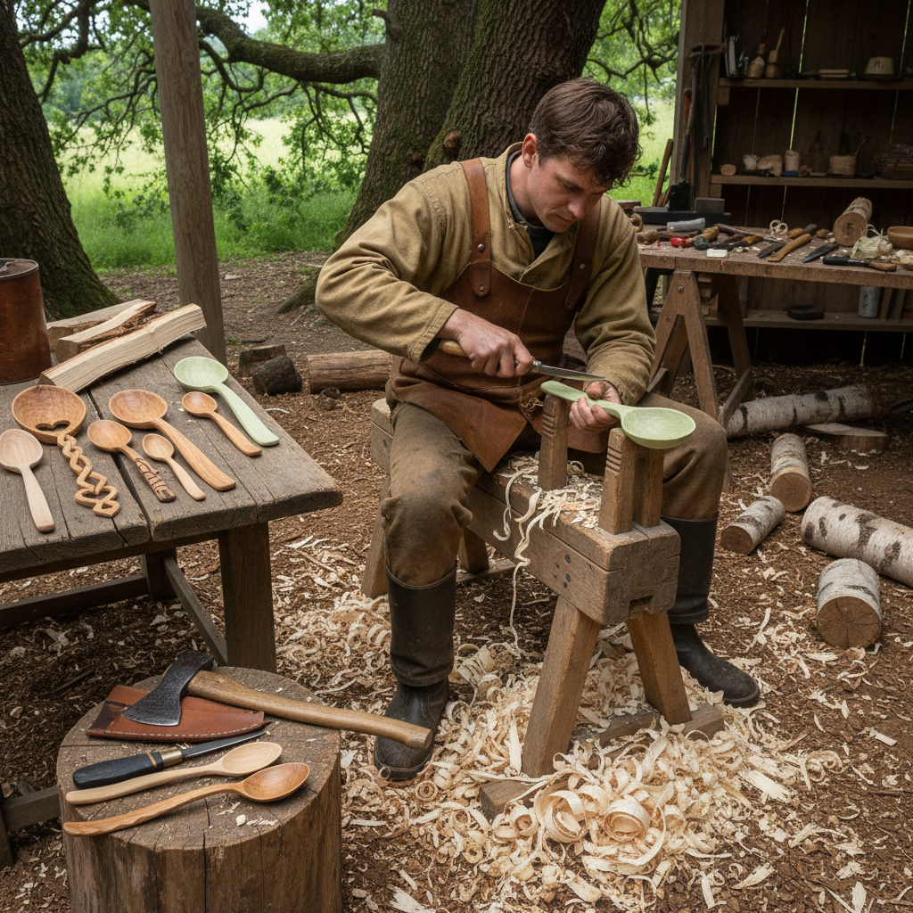

# Spoon Carving 勺雕

> "Spoon carving is the most intimate of woodcrafts — from a split log to a tool that touches your lips, shaped entirely by hand and blade, carrying the maker's intention into the most ordinary of daily rituals." — Unknown

## 概述

勺雕（Spoon Carving）是使用刀具从一块木材中雕刻出勺子的手工艺。这是人类最古老的木工形式之一——在金属工具出现之前，人类就已经用石器和贝壳雕刻木勺。勺雕的魅力在于：从一块原木到一把可用的勺子，整个过程只需要简单的手工工具（斧头、直刀、弯刀），不需要电力或复杂的设备。

当代的勺雕运动（Green Woodworking的一部分）强调：使用新鲜的"绿木"（green wood，未干燥的木材，更容易雕刻）、手工工具的简单性、与材料的亲密对话、以及制作日常使用物品的满足感。每把手工勺子都是独一无二的——木纹的走向、刀痕的质感、形状的微妙变化都记录着制作者的手和意图。

## 核心特征

| 特征 | 描述 |
|------|------|
| 手工 | 纯手工雕刻 |
| 简单 | 工具极其简单 |
| 绿木 | 常用新鲜木材 |
| 功能 | 制作功能性物品 |
| 亲密 | 与材料的亲密对话 |
| 独特 | 每件作品独一无二 |

## 视觉特征

- **有机**：有机的曲线形态
- **刀痕**：可见的刀痕质感
- **木纹**：自然的木纹
- **温暖**：木材的温暖感
- **简洁**：简洁的形态
- **功能**：功能性的美

## 代表作品

| 作品 | 艺术家 | 年代 | 意义 |
|------|--------|------|------|
| *Traditional Welsh love spoons* | 匿名 | 17世纪+ | 威尔士爱情勺 |
| *Scandinavian carved spoons* | 匿名 | 传统 | 北欧传统勺 |
| *Russian carved spoons* | 匿名 | 传统 | 俄罗斯木勺 |
| *Contemporary carved spoons* | Barn the Spoon | 当代 | 当代勺雕 |
| *Japanese carved utensils* | Various | 传统 | 日本木器 |

## 历史时间线

| 时期 | 事件 |
|------|------|
| 史前 | 最早的木勺雕刻 |
| 中世纪 | 欧洲的勺雕传统 |
| 17世纪+ | 威尔士爱情勺的传统 |
| 工业革命 | 手工勺雕的衰落 |
| 2000s+ | 当代勺雕运动的复兴 |
| 当代 | 全球勺雕社区的繁荣 |

## 中国语境

勺雕在中国有着悠久的传统——中国古代的木质餐具（如木勺、木箸）都是手工雕刻的。中国传统的漆器勺子先由木工雕刻胎体，再涂漆。当代中国的手工木作爱好者群体中，勺雕作为一种入门级的绿木工（Green Woodworking）活动越来越流行。一些中国的手工工作坊和市集提供勺雕体验课程。中国的一些当代木作艺术家也在探索勺子作为艺术形式的可能性。

## AI生成概念图

## 与其他风格的关系

- **Green Woodworking** → 绿木工
- **Wood Carving** → 木雕
- **Whittling** → 削木
- **Chip Carving** → 刻花木雕
- **Folk Art** → 民间艺术
- **Functional Craft** → 功能性工艺

---

*浮光艺志 | Chronicle of Artistry*
