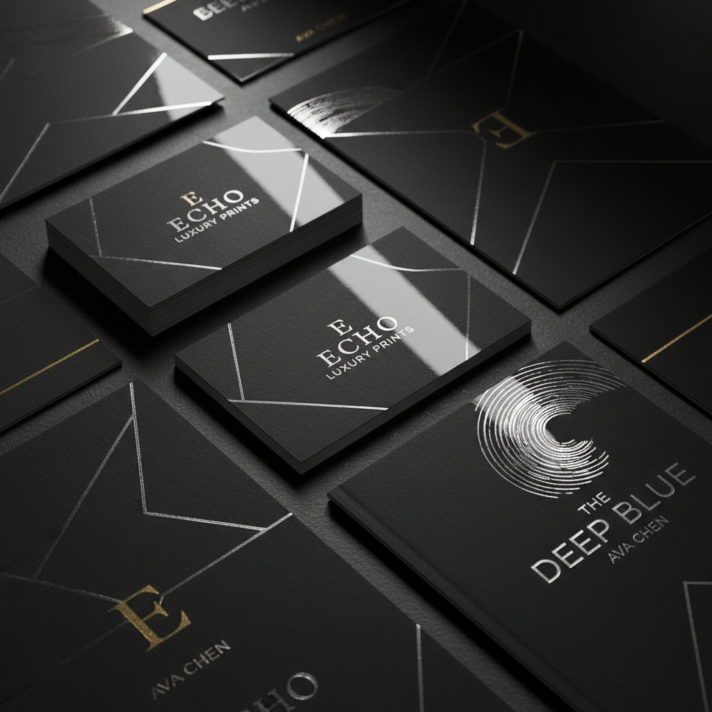

# Spot Varnish Art 局部上光艺术

> "Spot varnish is selective shine — a clear coating applied only to chosen areas of a printed sheet creates a contrast between matte and gloss that makes images leap forward and text recede, adding a tactile dimension that turns a flat print into a surface of varying textures. In the right light, the varnished areas catch reflections like still water while the uncoated paper absorbs light like dry earth." — Unknown

## 概述

局部上光艺术（Spot Varnish Art）是一种在印刷品的特定区域选择性地涂布光油（UV光油或水性光油）的印后加工技法——通过在哑光表面上创造局部的光泽区域，形成光泽与哑光的对比效果。局部上光增加了印刷品的触觉维度和视觉层次，是高端印刷品和包装设计中常用的增值工艺。

局部上光艺术的实践包括：1）UV局部上光——使用紫外线固化的光油；2）丝网上光——通过丝网印刷涂布光油；3）数字上光——使用数字印刷机进行局部上光；4）厚膜上光——涂布较厚的光油层创造立体感；5）哑光/光泽对比——在哑光底上创造光泽区域；6）纹理上光——创造特殊纹理效果的上光；7）当代局部上光——将传统技法与现代设计结合的创作。

## 核心特征

| 特征 | 描述 |
|------|------|
| 选择 | 选择性的局部涂布 |
| 对比 | 光泽与哑光的对比 |
| 触感 | 增加触觉维度 |
| 层次 | 增加视觉层次 |
| 透明 | 透明的光油涂层 |
| 高端 | 高端品质的标志 |

## 视觉特征

- **光泽**：局部的光泽反射
- **对比**：光泽与哑光的对比
- **触感**：可触摸的表面差异
- **层次**：视觉上的前后层次
- **精致**：精致的细节处理
- **高端**：高端品质的感觉

## 代表作品

| 作品 | 艺术家/文化 | 年代 | 意义 |
|------|-------------|------|------|
| *Luxury brand collateral* | 国际 | 当代 | 奢侈品牌印刷品 |
| *Book cover spot UV* | 国际 | 当代 | 书籍封面局部上光 |
| *Business card spot varnish* | 国际 | 当代 | 名片局部上光 |
| *Packaging spot UV* | 国际 | 当代 | 包装局部上光 |
| *Art print spot varnish* | 国际 | 当代 | 艺术版画局部上光 |

## 历史时间线

| 时期 | 事件 |
|------|------|
| 20世纪中 | 上光技术的工业化 |
| 1970年代 | UV固化技术的发展 |
| 1990年代 | 局部上光的精细化 |
| 2000年代 | 数字局部上光的出现 |
| 当代 | 局部上光的创意化应用 |

## 中国语境

局部上光在中国的印刷产业中有极其广泛的应用。中国是全球最大的印刷加工市场之一——局部UV上光是最常见的印后增值工艺。中国的包装设计中，局部上光——是提升产品档次的标准工艺之一。中国的书籍装帧设计中，局部上光——在封面设计中广泛使用。中国的名片和商务印刷中，局部上光——作为高品质的标志被普遍采用。中国的设计教育中，局部上光作为印后工艺——在平面设计和包装设计课程中教授。中国的印刷设备制造业——在局部上光设备领域有重要的全球市场份额。

## AI生成概念图

## 与其他风格的关系

- **Foil Stamping** → 烫金
- **Blind Embossing** → 无墨压凸
- **UV Printing** → UV印刷
- **Graphic Design** → 平面设计
- **Packaging Design** → 包装设计
- **Print Finishing** → 印后加工

---

*浮光艺志 | Chronicle of Artistry*
