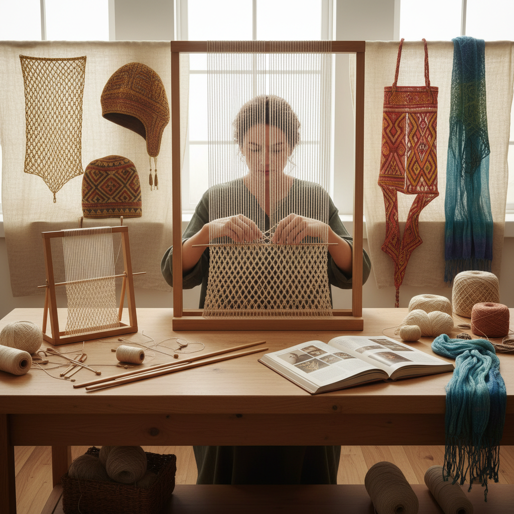

# Sprang Art 弹性编织艺术

> "Sprang is the forgotten textile — a technique that creates stretchy, net-like fabric without any knitting needles, crochet hooks, or looms. Working on a simple frame with parallel warp threads, the sprang maker twists adjacent threads around each other, building up rows of interlinking that create an elastic mesh. The magic of sprang is that it works from both ends simultaneously — twist the top and the bottom mirrors it perfectly, meeting in the middle." — Unknown

## 概述

弹性编织艺术（Sprang Art）是一种古老的纺织技法——通过在固定框架上扭转平行的经线来创造弹性网状织物，不需要纬线、不需要针具，仅靠经线之间的相互扭绞就能形成具有弹性的织物。Sprang是人类最早的弹性织物制作技术，比针织早数千年。

弹性编织艺术的实践包括：1）基础扭绞——简单的S形和Z形扭绞；2）复杂扭绞——多根线的复杂交叉；3）图案扭绞——通过不同扭绞方式创造图案；4）发网——古代最常见的sprang用途；5）袋子和网兜——弹性容器；6）当代sprang——将古老技法与现代设计结合的创作。

## 核心特征

| 特征 | 描述 |
|------|------|
| 弹性 | 天然的弹性织物 |
| 古老 | 极其古老的技法 |
| 简单 | 不需要复杂工具 |
| 对称 | 上下同时形成 |
| 网状 | 开放的网状结构 |
| 扭绞 | 经线的相互扭绞 |

## 视觉特征

- **网状**：开放的网状结构
- **弹性**：可拉伸的织物
- **对称**：上下对称的图案
- **扭绞**：可见的扭绞结构
- **透明**：半透明的网状效果
- **有机**：自然的弹性形态

## 代表作品

| 作品 | 艺术家/文化 | 年代 | 意义 |
|------|-------------|------|------|
| *Bronze Age hairnets* | 北欧 | 青铜时代 | 最早的sprang发网 |
| *Coptic sprang caps* | 古埃及 | 3-7世纪 | 科普特弹性帽 |
| *Pre-Columbian sprang* | 南美 | 古代 | 南美弹性织物 |
| *Ottoman sprang sashes* | 奥斯曼 | 15-19世纪 | 奥斯曼腰带 |
| *Contemporary sprang* | 当代 | 当代 | 当代sprang创作 |

## 历史时间线

| 时期 | 事件 |
|------|------|
| 新石器时代 | 最早的sprang证据 |
| 青铜时代 | 北欧sprang发网 |
| 古代 | 各文明的sprang传统 |
| 中世纪 | sprang逐渐被针织取代 |
| 当代 | sprang作为古老技艺的复兴 |

## 中国语境

弹性编织艺术在中国的历史尚待深入研究。中国古代的一些网状织物可能使用了类似sprang的技法——但目前考古证据尚不充分。中国传统的"络子"（网兜）制作中可能包含sprang的技术元素——用于包裹瓶子、玉器等物品的网状编织。中国新疆地区出土的古代纺织品中可能存在sprang技法的痕迹——丝绸之路沿线的文化交流可能将这种技术传入中国。中国当代的纺织研究者开始关注sprang——将其与中国古代纺织技术进行比较研究。中国的一些手工艺爱好者开始学习sprang——作为探索古代纺织技术的一部分。中国的纺织类博物馆中，sprang作为一种重要的古代纺织技法正在获得更多的展示和研究关注。

## AI生成概念图

## 与其他风格的关系

- **Naalbinding** → 针编艺术
- **Knitting** → 编织艺术
- **Net Making** → 结网艺术
- **Textile Art** → 纺织艺术
- **Ancient Crafts** → 古代工艺
- **Macrame** → 编结艺术

---

*浮光艺志 | Chronicle of Artistry*
