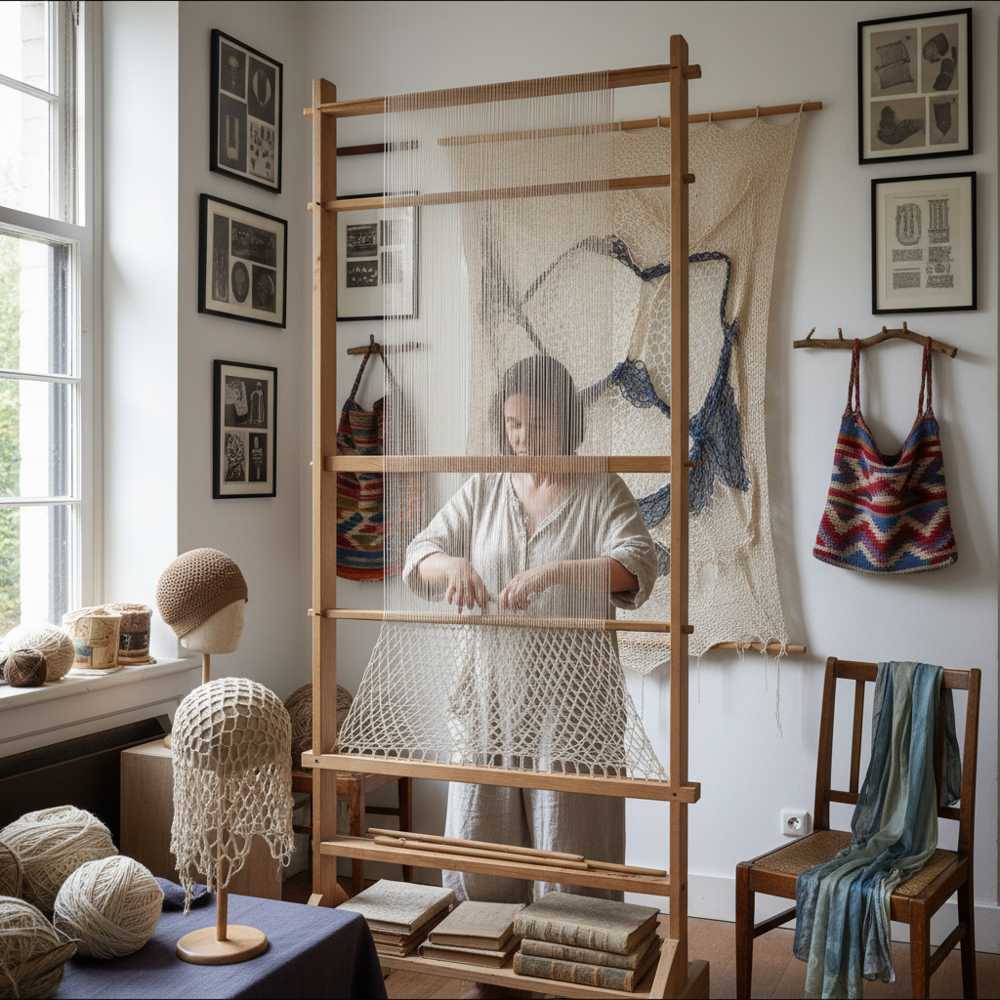

# Sprang 弹性编织

> "Sprang is the forgotten textile — threads stretched on a frame and interlocked by hand without any tool passing through them, creating an elastic fabric that predates knitting by millennia, a technique so ancient that examples have been found in Bronze Age bogs and Egyptian tombs, yet so obscure that most textile artists have never heard its name." — Unknown

## 概述

弹性编织（Sprang）是一种极其古老的纺织技法——将经线（warp threads）固定在框架的上下两端，然后用手指将相邻的经线相互扭转和交叉，形成具有天然弹性的网状织物。Sprang不使用纬线（weft），也不使用梭子或针——完全依靠经线之间的相互扭转来创造织物结构。

Sprang的独特之处在于它的弹性——由于线之间只是扭转而非打结，织物可以在各个方向伸展。这使得Sprang特别适合制作帽子、发网、袋子和紧身衣物。Sprang的历史可以追溯到公元前1500年甚至更早——丹麦沼泽中发现的青铜时代发网、埃及墓葬中的弹性织物、秘鲁前哥伦布时期的纺织品都使用了Sprang技法。尽管历史悠久，Sprang在现代几乎被遗忘，直到20世纪后期才被纺织考古学家和手工艺复兴者重新发现。

## 核心特征

| 特征 | 描述 |
|------|------|
| 弹性 | 天然的弹性织物 |
| 扭转 | 经线相互扭转 |
| 无纬线 | 不使用纬线 |
| 框架 | 在框架上制作 |
| 古老 | 极其古老的技法 |
| 对称 | 上下对称生长 |

## 视觉特征

- **网状**：开放的网状结构
- **弹性**：可见的弹性质感
- **扭转**：扭转的线条图案
- **对称**：上下镜像对称
- **轻盈**：轻盈透气的质感
- **原始**：原始的纺织美感

## 代表作品

| 作品 | 艺术家 | 年代 | 意义 |
|------|--------|------|------|
| *Bronze Age hairnets* | 北欧先民 | 青铜时代 | 青铜时代发网 |
| *Egyptian sprang caps* | 埃及工匠 | 古埃及 | 埃及弹性帽 |
| *Pre-Columbian sprang* | 南美先民 | 前哥伦布 | 南美弹性织物 |
| *Coptic sprang* | 科普特工匠 | 古代 | 科普特弹性织物 |
| *Contemporary sprang art* | Various | 当代 | 当代弹性编织艺术 |

## 历史时间线

| 时期 | 事件 |
|------|------|
| 公元前1500年+ | Sprang在多个文明中的使用 |
| 青铜时代 | 北欧沼泽中的Sprang发网 |
| 古埃及 | 埃及墓葬中的Sprang织物 |
| 中世纪 | Sprang在欧洲的持续使用 |
| 20世纪后期 | Sprang的学术重新发现 |
| 当代 | Sprang的手工艺复兴 |

## 中国语境

Sprang在中国几乎没有传统实践，但中国的纺织考古中可能存在类似技法的痕迹。中国古代的"编"技法中有一些与Sprang相似的经线扭转技术。当代中国的一些纤维艺术家和纺织研究者开始关注Sprang作为一种古老的纺织技法。中国的纺织院校在纺织史课程中可能涉及Sprang。随着全球手工艺复兴运动的影响，中国的一些手工爱好者开始通过网络学习Sprang。

## AI生成概念图

## 与其他风格的关系

- **Naalbinding** → 针编织
- **Knitting** → 针织
- **Weaving** → 编织
- **Netting** → 结网
- **Textile Archaeology** → 纺织考古
- **Fiber Art** → 纤维艺术

---

*浮光艺志 | Chronicle of Artistry*
