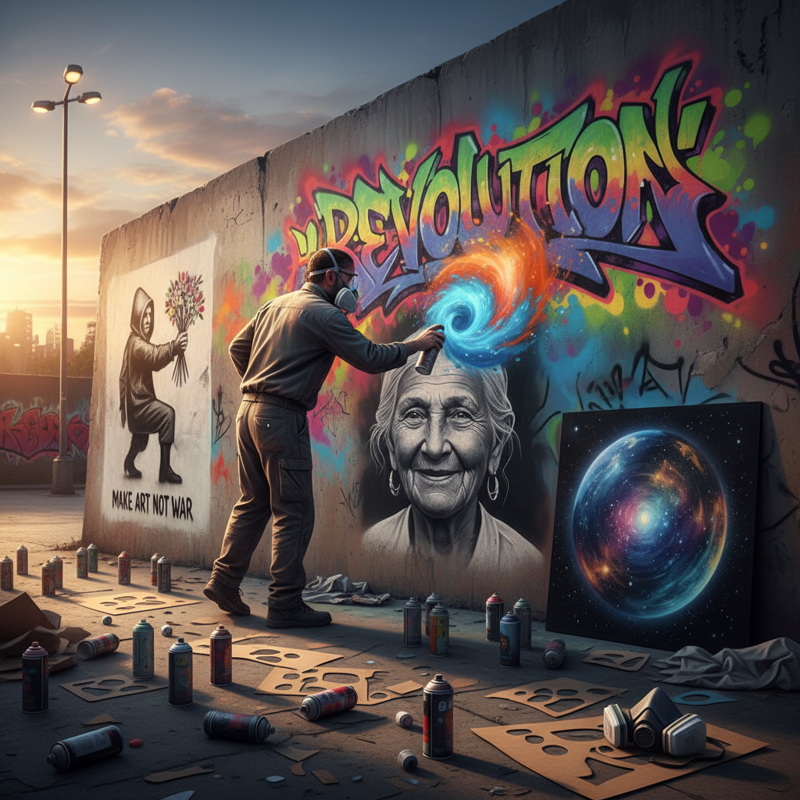

# Spray Paint 喷漆艺术

> "Spray paint is velocity made visible — a cloud of pigment propelled by pressure, capable of covering a wall in minutes or rendering photorealistic detail through the discipline of stencil and distance." — Unknown

## 概述

喷漆艺术（Spray Paint Art）是使用气雾罐喷漆（aerosol spray paint）进行创作的艺术形式。喷漆的独特性在于：它以雾状喷射颜料，可以实现从极细的线条到大面积的均匀覆盖，从硬边到柔和的渐变。喷漆艺术与街头文化（Graffiti、Street Art）密切相关——从1970年代纽约的地铁涂鸦开始，喷漆成为了城市青年文化表达的主要媒介。

喷漆艺术的技法包括：自由喷绘（freehand）、模版喷绘（stencil）、帽子技巧（cap tricks，使用不同喷嘴控制线条粗细）、以及"太空画"（space painting，使用喷漆在光滑表面上快速创作宇宙风景）。当代的喷漆艺术已从街头进入画廊——Banksy、Shepard Fairey等艺术家将喷漆带入了当代艺术的主流。

## 核心特征

| 特征 | 描述 |
|------|------|
| 气雾 | 气雾罐喷射 |
| 速度 | 快速覆盖大面积 |
| 渐变 | 自然的渐变效果 |
| 模版 | 可配合模版使用 |
| 街头 | 与街头文化相关 |
| 多面 | 可在任何表面使用 |

## 视觉特征

- **渐变**：柔和的色彩渐变
- **鲜艳**：鲜艳的色彩
- **大尺度**：常为大尺度作品
- **锐利**：模版的锐利边缘
- **层次**：多层喷绘的深度
- **速度**：速度感和能量

## 代表作品

| 作品 | 艺术家 | 年代 | 意义 |
|------|--------|------|------|
| *NYC subway graffiti* | Various | 1970s-80s | 涂鸦文化的起源 |
| *Girl with Balloon* | Banksy | 2002 | 模版喷漆艺术 |
| *OBEY Giant* | Shepard Fairey | 1989+ | 街头喷漆运动 |
| *Photorealistic murals* | Various | 当代 | 写实喷漆壁画 |
| *Space paintings* | Various | 当代 | 太空喷漆画 |

## 历史时间线

| 时期 | 事件 |
|------|------|
| 1949 | 气雾罐喷漆的发明 |
| 1970s | 纽约地铁涂鸦文化 |
| 1980s | 涂鸦进入画廊 |
| 1990s | 模版艺术的兴起 |
| 2000s | Banksy等的全球影响 |
| 当代 | 喷漆壁画的合法化和艺术化 |

## 中国语境

喷漆艺术在中国的发展始于1990年代末——受到西方街头文化的影响，中国的第一批涂鸦艺术家开始在城市中创作。北京、上海、广州等城市逐渐形成了涂鸦社区。当代中国的喷漆艺术已从地下走向主流——许多城市设立了合法的涂鸦墙，商业品牌也大量使用喷漆风格的视觉。中国的涂鸦艺术家如DALeast、Hua Tunan等在国际上获得认可。一些中国城市的旧城改造项目中，喷漆壁画被用作城市更新的工具。

## AI生成概念图

## 与其他风格的关系

- **Graffiti** → 涂鸦
- **Street Art** → 街头艺术
- **Stencil Art** → 模版艺术
- **Mural** → 壁画
- **Airbrush** → 气笔画
- **Pop Art** → 波普艺术

---

*浮光艺志 | Chronicle of Artistry*
