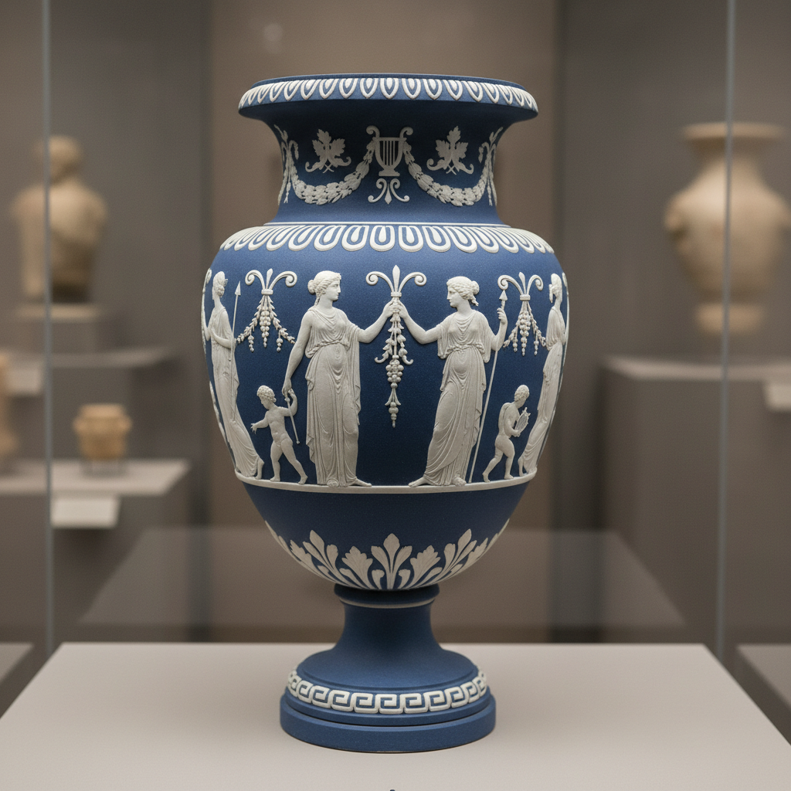

# Sprigging Art 贴花装饰艺术

> "Sprigging is sculpture applied — small relief ornaments molded separately and attached to the surface of a vessel with liquid clay, each sprig a miniature bas-relief that stands proud of the pot's skin like a cameo pinned to a dress, the technique that gave Wedgwood jasperware its white classical figures dancing across blue grounds and that continues wherever potters want to add dimensional decoration without carving into the wall." — Unknown

## 概述

贴花装饰艺术（Sprigging Art）是一种将单独模制的小型浮雕装饰件用泥浆粘贴到器物表面的陶瓷装饰技法。贴花件通常用模具压制——花朵、人物、动物、几何图案等——然后用液态粘土（泥浆）粘贴到器物表面，形成凸起的浮雕装饰效果。最著名的贴花装饰是Wedgwood的碧玉陶——白色古典人物浮雕贴在蓝色底上。

贴花装饰艺术的核心要素包括：1）模制装饰件——用模具压制小型浮雕；2）泥浆粘贴——用液态粘土将装饰件粘贴到器物上；3）浮雕效果——凸起于表面的立体装饰；4）可重复——同一模具可重复使用；5）组合自由——可自由组合不同装饰件；6）精细细节——模具可保留精细细节；7）色彩对比——装饰件与底色的对比。

## 核心特征

| 特征 | 描述 |
|------|------|
| 模制浮雕 | 单独模制的浮雕装饰件 |
| 粘贴附着 | 用泥浆粘贴到器物表面 |
| 立体效果 | 凸起的三维装饰 |
| 可重复 | 模具可反复使用 |
| 精细细节 | 可保留精细的细节 |
| 组合自由 | 可自由排列组合 |

## 视觉特征

- **凸起浮雕**：凸出于表面的装饰
- **精细细节**：模制的精细图案
- **色彩对比**：装饰件与底色的对比
- **古典风格**：常见古典题材
- **规律排列**：有序的装饰排列
- **光影效果**：浮雕的光影变化

## 代表作品

| 作品 | 艺术家/窑口 | 年代 | 意义 |
|------|-------------|------|------|
| *Wedgwood碧玉陶* | Wedgwood | 18世纪 | 贴花装饰的典范 |
| *中国唐代贴花* | 唐代各窑 | 唐代 | 中国贴花传统 |
| *德国盐釉贴花* | 德国 | 16-17世纪 | 德国贴花传统 |
| *当代贴花陶瓷* | 各地陶艺家 | 当代 | 贴花的现代应用 |
| *贴花瓷砖* | 当代设计 | 当代 | 建筑贴花装饰 |

## 历史时间线

| 时期 | 事件 |
|------|------|
| 古代 | 早期贴花装饰的出现 |
| 唐代 | 中国贴花装饰的成熟 |
| 16世纪 | 德国盐釉贴花的发展 |
| 18世纪 | Wedgwood碧玉陶的巅峰 |
| 当代 | 贴花装饰的持续应用 |

## 中国语境

贴花装饰在中国陶瓷史上有重要地位。中国唐代的陶瓷广泛使用贴花装饰——在器物表面贴附模制的花朵、人物、动物等浮雕。唐三彩中常见贴花装饰。宋代的某些窑口也使用贴花技法。中国传统的"堆塑"——在器物表面堆贴立体装饰——是贴花的一种发展形式。中国当代陶艺中，贴花作为一种增加表面层次和立体感的技法继续被使用。景德镇的传统工艺中，"堆白"（在青花瓷上堆贴白色浮雕）是一种精细的贴花技法。

## AI生成概念图

## 与其他风格的关系

- **Jasperware** → 碧玉陶
- **Relief** → 浮雕
- **Cameo** → 浮雕宝石
- **Mold Making** → 模具制作
- **Applied Art** → 应用装饰
- **Wedgwood** → 韦奇伍德

---

*浮光艺志 | Chronicle of Artistry*
