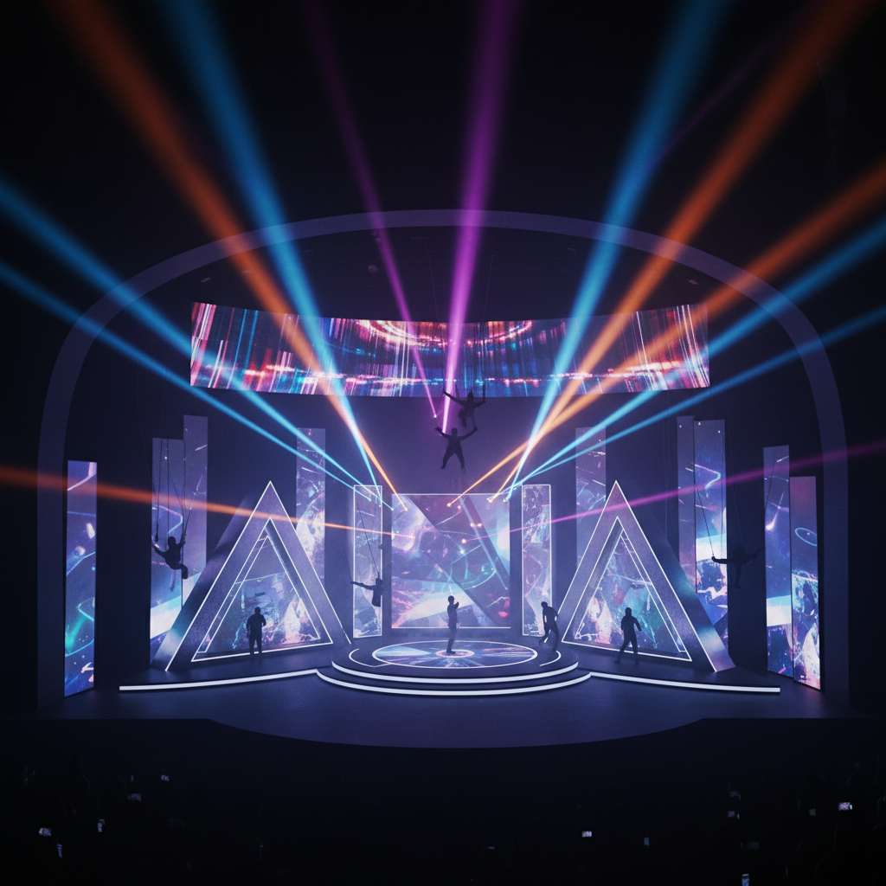

# Stage Design 舞台设计

> **时期：** 古希腊–至今  
> **关键词：** 空间叙事、灯光雕塑、布景转换、沉浸体验、跨媒介

## 概述

Stage Design（舞台设计/舞台美术）是为表演艺术创造视觉空间环境的设计艺术。从古希腊的露天剧场到当代的多媒体沉浸式演出，舞台设计师用空间、光线、材料和技术构建故事发生的世界——它不是静态的背景画，而是与表演者共同呼吸的活的空间。

## 风格特征

- **空间叙事**：通过空间结构讲述故事
- **灯光雕塑**：光线作为最重要的设计材料
- **转换机制**：场景变化的技术和美学
- **比例控制**：人体与空间的关系
- **多媒介融合**：投影、机械、数字技术的整合

## 代表人物与作品

- 阿道夫·阿皮亚（现代舞台灯光先驱）
- 罗伯特·威尔逊（视觉戏剧大师）
- 约瑟夫·斯沃博达（捷克舞台设计）
- Es Devlin（当代舞台/装置设计）

## 概念图

