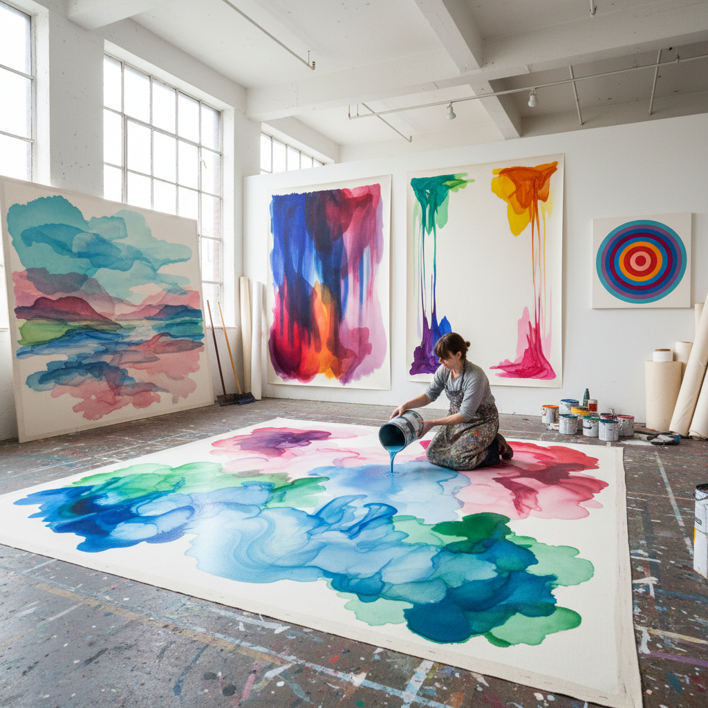

# Stain Painting 染色绘画

> "Stain painting is color without body — thinned pigment poured directly into raw unprimed canvas so that paint and surface become one inseparable thing, color soaking into fabric like dye into cloth, creating luminous fields that seem to glow from within rather than sit upon the surface, a technique that dissolved the boundary between painting and its support and made color itself the subject, structure, and soul of the work." — Unknown

## 概述

染色绘画（Stain Painting）是一种将稀释的颜料直接倒在或浸入未经底料处理的生画布上，使颜料渗透进画布纤维中，与画布融为一体的绘画技法。与传统的在画布表面堆积颜料不同，染色绘画让颜色"成为"画布本身——颜料不是"在"画布上，而是"在"画布里。

染色绘画由海伦·弗兰肯塔勒（Helen Frankenthaler）在1952年的作品《山与海》（Mountains and Sea）中开创。弗兰肯塔勒受到杰克逊·波洛克（Jackson Pollock）的滴画启发，但她选择将颜料极度稀释后倒在未上底料的画布上，让颜料像水彩一样渗透进画布。这种技法后来被莫里斯·路易斯（Morris Louis）和肯尼斯·诺兰（Kenneth Noland）进一步发展，成为"色域绘画"（Color Field Painting）和"华盛顿色彩学派"的核心技法。

## 核心特征

| 特征 | 描述 |
|------|------|
| 渗透 | 颜料渗入画布纤维 |
| 稀释 | 极度稀释的颜料 |
| 生布 | 未上底料的画布 |
| 一体 | 颜料与画布融为一体 |
| 发光 | 从内部发光的效果 |
| 平面 | 完全的平面性 |

## 视觉特征

- **透明**：透明的色彩层次
- **渗透**：颜料渗入的痕迹
- **柔和**：柔和的色彩边缘
- **发光**：从内部发光的感觉
- **轻盈**：轻盈无重量的色彩
- **有机**：有机的流动形态

## 代表作品

| 作品 | 艺术家 | 年代 | 意义 |
|------|--------|------|------|
| *Mountains and Sea* | Helen Frankenthaler | 1952 | 染色绘画的开创之作 |
| *Veil series* | Morris Louis | 1958-59 | 路易斯的面纱系列 |
| *Unfurled series* | Morris Louis | 1960-61 | 路易斯的展开系列 |
| *Alpha-Phi* | Morris Louis | 1961 | 路易斯的色彩瀑布 |
| *Flood* | Helen Frankenthaler | 1967 | 弗兰肯塔勒的洪水 |

## 历史时间线

| 时期 | 事件 |
|------|------|
| 1952 | Frankenthaler创作《山与海》 |
| 1953 | Louis和Noland参观Frankenthaler工作室 |
| 1954-62 | Morris Louis的染色绘画鼎盛期 |
| 1960年代 | 华盛顿色彩学派的形成 |
| 当代 | 染色技法的持续影响 |

## 中国语境

染色绘画在中国当代抽象艺术中有重要影响。中国的一些抽象画家借鉴染色绘画的技法来探索色彩与材料的关系。有趣的是，中国传统的"泼墨"和"泼彩"技法与染色绘画有深层的相通之处——都是让液态材料自由流动和渗透，利用材料的物理特性产生效果。张大千的泼彩山水可以被视为中国版的"染色绘画"——将稀释的颜料泼洒在纸或绢上，让颜料自由渗透和流动。当代中国的一些实验水墨艺术家也在探索类似染色绘画的"渗透美学"。

## AI生成概念图

## 与其他风格的关系

- **Color Field Painting** → 色域绘画
- **Abstract Expressionism** → 抽象表现主义
- **Helen Frankenthaler** → 海伦·弗兰肯塔勒
- **Morris Louis** → 莫里斯·路易斯
- **Post-Painterly Abstraction** → 后绘画性抽象
- **Washington Color School** → 华盛顿色彩学派

---

*浮光艺志 | Chronicle of Artistry*
