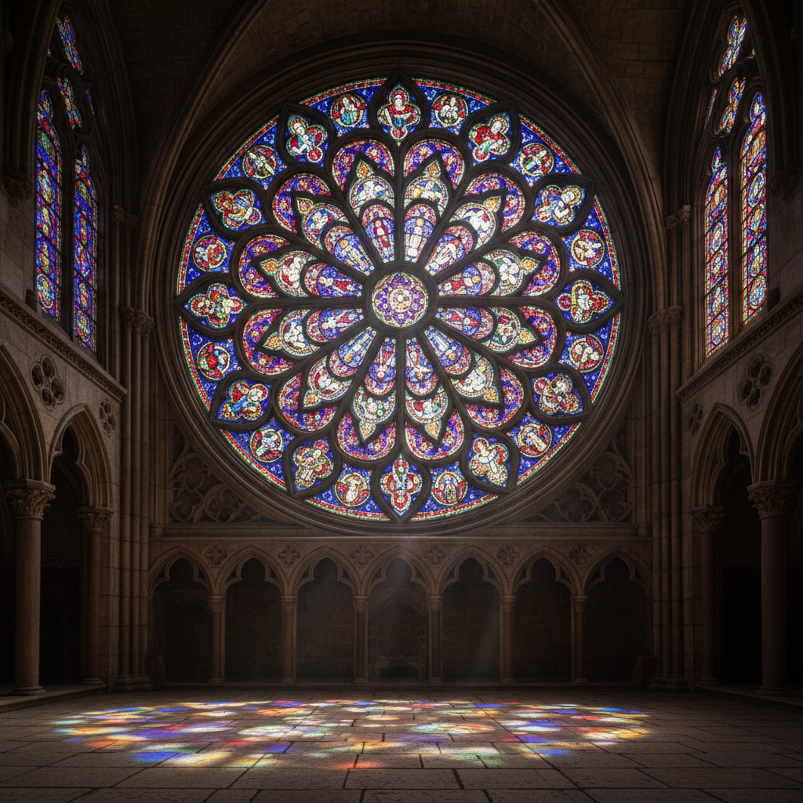

# Stained Glass Art 彩色玻璃艺术

> "Stained glass is the most sublime of all arts — it is light itself made visible." — Marc Chagall

## 概述

彩色玻璃艺术（Stained Glass Art）是使用彩色玻璃片通过铅条连接组成图案和画面的艺术形式。它是中世纪哥特式大教堂最辉煌的艺术成就——当阳光穿过彩色玻璃窗，整个建筑内部被转化为一个光的圣殿。

彩色玻璃的独特之处在于它以光为媒介——不是反射光，而是透射光。观看彩色玻璃就是直接观看被着色的光本身。

## 核心特征

| 特征 | 描述 |
|------|------|
| 透射光 | 以透射光而非反射光呈现 |
| 建筑性 | 与建筑结构紧密结合 |
| 铅条 | 铅条既是结构也是线条 |
| 叙事性 | 通常讲述宗教或历史故事 |
| 色彩 | 宝石般的饱和色彩 |
| 变化性 | 随光线变化而变化 |

## 视觉特征

- **光线**：透射光的宝石般色彩
- **铅线**：黑色铅条形成的线条网络
- **色块**：大面积的纯色玻璃块
- **细节**：玻璃上的彩绘细节
- **变化**：随时间和天气变化的光效
- **尺度**：从小型面板到巨型玫瑰窗

## 代表作品

| 作品 | 地点/艺术家 | 年代 | 意义 |
|------|-------------|------|------|
| *Chartres Cathedral windows* | 沙特尔大教堂 | 1200s | 哥特式彩色玻璃的巅峰 |
| *Sainte-Chapelle* | 巴黎 | 1248 | 最完整的中世纪玻璃 |
| *Rose Windows, Notre-Dame* | 巴黎 | 1250s | 玫瑰窗的经典 |
| *Metz Cathedral windows* | Marc Chagall | 1960s | 现代彩色玻璃的杰作 |
| *Coventry Cathedral* | John Piper | 1962 | 战后重建的象征 |
| *Gerhard Richter window* | 科隆大教堂 | 2007 | 当代抽象彩色玻璃 |

## 历史时间线

| 时期 | 事件 |
|------|------|
| 7世纪 | 最早的教堂彩色玻璃 |
| 12-13世纪 | 哥特式大教堂——彩色玻璃的黄金时代 |
| 14-15世纪 | 技法精进——更多细节和写实 |
| 16-18世纪 | 彩色玻璃的衰落 |
| 19世纪 | 哥特复兴——彩色玻璃的复兴 |
| 1890s | Art Nouveau——Tiffany玻璃 |
| 20世纪 | Chagall等现代艺术家的介入 |
| 2000s-至今 | 当代艺术家的重新诠释 |

## 中国语境

彩色玻璃在中国主要见于近代以来的教堂建筑（如上海徐家汇天主教堂、广州石室圣心大教堂）。中国传统建筑中没有彩色玻璃传统，但有类似的透光装饰——如窗花、纱窗、琉璃。当代中国的一些公共建筑和艺术项目开始使用彩色玻璃作为装饰元素。

## AI生成概念图

## 与其他风格的关系

- **Gothic Art** → 哥特式建筑是彩色玻璃的载体
- **Light Art** → 彩色玻璃是最古老的光艺术
- **Glass Art** → 玻璃艺术的建筑应用
- **Religious Art** → 彩色玻璃主要服务于宗教空间
- **Art Nouveau** → 新艺术运动复兴了彩色玻璃
- **Mosaic Art** → 马赛克与彩色玻璃共享碎片组合的逻辑

---

*浮光艺志 | Chronicle of Artistry*
