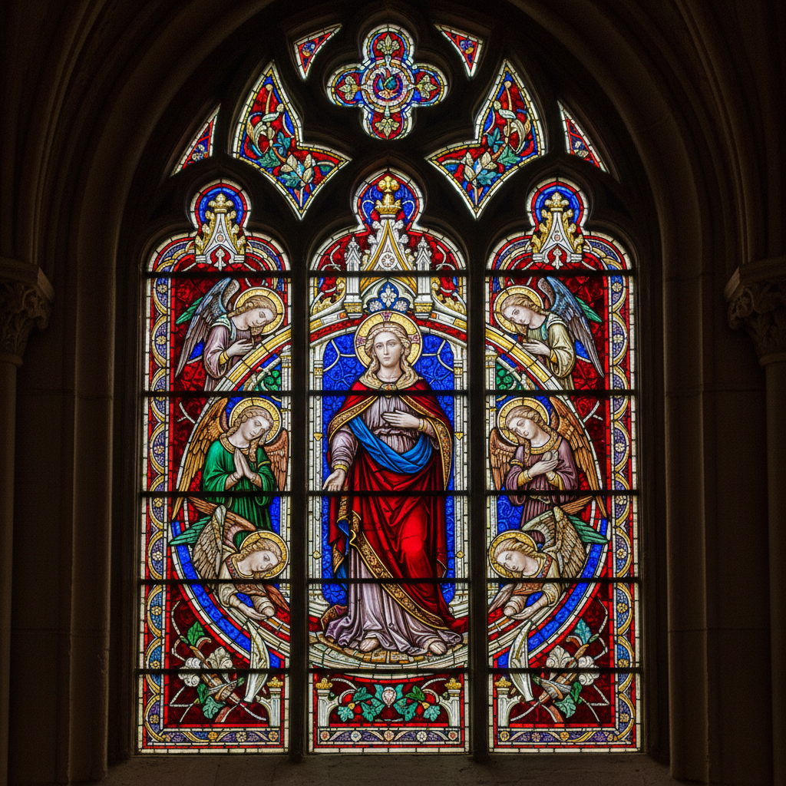

# Stained Glass Painting Art 彩绘玻璃艺术

> "Stained glass painting is drawing with light and shadow on a surface already made of light — after the colored glass pieces are cut and assembled, the painter adds details in vitreous paint: faces, drapery folds, architectural elements, and inscriptions that are fired permanently into the glass surface, giving the luminous mosaic of color the narrative precision of a painting." — Unknown

## 概述

彩绘玻璃艺术（Stained Glass Painting Art）是在彩色玻璃窗的基础上进行绘画的精细技法——在已经切割和组装好的彩色玻璃片上，用玻璃颜料（vitreous paint）绘制面部表情、衣褶、建筑细节和文字等，然后烧制使颜料永久融入玻璃表面。彩绘玻璃绘画赋予了彩色玻璃窗叙事的精确性和绘画的细腻度。

彩绘玻璃艺术的实践包括：1）玻璃颜料——使用专用的玻璃颜料；2）描线——用深色颜料描绘轮廓和细节；3）渲染——用稀释颜料创造明暗渐变；4）银染——用硝酸银创造金黄色调；5）烧制——在窑中烧制使颜料融入玻璃；6）多层——多次烧制建立层次；7）当代彩绘玻璃——将传统技法与现代创作结合。

## 核心特征

| 特征 | 描述 |
|------|------|
| 绘画 | 在玻璃上绘画 |
| 烧制 | 烧制使颜料永久化 |
| 细节 | 精细的面部和衣褶 |
| 光线 | 利用透射光线 |
| 叙事 | 叙事性的画面 |
| 教堂 | 教堂窗户的传统 |

## 视觉特征

- **光线**：透射光线的效果
- **色彩**：鲜艳的彩色玻璃
- **细节**：精细的绘画细节
- **叙事**：叙事性的场景
- **铅条**：铅条分隔的构图
- **神圣**：神圣的整体氛围

## 代表作品

| 作品 | 艺术家/文化 | 年代 | 意义 |
|------|-------------|------|------|
| *Chartres Cathedral windows* | 法国 | 12-13世纪 | 沙特尔大教堂窗户 |
| *Sainte-Chapelle windows* | 法国 | 13世纪 | 圣礼拜堂窗户 |
| *York Minster Great East Window* | 英国 | 15世纪 | 约克大教堂东窗 |
| *Marc Chagall windows* | 法国 | 20世纪 | 夏加尔彩绘玻璃 |
| *Gerhard Richter Cologne window* | 德国 | 2007年 | 里希特科隆大教堂窗 |

## 历史时间线

| 时期 | 事件 |
|------|------|
| 10世纪 | 彩绘玻璃绘画的早期发展 |
| 12-13世纪 | 哥特式教堂的黄金时代 |
| 14-15世纪 | 银染技法的发展 |
| 19世纪 | 哥特复兴运动的复兴 |
| 当代 | 彩绘玻璃的当代艺术化 |

## 中国语境

彩绘玻璃与中国的建筑装饰有一定的关联。中国的教堂建筑中，彩绘玻璃窗——在各地的天主教和基督教教堂中存在。中国的上海、北京、广州等城市——保存有精美的历史彩绘玻璃窗。中国当代的建筑设计中，彩绘玻璃——作为装饰元素在一些公共建筑中使用。中国的玻璃艺术教育中，彩绘玻璃作为重要的建筑装饰技法——在相关课程中教授。中国的文物保护中，历史教堂的彩绘玻璃窗——是重要的保护对象。中国当代的玻璃艺术家——有一些从事彩绘玻璃的创作和修复。

## AI生成概念图

## 与其他风格的关系

- **Stained Glass** → 彩色玻璃
- **Gothic Architecture** → 哥特建筑
- **Glass Painting** → 玻璃绘画
- **Religious Art** → 宗教艺术
- **Vitreous Enamel** → 玻璃质珐琅
- **Light Art** → 光艺术

---

*浮光艺志 | Chronicle of Artistry*
