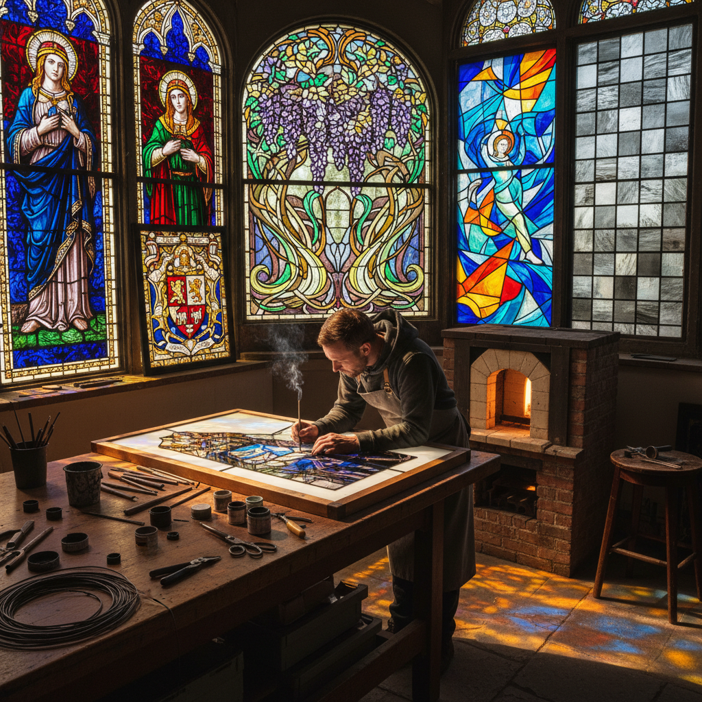

# Stained Glass Painting 彩绘玻璃

> "Stained glass painting transforms windows into walls of light — the artist paints not with pigments that reflect, but with glass that transmits, creating images that change with every passing cloud, every hour of the day, alive with the sun itself as their illumination." — Unknown

## 概述

彩绘玻璃（Stained Glass Painting）是在彩色玻璃片上使用特殊的玻璃颜料（通常是金属氧化物与玻璃粉的混合物）绑定绘画细节，然后在窑炉中烧制使颜料永久融合到玻璃表面的技法。彩绘玻璃是中世纪欧洲教堂建筑中最重要的艺术形式之一——巨大的彩色玻璃窗讲述圣经故事，用光线创造神圣的氛围。

彩绘玻璃的制作过程包括：设计图案（cartoon）、选择和切割彩色玻璃片、在玻璃上绘制细节（面部表情、衣褶、文字等）、窑烧固定颜料、用铅条（came）将各片玻璃组装成完整的窗户。现代彩绘玻璃艺术家在传统技法的基础上融合当代设计理念，创作从宗教到世俗、从具象到抽象的各种作品。

## 核心特征

| 特征 | 描述 |
|------|------|
| 透光 | 利用透射光线 |
| 颜料 | 玻璃专用颜料 |
| 烧制 | 窑烧固定颜料 |
| 铅条 | 铅条组装结构 |
| 叙事 | 叙事性图像 |
| 建筑 | 与建筑结合 |

## 视觉特征

- **光线**：透射光的效果
- **色彩**：宝石般的色彩
- **线条**：铅条的线条结构
- **叙事**：叙事性的画面
- **神圣**：神圣的氛围
- **变化**：随光线变化

## 代表作品

| 作品 | 艺术家 | 年代 | 意义 |
|------|--------|------|------|
| *Chartres Cathedral windows* | Unknown | 12-13世纪 | 哥特式彩绘玻璃巅峰 |
| *Sainte-Chapelle windows* | Unknown | 13世纪 | 巴黎圣礼拜堂 |
| *Marc Chagall windows* | Marc Chagall | 20世纪 | 现代彩绘玻璃 |
| *Gerhard Richter Cologne window* | Gerhard Richter | 2007 | 当代抽象彩绘玻璃 |
| *Louis Comfort Tiffany windows* | Tiffany Studios | 19-20世纪 | 新艺术运动玻璃 |

## 历史时间线

| 时期 | 事件 |
|------|------|
| 7世纪 | 最早的彩绘玻璃窗 |
| 12-13世纪 | 哥特式教堂的黄金时代 |
| 文艺复兴 | 绘画性彩绘玻璃 |
| 19世纪 | 新艺术运动的复兴 |
| 20世纪 | 现代艺术家的参与 |
| 当代 | 当代彩绘玻璃的多样化 |

## 中国语境

彩绘玻璃在中国主要通过近代教堂建筑传入——上海、北京、广州等城市的历史教堂中保存有精美的彩绘玻璃窗。中国的当代建筑和室内设计中越来越多地使用彩绘玻璃元素。中国的玻璃艺术教育中包含彩绘玻璃技法的教学。中国的一些当代艺术家将彩绘玻璃与中国传统图案和审美结合，创作具有中国特色的彩绘玻璃作品。

## AI生成概念图

## 与其他风格的关系

- **Glass Fusing** → 玻璃熔合
- **Glass Blowing** → 吹制玻璃
- **Gothic Architecture** → 哥特式建筑
- **Religious Art** → 宗教艺术
- **Art Nouveau** → 新艺术运动
- **Mosaic** → 马赛克

---

*浮光艺志 | Chronicle of Artistry*
