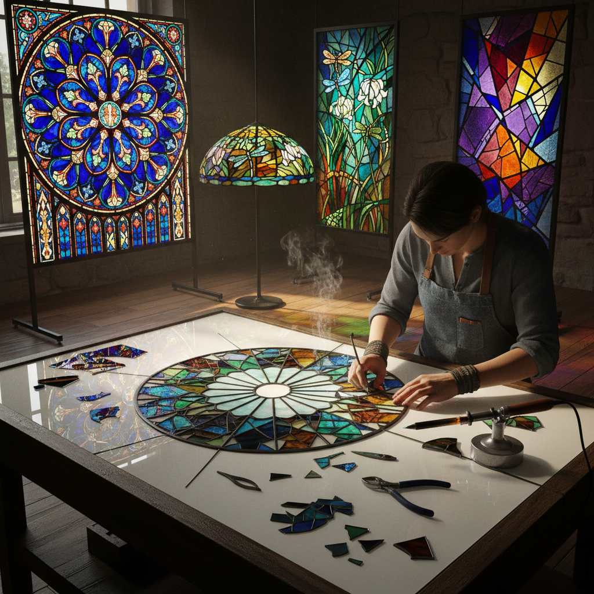

# Stained Glass 彩色玻璃

> "Stained glass is architecture's painting — light itself becomes the medium, transformed by colored glass into stories that glow from within." — Unknown

## 概述

彩色玻璃（Stained Glass）是使用有色玻璃片通过铅条（came）连接组合成图案或画面的艺术。当光线穿过彩色玻璃时，玻璃的颜色被光线激活，产生宝石般的光辉——这是任何不透明媒介无法达到的效果。彩色玻璃是中世纪哥特式大教堂最标志性的艺术形式——巨大的玫瑰窗和叙事窗将圣经故事转化为光与色的交响。玻璃的颜色来自金属氧化物：钴产生蓝色、铜产生红色和绿色、锰产生紫色。细节通过在玻璃表面绘制黑色颜料（grisaille）并烧制来添加。

彩色玻璃的哲学在于：以光为画——不是反射光线，而是让光线穿透，成为图像本身的一部分。

## 核心特征

| 特征 | 描述 |
|------|------|
| 透光 | 光线穿透玻璃 |
| 铅条 | 铅条连接玻璃片 |
| 色彩 | 宝石般的色彩 |
| 叙事 | 叙事性的图案 |
| 建筑 | 与建筑结合 |
| 光影 | 随光线变化 |

## 视觉特征

- **发光**：从内部发光的效果
- **宝石**：宝石般的色彩饱和度
- **线条**：铅条形成的线条
- **叙事**：叙事性的画面
- **变化**：随光线和时间变化
- **庄严**：庄严神圣的氛围

## 代表作品

| 作品 | 艺术家 | 年代 | 意义 |
|------|--------|------|------|
| *Chartres Cathedral windows* | 匿名 | 12-13世纪 | 哥特式彩窗巅峰 |
| *Sainte-Chapelle* | 匿名 | 1248 | 最完整的中世纪彩窗 |
| *Marc Chagall windows* | Marc Chagall | 1960s | 现代彩色玻璃 |
| *Louis Comfort Tiffany* | Tiffany | 1890s+ | 新艺术彩色玻璃 |
| *Gerhard Richter Cologne window* | Richter | 2007 | 当代彩色玻璃 |

## 历史时间线

| 时期 | 事件 |
|------|------|
| 7世纪 | 最早的教堂彩色玻璃 |
| 12-13世纪 | 哥特式彩窗的黄金时代 |
| 文艺复兴 | 彩色玻璃的绘画化 |
| 19世纪 | Tiffany的新艺术彩窗 |
| 20世纪 | 现代艺术家的彩窗 |
| 当代 | 当代彩色玻璃艺术 |

## 中国语境

彩色玻璃在中国主要通过教堂建筑传入——上海、北京、广州等地的历史教堂保存有精美的彩色玻璃窗。当代中国的彩色玻璃艺术正在快速发展——从教堂修复到商业空间装饰，从艺术创作到建筑设计。中国的一些玻璃艺术工作室和美术院校开设彩色玻璃课程。中国传统建筑中虽然没有西方式的彩色玻璃窗，但有类似的透光装饰——如窗花、纱窗和琉璃构件，都是利用光线穿透来创造美感。

## AI生成概念图

## 与其他风格的关系

- **Glass Art** → 玻璃艺术
- **Gothic Art** → 哥特式艺术
- **Mosaic** → 马赛克（拼合类比）
- **Light Art** → 光艺术
- **Architecture** → 建筑
- **Tiffany** → 蒂芙尼风格

---

*浮光艺志 | Chronicle of Artistry*
