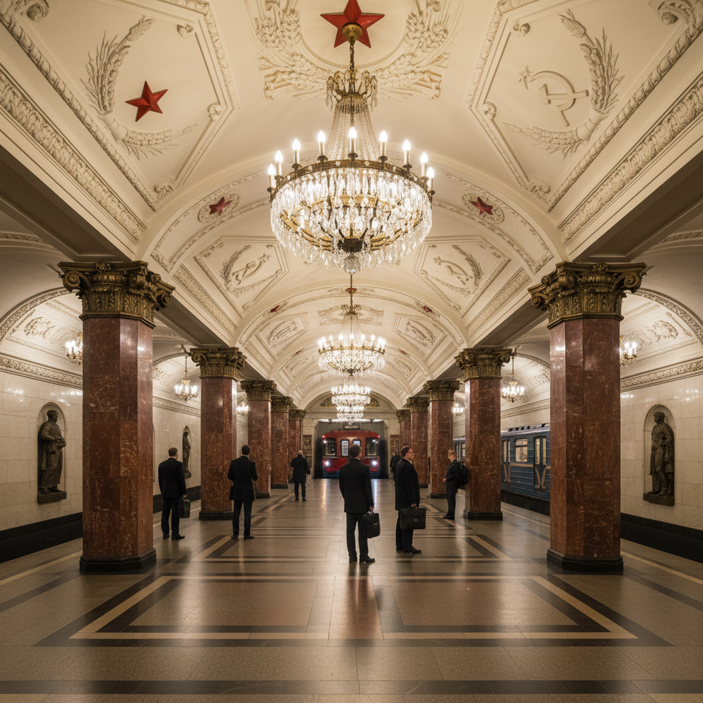

# Stalinist Empire Style 斯大林帝国风格



> **"社会主义的凡尔赛——用古典柱廊和金色穹顶宣告无产阶级的胜利。"**

## 概述

斯大林帝国风格（Stalinist Empire Style / Сталинский ампир）是1933年至1955年间苏联的官方建筑与装饰风格。它将古典主义的宏伟形式与社会主义意识形态符号相结合，创造出一种独特的"无产阶级巴洛克"——既要展示社会主义制度的优越性，又要超越资本主义世界的建筑成就。

## 时代背景

| 维度 | 内容 |
|------|------|
| 时间 | 1933–1955 |
| 确立 | 苏维埃宫竞赛（1931-33）确定古典主义方向 |
| 终结 | 1955年赫鲁晓夫"反对建筑中的铺张浪费"法令 |
| 政治功能 | 通过建筑展示社会主义制度的力量与永恒 |

## 视觉特征

- **古典柱式**：科林斯柱、爱奥尼柱的大量使用
- **纪念性尺度**：压倒性的体量，高耸的塔楼
- **社会主义装饰**：五角星、麦穗、锤子镰刀、红旗浮雕
- **金色与米色**：温暖的色调，镀金装饰
- **对称构图**：严格的轴线对称
- **塔楼尖顶**：哥特式尖塔与古典主义的混合
- **地铁宫殿**：大理石、马赛克、水晶吊灯

## 代表建筑

| 建筑 | 地点 | 年代 | 建筑师 |
|------|------|------|------|
| 莫斯科七姐妹 | 莫斯科 | 1947-57 | 多位 |
| 莫斯科大学主楼 | 莫斯科 | 1949-53 | Rudnev |
| 华沙科学文化宫 | 华沙 | 1952-55 | Rudnev |
| 莫斯科地铁站群 | 莫斯科 | 1935-55 | 多位 |
| 上海展览中心 | 上海 | 1954-55 | 苏联援建 |
| 北京展览馆 | 北京 | 1953-54 | 苏联援建 |

## 苏联装饰艺术（Soviet Art Deco）

斯大林帝国风格的早期阶段（1932-1937）存在一个短暂的"苏联装饰艺术"过渡期，将西方Art Deco的几何美学与构成主义遗产及古典装饰方法相结合。

## 与其他风格的关系

```
新古典主义 + 帝国风格(拿破仑)
         ↓
俄国构成主义(1920s) → [被压制]
         ↓
苏联装饰艺术(1932-37) → 斯大林帝国风格(1933-55)
                                    ↓
                         赫鲁晓夫"反铺张"(1955)
                                    ↓
                         苏联现代主义(1955-91)
```

## 国际传播

- **中国**：1950年代"苏联援建"项目（北京十大建筑部分受影响）
- **东欧**：华沙、布加勒斯特、布达佩斯的斯大林式建筑
- **朝鲜**：平壤城市规划中的延续
- **蒙古**：乌兰巴托政府建筑

## 当代影响

- 莫斯科地铁作为旅游景点和摄影圣地
- "斯大林式公寓"在莫斯科房地产市场的高溢价
- 游戏《Atomic Heart》中的视觉参照
- 复古未来主义中的"苏联乌托邦"美学分支

## 多语言名称

| 语言 | 名称 |
|------|------|
| 俄语 | Сталинский ампир / Сталинская архитектура |
| 英语 | Stalinist Architecture / Stalin Empire Style |
| 中文 | 斯大林式建筑 / 斯大林帝国风格 |
| 德语 | Stalinistische Architektur / Zuckerbäckerstil（糖果师风格） |
| 日语 | スターリン様式 |

## 延伸阅读

- Dmitry Khmelnitsky《Stalin's Architecture》
- Karl Schlögel《Moscow, 1937》
- 莫斯科建筑博物馆（Музей архитектуры）

---

*最后更新：2026-07-26*
