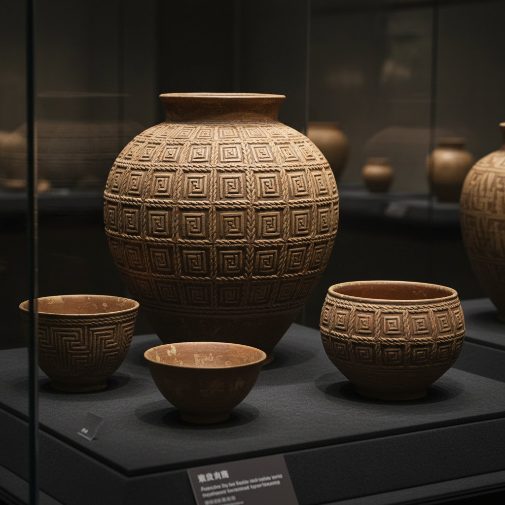

# Stamped Pottery Art 印纹陶艺术

> "Stamped pottery is memory pressed into clay — a carved wooden paddle, a twisted cord, a shell edge, or a hand-cut stamp pressed into soft clay before firing, each impression a tiny fossil of the tool that made it, patterns repeating across the surface like textile prints translated into earth, the simplest form of decoration and yet capable of infinite variety through the endless invention of new stamps." — Unknown

## 概述

印纹陶艺术（Stamped Pottery Art）是一种用各种工具（印模、绳索、贝壳、木拍等）在未干的粘土表面压印形成纹饰的陶瓷装饰技法。印纹是人类最早的陶瓷装饰方式之一——从新石器时代的绳纹陶到商周的印纹硬陶，从非洲的拍印陶到欧洲的印花陶，印纹装饰贯穿了整个人类陶瓷史。印纹的魅力在于简单工具可以创造无穷的图案变化。

印纹陶艺术的核心要素包括：1）印模工具——各种形状的印压工具；2）湿软粘土——在粘土未干时压印；3）重复图案——通过重复压印形成图案；4）凹陷纹理——压印形成的凹陷装饰；5）工具多样——绳索、贝壳、木模等多种工具；6）简单高效——简单的工具和操作；7）历史悠久——最古老的装饰方式之一。

## 核心特征

| 特征 | 描述 |
|------|------|
| 压印成纹 | 用工具压印形成纹饰 |
| 工具多样 | 各种材料的印模工具 |
| 重复图案 | 通过重复形成规律图案 |
| 凹陷效果 | 压印形成的凹陷纹理 |
| 简单高效 | 操作简单效果丰富 |
| 历史最久 | 最古老的装饰方式之一 |

## 视觉特征

- **凹陷纹理**：压印形成的凹陷图案
- **重复节奏**：规律重复的视觉节奏
- **几何图案**：几何形状的印纹排列
- **绳纹效果**：绳索压印的纹理
- **触感丰富**：凹凸不平的触感
- **光影效果**：凹陷中的光影变化

## 代表作品

| 作品 | 艺术家/文化 | 年代 | 意义 |
|------|-------------|------|------|
| *绳纹陶器* | 日本绳文 | 公元前14000年 | 最早的印纹陶 |
| *中国印纹硬陶* | 中国商周 | 商-周 | 中国印纹传统 |
| *非洲拍印陶* | 非洲各族 | 传统 | 非洲印纹传统 |
| *Wedgwood印花* | Wedgwood | 18世纪 | 工业印花陶瓷 |
| *当代印纹陶* | 各地陶艺家 | 当代 | 印纹的现代应用 |

## 历史时间线

| 时期 | 事件 |
|------|------|
| 公元前14000年 | 绳纹陶器的出现 |
| 新石器时代 | 印纹陶在全球普及 |
| 商周时期 | 中国印纹硬陶的成熟 |
| 18世纪 | 工业化印花陶瓷 |
| 当代 | 印纹作为艺术装饰手段 |

## 中国语境

印纹陶在中国有极其重要的历史地位。中国南方的印纹硬陶——从商代到汉代——是中国陶瓷史的重要组成部分。这些陶器表面布满了用陶拍压印的几何纹样——方格纹、回纹、云雷纹、绳纹等——形成了独特的装饰体系。中国的印纹硬陶被认为是原始瓷器的前身，在中国陶瓷发展史上具有承上启下的作用。中国当代陶艺中，印纹作为一种回归传统的装饰手法被重新发掘。中国的陶艺教育中，印纹是最基础的装饰课程之一。

## AI生成概念图

## 与其他风格的关系

- **Impressed Decoration** → 压印装饰
- **Cord Marking** → 绳纹
- **Sgraffito** → 刮花
- **Relief** → 浮雕
- **Pattern Design** → 图案设计
- **Primitive Pottery** → 原始陶器

---

*浮光艺志 | Chronicle of Artistry*
