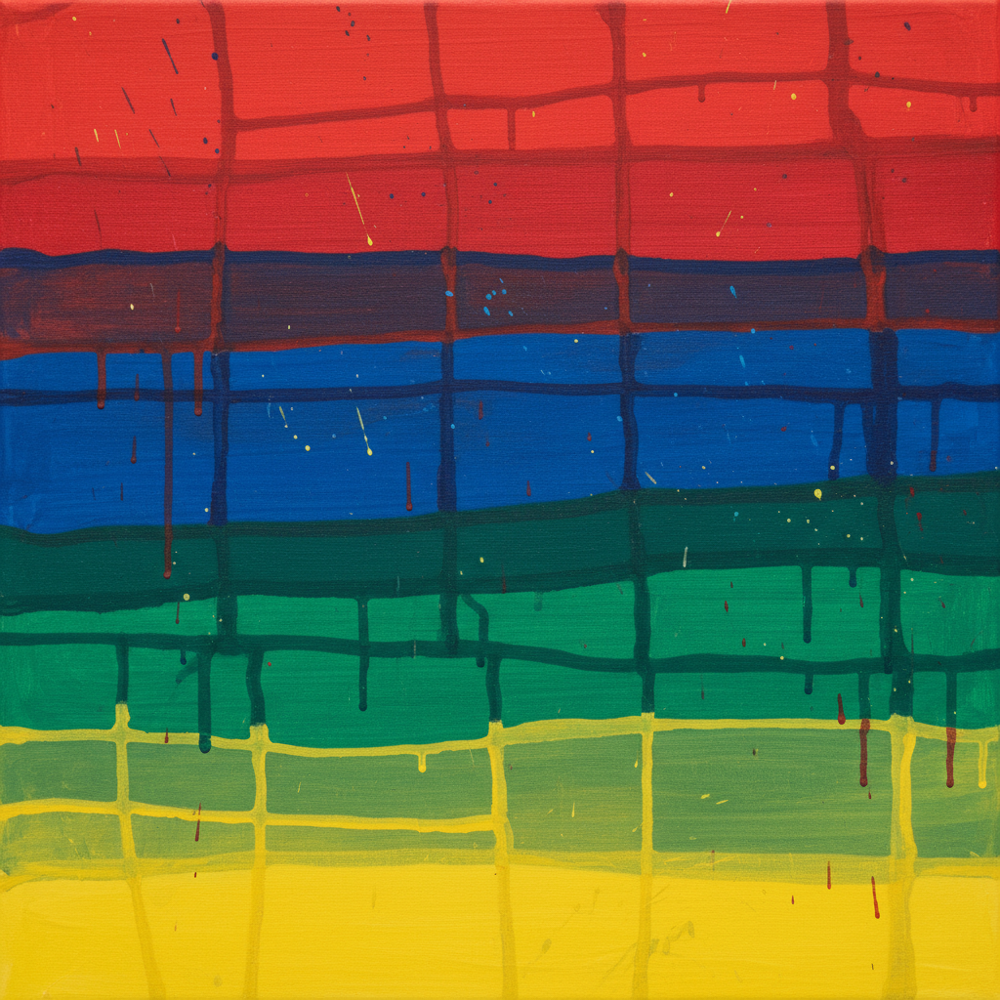

# Stanley Whitney 斯坦利·惠特尼

> **时期：** 1946–至今  
> **关键词：** 色彩网格、即兴堆叠、爵士节奏、非裔美国抽象

## 概述

Stanley Whitney 是美国抽象画家，以标志性的色彩网格构图闻名。他的作品将画面分割为不规则的水平条带和色块，每个色块都是一次即兴的色彩决定——如同爵士乐手的即兴演奏，在结构框架内追求自由。他在70多岁时才获得广泛的国际认可。

## 风格特征

- **色彩网格**：画面由水平和垂直的不规则分割组成，每个格子填充不同色彩
- **即兴色彩**：色彩选择基于直觉和当下感受，拒绝预先规划
- **不规则边缘**：格子的边界不是直线，而是手绘的有机曲线
- **饱和纯色**：大量使用高纯度色彩——朱红、钴蓝、翠绿、柠檬黄
- **爵士结构**：整体构图如同音乐的节奏——重复中有变化，规则中有自由

## 代表作品

- *Dance the Orange*（2019）
- *The Italian Paintings*（2015，系列）
- *My Name is Not Susan*（2014）
- *This Side of Blue*（2016）

## 历史意义

Whitney 证明了网格——现代主义最"理性"的构图——可以成为情感和即兴的载体。他的迟来成功也是艺术界对非裔美国抽象画家长期忽视的一次修正。

## 概念图

