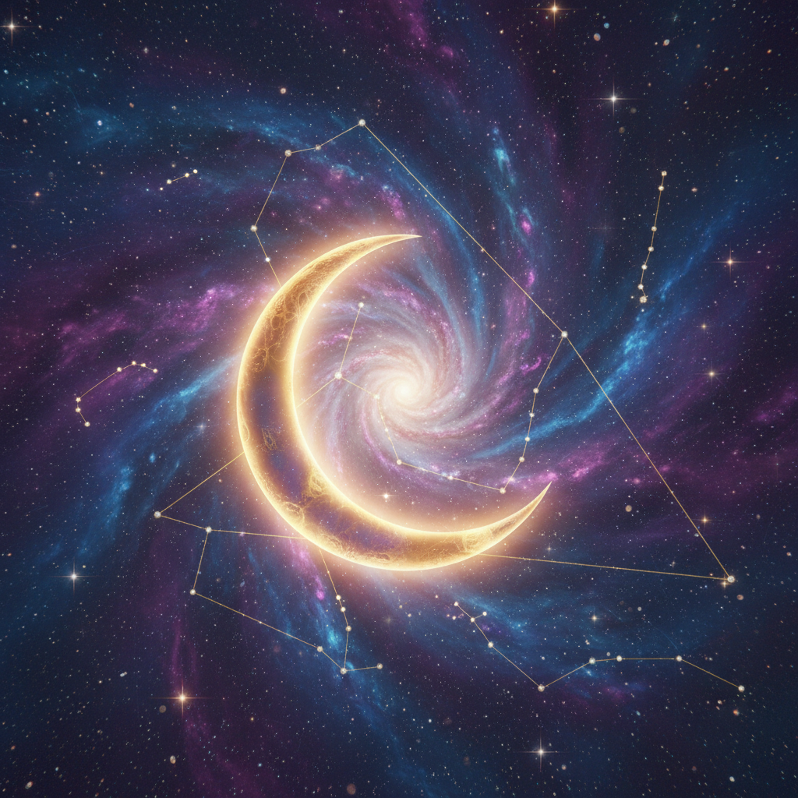

# Starcore 星核



> **"银河、星座、宇宙尘埃——仰望星空时，我们都是渺小而伟大的。"**

## 概述

| 维度 | 描述 |
|------|------|
| 时期 | 2020–至今 |
| 别名 | Starcore, Celestial Aesthetic, Cosmic Aesthetic |
| 核心色彩 | 深蓝、紫色、黑色、金色、银色 |
| 关键元素 | 星星、月亮、银河、星座、星云 |
| 代表人物 | Pinterest/TikTok 社区驱动 |
| 关联风格 | Spacecore, Witchcore, Celestial, Dark Academia |

---

## 历史脉络

| 年份 | 事件 |
|------|------|
| 古代 | 星座神话——人类最早的"连线游戏" |
| 中世纪 | 占星术——星星决定命运 |
| 1960s | 太空竞赛——星空的科学化 |
| 2010s | 星座文化在社交媒体复兴 |
| 2020 | Starcore 作为独立美学兴起 |
| 2022 | 与 Witchcore、Celestial 交叉 |

### 核心哲学

Starcore 的精神是**"我们都是星尘——宇宙在我们体内"**：
- 星空 = 敬畏（"我们多么渺小"）
- 星座 = 连接（"古人也看过同样的星星"）
- 宇宙 = 神秘 + 科学
- "每颗星星都是一个太阳"
- 黑暗 = 美（没有黑暗就看不见星星）

---

## 视觉语法

### 色彩系统

```
主色：
  深蓝 (#0D1B2A) — 夜空
  紫色 (#4B0082) — 星云
  黑色 (#000000) — 宇宙
  金色 (#FFD700) — 星星
  银色 (#C0C0C0) — 月光

辅色：
  青色 (#00CED1) — 星云
  粉色 (#FF69B4) — 星云
  白色 (#FFFFFF) — 星光

质感：
  闪烁 — 星星
  流动 — 星云
  光滑 — 月球表面
  颗粒 — 宇宙尘埃
```

### 标志性元素

| 类别 | 元素 |
|------|------|
| 天体 | 星星、月亮、行星、银河、星云 |
| 符号 | 星座图、月相、太阳、流星 |
| 物件 | 望远镜、星盘、水晶球、塔罗牌 |
| 图案 | 星座连线、星空渐变、月相序列 |
| 材质 | 金属、水晶、丝绒（深色） |
| 态度 | 神秘、敬畏、浪漫、探索 |

---

## 与千禧怀旧的关系

### 星座文化的社交媒体复兴
- "你是什么星座？"= 社交破冰
- 星座 meme = 互联网文化
- Co-Star 等星座 App 的流行
- 从"迷信"到"美学"的转变

### 与 Witchcore 的交叉
- 两者共享"神秘"元素
- 月亮 = 两者的核心符号
- Starcore 更偏"科学+浪漫"
- Witchcore 更偏"魔法+力量"

---

## 中国语境

- 中国星座文化（二十八宿、紫微斗数）
- "星河"在中国诗词中的意象
- 与中国"仙侠"美学的交叉
- 天文摄影在中国的兴起
- 与中国"暗夜保护"运动的关系

---

## 设计应用

| 场景 | 应用方式 |
|------|----------|
| 品牌 | 深蓝+金色+星座+神秘+高级 |
| 空间 | 深色+星光+金属+水晶+烛光 |
| 时尚 | 深色+闪光+星座图案+金属配饰 |
| 数字 | 星空渐变+闪烁动效+星座互动 |

---

## 相关风格

← [Spacecore 太空核](spacecore.md) | [Witchcore 女巫核](witchcore.md) →

↑ [返回千禧怀旧目录](README.md) | [返回总目录](../README.md)
