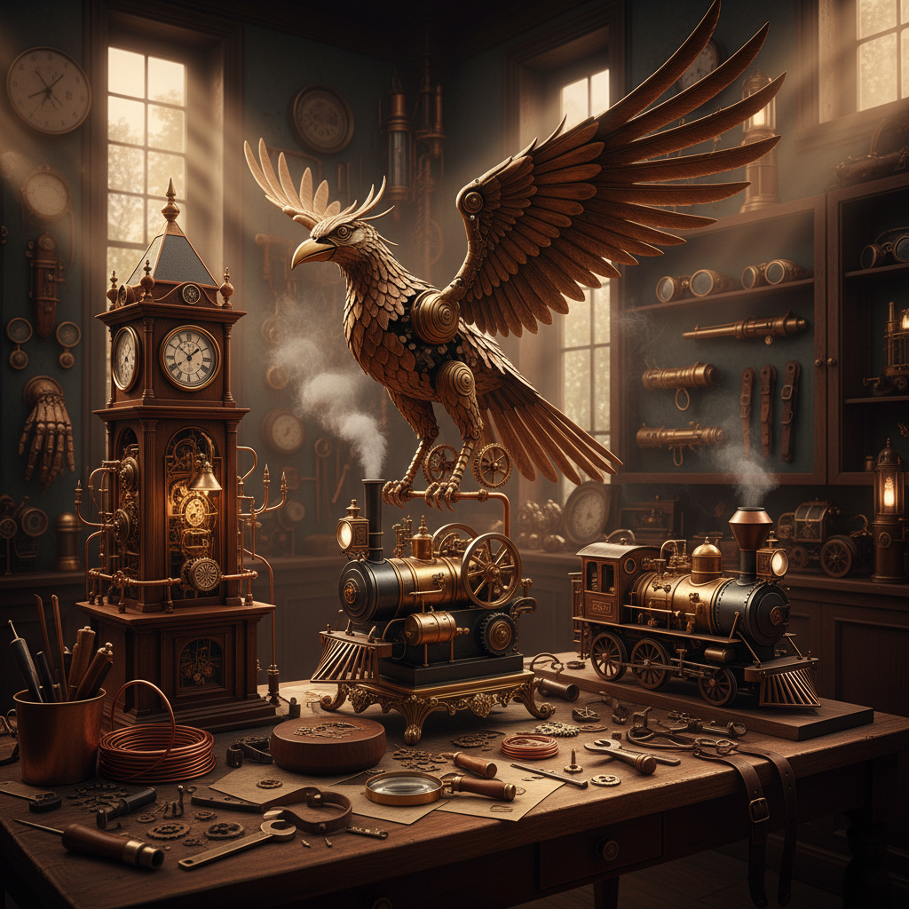

# Steam Art 蒸汽艺术

> "Steam is energy made visible — water transformed by heat into a rushing, billowing, hissing force that powered the Industrial Revolution and changed the shape of civilization. Steam art captures this transformative power: the beauty of pistons and pressure gauges, the romance of locomotives and steamships, the aesthetic of brass and iron and escaping vapor that speaks of an age when machines were beautiful because they were honest about their workings." — Unknown

## 概述

蒸汽艺术（Steam Art）是以蒸汽动力、蒸汽机械和蒸汽朋克美学为主题或媒介的艺术形式——包括以蒸汽时代工业美学为灵感的创作、利用蒸汽作为艺术媒介的装置、以及蒸汽朋克（Steampunk）风格的设计和造型艺术。蒸汽艺术融合了工业革命的机械美学与维多利亚时代的装饰风格。

蒸汽艺术的实践包括：1）蒸汽朋克设计——融合维多利亚美学与幻想科技的设计；2）蒸汽机械雕塑——以蒸汽机械为主题的雕塑；3）蒸汽装置艺术——利用真实蒸汽的艺术装置；4）蒸汽朋克时尚——蒸汽朋克风格的服装和配饰；5）蒸汽朋克插画——蒸汽朋克风格的插画和概念艺术；6）工业遗产艺术——以蒸汽时代工业遗产为主题的创作；7）蒸汽动力艺术——利用蒸汽动力驱动的动态艺术品。

## 核心特征

| 特征 | 描述 |
|------|------|
| 机械 | 精密的机械美学 |
| 黄铜 | 黄铜和铜的材质 |
| 齿轮 | 齿轮和管道的元素 |
| 维多利亚 | 维多利亚时代风格 |
| 蒸汽 | 蒸汽和烟雾的视觉 |
| 复古未来 | 复古与未来的结合 |

## 视觉特征

- **黄铜**：温暖的黄铜色调
- **齿轮**：精密的齿轮机构
- **管道**：蒸汽管道和阀门
- **烟雾**：蒸汽和烟雾效果
- **铆钉**：铆钉和金属板
- **仪表**：压力表和仪表盘

## 代表作品

| 作品 | 艺术家 | 年代 | 意义 |
|------|--------|------|------|
| *Steampunk sculptures* | Various | 当代 | 蒸汽朋克雕塑 |
| *Steam-powered art* | Various | 当代 | 蒸汽动力艺术 |
| *Industrial heritage art* | Various | 当代 | 工业遗产艺术 |
| *Steampunk fashion* | Various | 当代 | 蒸汽朋克时尚 |
| *Steam installations* | Various | 当代 | 蒸汽装置艺术 |

## 历史时间线

| 时期 | 事件 |
|------|------|
| 18-19世纪 | 蒸汽时代的工业美学 |
| 1980年代 | 蒸汽朋克文学的诞生 |
| 2000年代 | 蒸汽朋克作为视觉文化运动 |
| 2010年代 | 蒸汽朋克的全球流行 |
| 当代 | 蒸汽美学与当代艺术的融合 |

## 中国语境

蒸汽艺术在中国有独特的发展背景。中国的蒸汽朋克文化在2010年代开始兴起——受到全球蒸汽朋克运动的影响。中国的一些设计师和艺术家将蒸汽朋克美学与中国传统元素相结合——创造出"中国蒸汽朋克"（Chinese Steampunk）风格，融合了清末民初的中国元素与蒸汽机械美学。中国的工业遗产保护和再利用中也体现了蒸汽美学——许多老工厂被改造为艺术区（如北京798、上海M50），保留了工业时代的蒸汽管道和机械设备作为装饰。中国的一些主题公园和游戏采用蒸汽朋克风格——如一些国产游戏中的蒸汽朋克世界观。中国的Cosplay和手工社区中也有活跃的蒸汽朋克爱好者——制作精美的蒸汽朋克道具和服装。

## AI生成概念图

## 与其他风格的关系

- **Steampunk** → 蒸汽朋克
- **Industrial Art** → 工业艺术
- **Mechanical Art** → 机械艺术
- **Retro-futurism** → 复古未来主义
- **Kinetic Art** → 动态艺术
- **Sculpture** → 雕塑

---

*浮光艺志 | Chronicle of Artistry*
