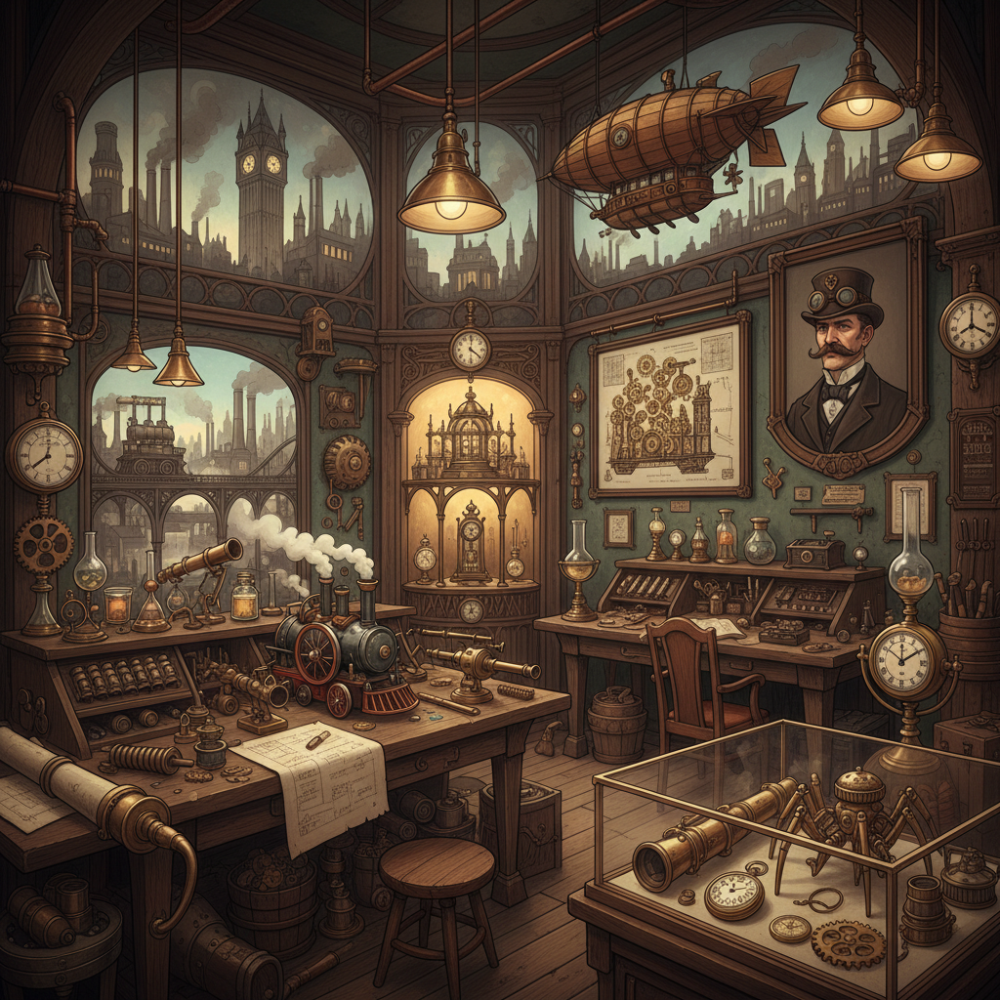

# Steampunk Art 蒸汽朋克艺术

> "Steampunk reimagines the future as the Victorians might have dreamed it — brass gears and copper pipes powering impossible machines, airships drifting through smog-filled skies, clockwork automata serving tea in gaslit parlors, a retro-future where steam power never gave way to electricity and the aesthetic of the Industrial Revolution became the foundation for a civilization of elegant complexity, where every mechanism is visible and every surface is adorned." — Unknown

## 概述

蒸汽朋克（Steampunk）是一种以维多利亚时代（19世纪）的工业美学为基础，想象一个蒸汽动力技术高度发达的替代历史或幻想世界的文化和美学运动。蒸汽朋克的视觉世界充满了黄铜齿轮、铜管、蒸汽机、飞艇、发条装置、护目镜和维多利亚时代的服饰——一种"复古未来主义"（retro-futurism）的美学。

"Steampunk"一词由科幻作家K.W.杰特（K.W. Jeter）在1987年创造，用于描述他和蒂姆·鲍尔斯（Tim Powers）、詹姆斯·布雷洛克（James Blaylock）等人创作的维多利亚时代背景的科幻小说。蒸汽朋克的视觉先驱包括儒勒·凡尔纳（Jules Verne）和H.G.威尔斯（H.G. Wells）的插图，以及维多利亚时代的工程图纸。当代蒸汽朋克已经发展成为一个包含文学、视觉艺术、时尚、音乐、手工制作和生活方式的完整亚文化。

## 核心特征

| 特征 | 描述 |
|------|------|
| 维多利亚 | 维多利亚时代美学 |
| 蒸汽 | 蒸汽动力技术 |
| 齿轮 | 可见的机械结构 |
| 黄铜 | 黄铜和铜的材质 |
| 飞艇 | 飞艇和蒸汽机车 |
| 复古未来 | 复古的未来想象 |

## 视觉特征

- **齿轮**：暴露的齿轮和机械
- **黄铜**：黄铜和铜的色调
- **蒸汽**：蒸汽和烟雾
- **维多利亚**：维多利亚时代服饰
- **飞艇**：飞艇和奇异飞行器
- **护目镜**：护目镜和望远镜

## 代表作品

| 作品 | 艺术家 | 年代 | 意义 |
|------|--------|------|------|
| *The Difference Engine* | William Gibson & Bruce Sterling | 1990 | 蒸汽朋克文学经典 |
| *Steampunk sculptures* | Various makers | 2000年代起 | 蒸汽朋克手工艺品 |
| *Bioshock Infinite* | Irrational Games | 2013 | 蒸汽朋克游戏设计 |
| *Mortal Engines* | Philip Reeve / Peter Jackson | 2001/2018 | 移动城市的视觉 |
| *Girl Genius* | Phil & Kaja Foglio | 2001起 | 蒸汽朋克漫画 |

## 历史时间线

| 时期 | 事件 |
|------|------|
| 1987 | K.W. Jeter创造"steampunk"一词 |
| 1990年代 | 蒸汽朋克文学的发展 |
| 2000年代 | 蒸汽朋克亚文化的兴起 |
| 2010年代 | 蒸汽朋克的主流化 |
| 当代 | 蒸汽朋克的全球化 |

## 中国语境

蒸汽朋克在中国有活跃的爱好者群体。中国的蒸汽朋克创作往往融合中国元素——如将蒸汽朋克美学与中国传统建筑、服饰和神话结合，创造"中国蒸汽朋克"或"丝绸朋克"（Silkpunk）的独特风格。刘宇昆（Ken Liu）的"丝绸朋克"小说系列就是将东亚文化与蒸汽朋克融合的代表。中国的Cosplay社区、手工制作社区和游戏产业中都有丰富的蒸汽朋克创作。中国晚清时期的"洋务运动"和早期工业化历史也为中国蒸汽朋克提供了独特的历史想象空间。

## AI生成概念图

## 与其他风格的关系

- **Cyberpunk** → 赛博朋克
- **Dieselpunk** → 柴油朋克
- **Victorian Art** → 维多利亚艺术
- **Retro-Futurism** → 复古未来主义
- **Art Nouveau** → 新艺术运动
- **Gothic** → 哥特风格

---

*浮光艺志 | Chronicle of Artistry*
