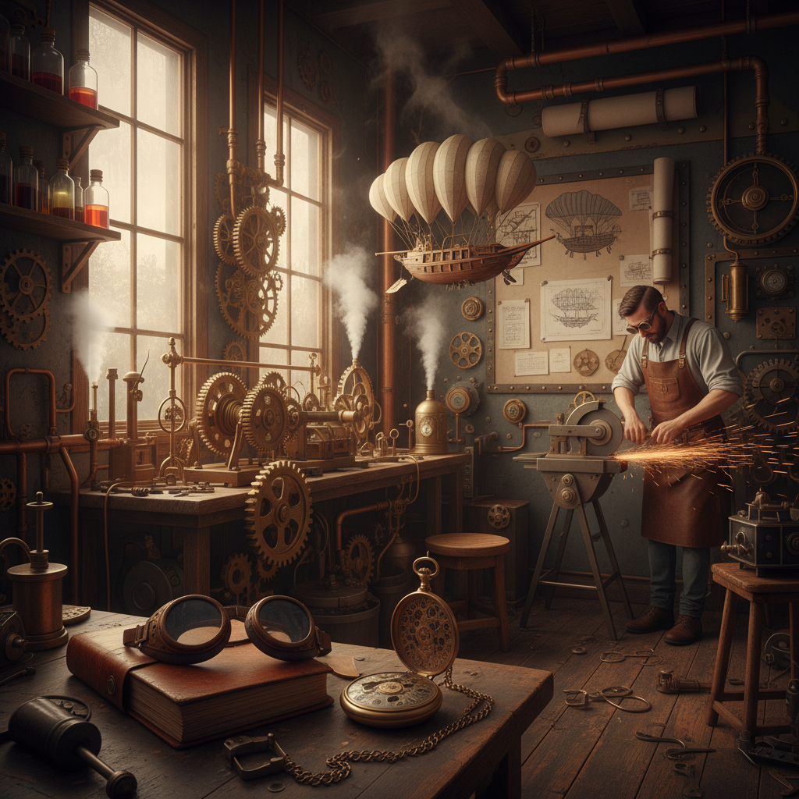
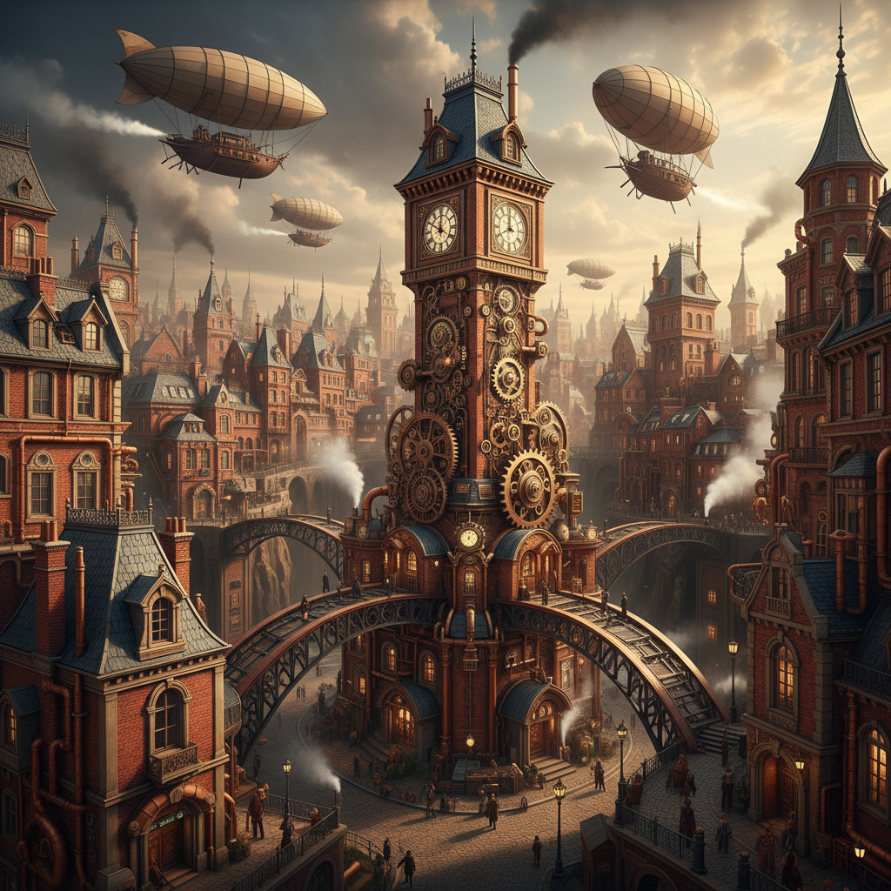

# Steampunk 蒸汽朋克





> **"如果维多利亚时代有了蒸汽计算机——齿轮、黄铜和永不存在的未来。"**

## 概述

| 维度 | 描述 |
|------|------|
| 时期 | 1980s 文学起源 / 2000s–2010s 视觉文化高峰 |
| 别名 | Steampunk, Victorian Futurism, Clockpunk |
| 核心色彩 | 黄铜金、深棕、铁锈红、墨绿、象牙白 |
| 关键元素 | 齿轮、蒸汽管道、护目镜、怀表、飞艇 |
| 代表人物 | Jules Verne、H.G. Wells、宫崎骏 |
| 关联风格 | Dieselpunk, Clockpunk, Gothic, Industrial |

---

## 历史脉络

### 1980s：文学起源

"Steampunk" 一词由作家 **K.W. Jeter** 在 1987 年创造，用来描述他和同代作家的维多利亚时代科幻小说：

**核心设定**：
- 如果蒸汽机技术继续发展而非被电力取代
- 维多利亚时代拥有了先进的机械计算机
- 一个"从未存在的19世纪"

### 文学基因

| 作品 | 贡献 |
|------|------|
| Jules Verne《海底两万里》 | 维多利亚时代的科技幻想 |
| H.G. Wells《时间机器》 | 机械时间旅行 |
| William Gibson《差分机》(1990) | 蒸汽朋克经典小说 |
| Philip Pullman《黄金罗盘》 | 平行世界的蒸汽技术 |

### 2000s–2010s：视觉文化爆发

Steampunk 从文学亚文化发展为**全球性的视觉运动**：
- Cosplay 和 Maker 文化的兴起
- Etsy 上的手工蒸汽朋克饰品
- 电影：《雨果》(2011)、《疯狂的麦克斯》系列
- 游戏：《Bioshock Infinite》(2013)
- 时尚：Alexander McQueen 的维多利亚元素

### 核心哲学

Steampunk 的吸引力在于它提供了一种**对工业化的浪漫化批判**：
- 反对大规模生产——崇尚手工制作
- 反对数字化——崇尚机械的可见性
- 反对消费主义——崇尚修理和改造
- 一种"如果技术走了另一条路"的幻想

---

## 视觉语法

### 色彩系统

```
主色：
  黄铜金 (#B8860B) — 齿轮、管道、框架
  深棕 (#654321) — 皮革、木材
  铁锈红 (#B7410E) — 氧化金属
  墨绿 (#006400) — 铜绿、玻璃
  象牙白 (#FFFFF0) — 蒸汽、纸张

辅色：
  黑色 (#000000) — 铸铁、煤烟
  琥珀 (#FFBF00) — 灯光、护目镜
  铜色 (#B87333) — 管道、铆钉

质感：
  金属（黄铜/铜/铁） — 机械部件
  皮革 — 服装、配件
  木材 — 框架、船体
  玻璃 — 护目镜、仪表盘
  蒸汽/烟雾 — 氛围
```

### 标志性元素

| 类别 | 元素 |
|------|------|
| 机械 | 齿轮、蒸汽管道、活塞、铆钉 |
| 配饰 | 护目镜、怀表、指南针、望远镜 |
| 交通 | 飞艇、蒸汽火车、机械马 |
| 武器 | 改造手枪、机械臂、蒸汽炮 |
| 服装 | 维多利亚礼服+机械改造、高礼帽、束腰 |
| 建筑 | 钟楼、工厂烟囱、铁桥、温室 |

---

## 与千禧怀旧的关系

### 2000s 的 Steampunk 热潮
- 2008–2013 是 Steampunk 的文化高峰
- 与 Maker 运动和 DIY 文化同步
- 代表了对"数字化一切"的早期反思
- 很多千禧一代的 Cosplay 入门就是 Steampunk

### 与 Frutiger Aero 的对比
- Frutiger Aero = 数字乐观主义（未来是光滑的、透明的）
- Steampunk = 机械浪漫主义（未来是黄铜的、可触摸的）
- 两者都是对"未来"的想象，但方向完全相反

---

## 中国语境

- "蒸汽朋克"在中国 Cosplay 圈的流行
- 《三体》等科幻作品中的机械美学元素
- 上海/重庆等城市的工业遗产改造空间
- 密室逃脱/剧本杀中的蒸汽朋克主题
- 国产游戏中的蒸汽朋克世界观

---

## 设计应用

| 场景 | 应用方式 |
|------|----------|
| 品牌 | 黄铜色+齿轮图案+维多利亚字体 |
| 空间 | 裸露管道+黄铜灯具+皮革家具 |
| 产品 | 机械表+手工皮具+复古仪器 |
| 游戏 | 蒸汽动力世界+机械生物+飞艇 |

---

## 延伸阅读

- 《差分机》William Gibson & Bruce Sterling
- "Steampunk Magazine" 存档
- 宫崎骏作品中的蒸汽朋克元素分析

---

## 相关风格

← [Cyberpunk 赛博朋克](cyberpunk.md) | [Dark Academia 暗黑学院](dark-academia.md) →

↑ [返回千禧怀旧目录](README.md) | [返回总目录](../README.md)
