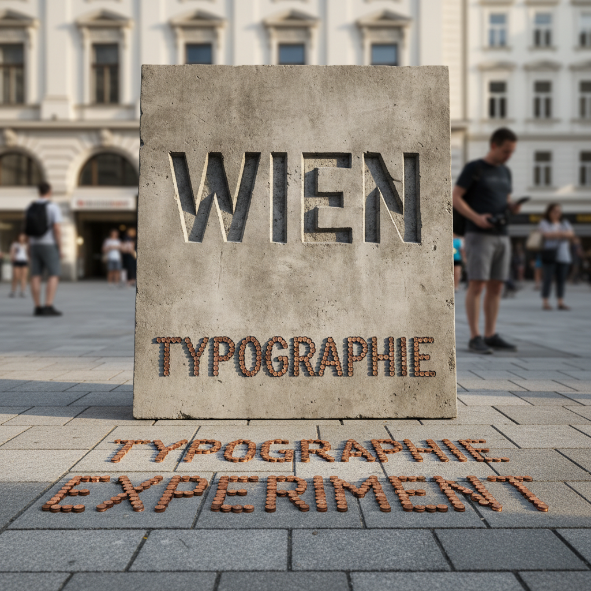

# Stefan Sagmeister 斯蒂芬·萨格迈斯特

> **时期：** 1962–至今  
> **关键词：** 身体排版、快乐设计、实验海报、物质化文字

## 概述

Stefan Sagmeister 是奥地利平面设计师，以极端的实验性设计闻名。他在自己身上用刀片刻字做海报、用数万个硬币在人行道上拼出文字、让香蕉自然变色形成图案——将设计从屏幕和纸面解放到物理世界中。

## 风格特征

- **身体作为媒介**：在皮肤上刻字、用身体做排版
- **物质化文字**：用实物（硬币、食物、衣服）拼出文字
- **时间性设计**：利用腐烂、生长等自然过程
- **快乐研究**：近年转向"美"和"快乐"的系统研究
- **极端实验**：每个项目都挑战设计的边界

## 代表作品

- *AIGA海报*（1999，身体刻字）
- *Things I Have Learned in My Life So Far*（2008）
- *The Happy Film*（2016）
- *Beauty*展览（2018–至今）

## 概念图

