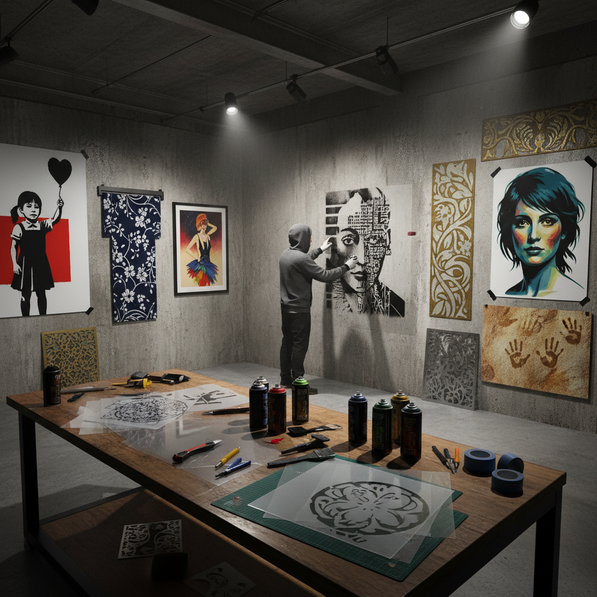

# Stencil Art 模版艺术

> "A stencil is a window cut in a wall — paint passes through the opening and leaves its mark on whatever lies behind. The stencil artist works with negative space, cutting away shapes to create images, building complexity through layers of simple masks. From cave painters blowing pigment around their hands to street artists spraying through laser-cut acetate, the stencil has been humanity's simplest tool for repeating an image." — Unknown

## 概述

模版艺术（Stencil Art）是通过在薄板材料上切割出图案，然后将颜料通过切口涂抹到表面上的装饰和艺术技法——模版可以精确地重复图案，是最古老和最通用的图案复制方法之一。从史前洞穴壁画到当代街头艺术，模版一直是人类表达的重要工具。

模版艺术的实践包括：1）单层模版——简单的单色模版印刷；2）多层模版——多层叠加的彩色模版；3）街头模版——城市街头的模版涂鸦艺术；4）织物模版——纺织品上的模版印花（如型染）；5）建筑模版——建筑装饰的模版图案；6）数字模版——激光切割的精密模版；7）当代模版——将传统技法与现代设计结合的创作。

## 核心特征

| 特征 | 描述 |
|------|------|
| 重复 | 可精确重复图案 |
| 简单 | 工具和方法简单 |
| 快速 | 快速的图案复制 |
| 层叠 | 可多层叠加 |
| 通用 | 适用于各种表面 |
| 负空间 | 利用负空间创作 |

## 视觉特征

- **锐利**：清晰锐利的边缘
- **平面**：平面化的图像
- **层次**：多层叠加的色彩层次
- **重复**：精确重复的图案
- **对比**：强烈的图底对比
- **桥接**：模版特有的"桥"结构

## 代表作品

| 作品 | 艺术家/文化 | 年代 | 意义 |
|------|-------------|------|------|
| *Cave hand stencils* | 史前 | 4万年前 | 最早的模版艺术 |
| *Japanese katazome* | 日本 | 室町至今 | 日本型染 |
| *Banksy works* | Banksy | 当代 | 街头模版艺术 |
| *Art Nouveau stencils* | 新艺术运动 | 19-20世纪 | 装饰模版 |
| *Pochoir prints* | 法国 | 1920s-30s | 法国模版印刷 |

## 历史时间线

| 时期 | 事件 |
|------|------|
| 史前 | 洞穴手印模版 |
| 古代 | 各文明的模版装饰 |
| 中世纪 | 教堂和建筑模版 |
| 20世纪 | 模版在设计和艺术中的应用 |
| 当代 | 街头艺术和数字模版 |

## 中国语境

模版艺术在中国有丰富的传统形式。中国的"漏版印花"（蜡染的一种变体）是模版印花的重要形式——使用油纸或金属模版在织物上印制图案。中国传统的"刷花"技法使用模版在瓷器上施加图案——是陶瓷装饰的重要方法。中国的蓝印花布制作中使用"花版"（镂空模版）——将防染浆料通过模版涂抹在布面上。中国的剪纸艺术与模版有密切关系——剪纸本身就可以作为模版使用。中国当代的街头艺术中，模版涂鸦也在城市中出现——受到Banksy等国际街头艺术家的影响。中国的设计行业中，模版作为图案复制工具有广泛应用——从包装设计到室内装饰。中国的非物质文化遗产中，多种使用模版的工艺被列入保护名录——如蓝印花布的花版制作技艺。

## AI生成概念图

## 与其他风格的关系

- **Block Printing** → 木版印刷
- **Screen Printing** → 丝网印刷
- **Street Art** → 街头艺术
- **Textile Printing** → 纺织印花
- **Graffiti** → 涂鸦艺术
- **Paper Cutting** → 剪纸艺术

---

*浮光艺志 | Chronicle of Artistry*
