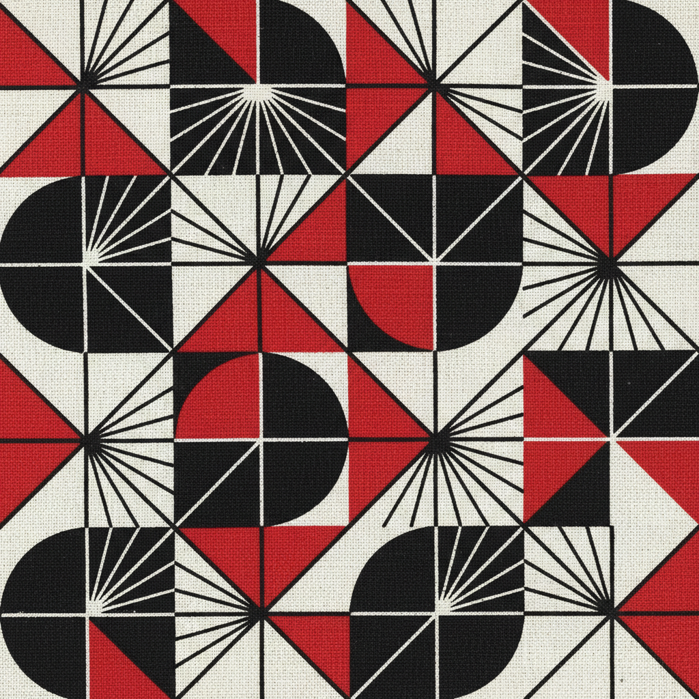

# Stepanova Art 斯捷潘诺娃艺术

> "Technology and industry have confronted art with the problem of construction as an active process, and not as contemplative reflection." — Varvara Stepanova

## 概述

斯捷潘诺娃艺术（Stepanova Art）是20世纪初俄罗斯构成主义女性艺术家瓦尔瓦拉·费奥多罗芙娜·斯捷潘诺娃（Varvara Fyodorovna Stepanova, 1894-1958）创立的生产主义艺术风格。斯捷潘诺娃是罗德钦科的伴侣和合作者——她在绑画、平面设计、纺织设计和舞台设计等领域都做出了独立而重要的贡献。她是"生产主义"（Productivism）运动的核心成员——主张艺术家应该进入工厂，用艺术改造日常生活。

斯捷潘诺娃最具影响力的贡献是她的纺织品设计和运动服装设计。她为第一纺织印花厂设计了大量几何图案的面料——将构成主义的美学带入了千家万户的日常生活。她设计的运动服装以功能性和几何美感著称——打破了传统服装的装饰性，追求身体运动的自由。她的平面设计作品——特别是为杂志和书籍所做的排版设计——也展现了构成主义的视觉力量。

斯捷潘诺娃艺术的核心要素包括：1）生产主义——艺术进入生产和生活；2）纺织设计——几何图案的面料设计；3）运动服装——功能主义的服装设计；4）平面设计——构成主义的排版和版面；5）视觉诗歌——文字与图像的实验；6）协作精神——与罗德钦科的创造性合作；7）女性实践——在男性主导领域的独立贡献。

## 核心特征

| 特征 | 描述 |
|------|------|
| 生产主义 | 艺术进入生产和生活 |
| 纺织设计 | 几何图案面料设计 |
| 运动服装 | 功能主义服装设计 |
| 平面设计 | 构成主义排版版面 |
| 视觉诗歌 | 文字与图像实验 |
| 协作精神 | 创造性合作 |

## 视觉特征

- **几何图案**：重复的几何纺织图案
- **红黑配色**：强烈的红黑色彩对比
- **功能形式**：服装的功能性剪裁
- **网格排版**：严格的网格排版系统
- **运动感**：充满动感的人物姿态
- **工业美学**：机器和工业的视觉语言

## 代表作品

| 作品 | 年代 | 意义 |
|------|------|------|
| *运动服装设计* (Sports Clothing) | 1923 | 功能主义服装 |
| *纺织品设计* (Textile Designs) | 1924-1925 | 日常生活中的构成主义 |
| *塔列尔金之死* (Death of Tarelkin) 舞台 | 1922 | 构成主义舞台 |
| *视觉诗歌* (Visual Poetry) | 1919 | 文字实验 |
| *人物构成* (Figure Compositions) | 1920-1921 | 几何人物 |
| *杂志设计* (Magazine Layouts) | 1920年代 | 平面设计 |

## 历史时间线

| 时期 | 事件 |
|------|------|
| 1894年 | 出生于考纳斯 |
| 1910-1913年 | 喀山美术学校学习 |
| 1914年 | 与罗德钦科相识 |
| 1919-1921年 | 绑画和视觉诗歌创作 |
| 1921年 | 加入生产主义运动 |
| 1923-1925年 | 纺织品和服装设计 |
| 1958年 | 在莫斯科去世 |

## 中国语境

斯捷潘诺娃在中国的知名度有限，但她的艺术实践对中国当代设计和女性艺术研究有多重启示。她将先锋艺术美学带入纺织品和服装设计的实践——"让艺术走进日常生活"——与中国当代"设计改变生活"的理念高度契合。她的几何纺织图案设计方法对中国当代纺织和时装设计有直接的参考价值。作为20世纪初与男性先锋艺术家完全平等的女性创作者，斯捷潘诺娃的成就为讨论中国女性设计师和艺术家的历史贡献提供了重要的比较视角。她证明了"生产主义"的理想——艺术家可以通过设计日常用品来改变社会——在今天依然具有现实意义。

## 概念图

## 与其他风格的关系

- **Constructivism** → 构成主义
- **Rodchenko** → 罗德钦科（伴侣和合作者）
- **Popova** → 波波娃（纺织设计同道）
- **Productivism** → 生产主义
- **Bauhaus** → 包豪斯
- **Fashion Design** → 时装设计

---

*浮光艺志 | Chronicle of Artistry*
