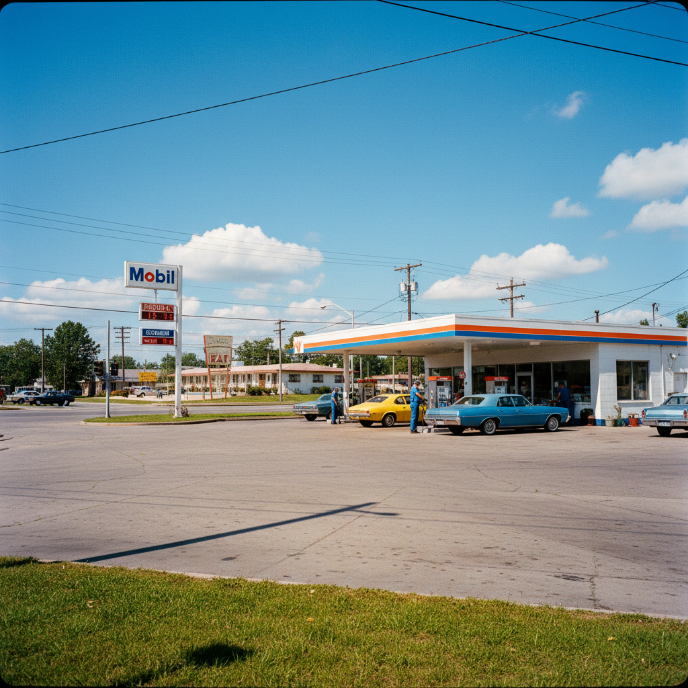

# Stephen Shore 斯蒂芬·肖尔

> **时期：** 1947–至今  
> **关键词：** 新彩色摄影、美国公路、日常风景、大画幅纪实

## 概述

Stephen Shore 是美国摄影师，彩色摄影艺术化的先驱之一。1970年代他驾车穿越美国，用大画幅相机记录加油站、十字路口、汽车旅馆和早餐桌面——这些"无聊"的日常场景在他的镜头下获得了一种平静的纪念碑性。

## 风格特征

- **大画幅彩色**：8×10英寸底片带来极致细节和色彩
- **日常纪念碑**：将平凡场景赋予庄严感
- **美国公路**：加油站、停车场、快餐店等公路景观
- **正面构图**：直接、正面、不加修饰的观看方式
- **色彩民主**：所有颜色平等对待，无主次之分

## 代表作品

- *Uncommon Places*（1973–1981）
- *American Surfaces*（1972–1973）
- *Transparencies: Small Camera Works*
- *Steel Town*（1977）

## 概念图

