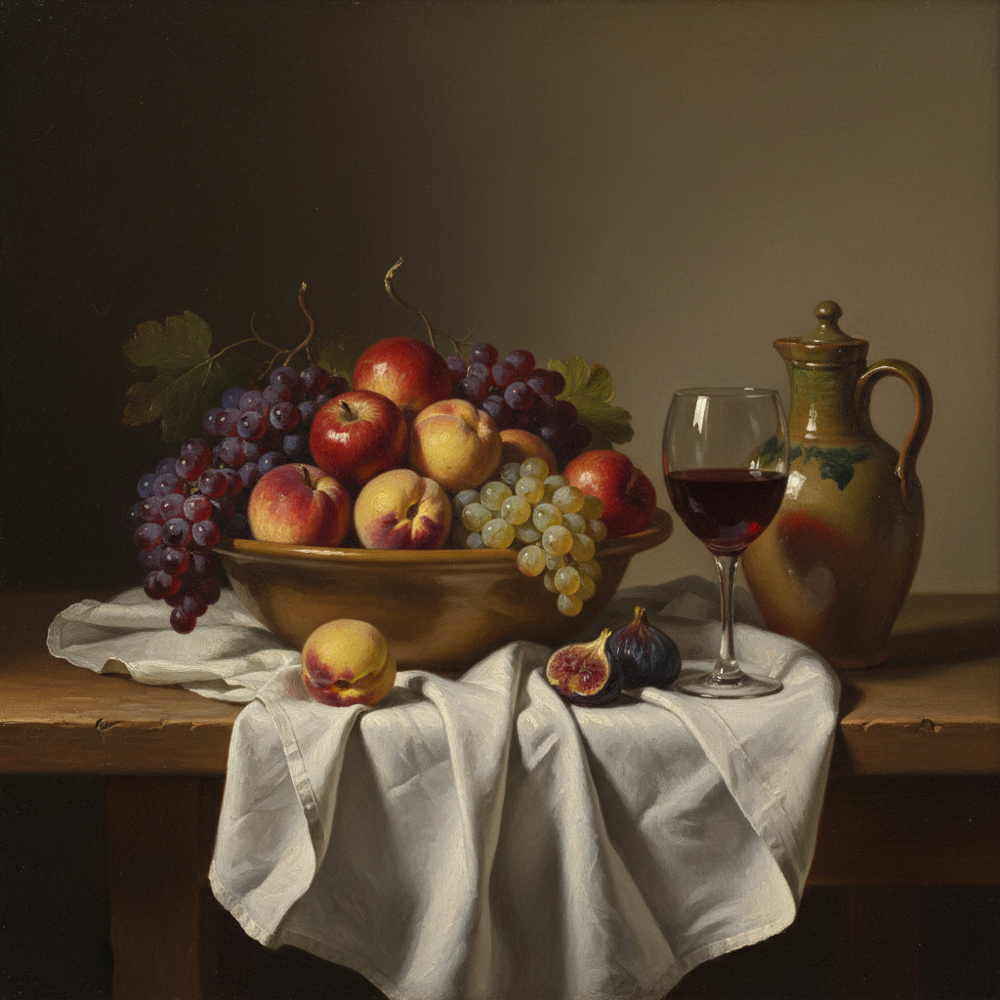

# Still Life Painting 静物画

> **时期：** 古埃及–至今  
> **关键词：** 日常物品、构图安排、光影研究、象征意义、技法展示

## 概述

Still Life（静物画）是以无生命物品为主题的绘画类型——水果、花卉、器皿、食物、书籍被精心安排在桌面上，成为画家研究光影、色彩、质感和构图的实验场。从庞贝壁画中的水果篮到塞尚重新定义空间的苹果，静物画看似最简单，却承载了绘画最本质的追问。

## 风格特征

- **精心构图**：物品的位置和关系经过设计
- **质感表现**：金属、玻璃、织物的不同触感
- **光影研究**：单一光源下的明暗变化
- **象征系统**：物品暗示道德或社会含义
- **技法炫示**：展示画家的写实能力

## 代表人物与作品

- 卡拉瓦乔《水果篮》
- 夏尔丹 厨房静物系列
- 塞尚 苹果与橘子系列
- 乔治·莫兰迪 瓶子系列

## 概念图

