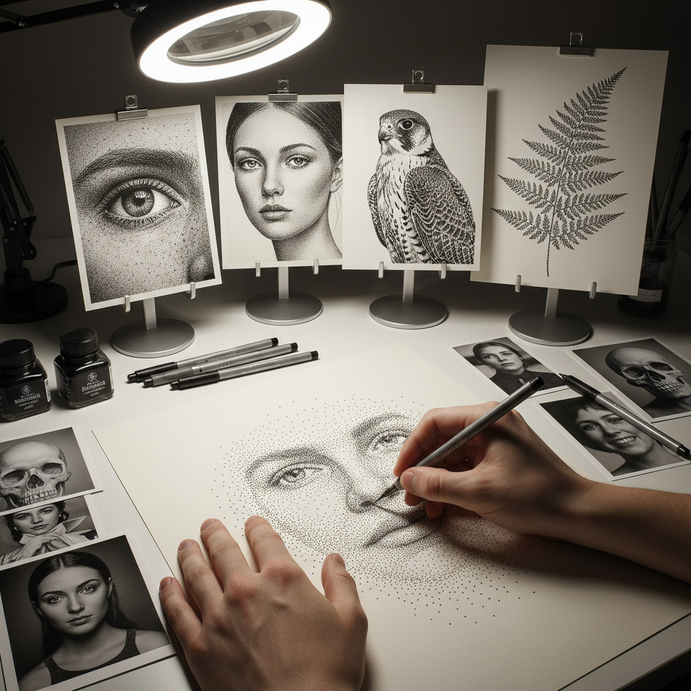

# Stippling Painting 点画法

> "Stippling is the meditation of mark-making — dot by dot, point by point, the artist builds form from nothing, each tiny mark a pixel of patience that accumulates into images of astonishing subtlety and tonal richness." — Unknown

## 概述

点画法（Stippling）是一种完全使用点（dots）来建立图像的绘画和绘图技法。通过控制点的密度、大小和间距，艺术家可以创造出从最亮到最暗的完整色调范围。点越密集，区域越暗；点越稀疏，区域越亮。点画法可以用于墨水笔、铅笔、颜料等多种媒介。

点画法与点彩派（Pointillism）有关但不完全相同——点彩派使用彩色的点来产生光学混色效果，而点画法通常指单色（通常是黑色墨水）的点来建立明暗。点画法需要极大的耐心——一幅精细的点画作品可能包含数十万甚至数百万个点。但最终的效果是独特的——柔和的色调过渡、精细的细节和独特的质感。

## 核心特征

| 特征 | 描述 |
|------|------|
| 点 | 完全使用点构成 |
| 密度 | 通过密度控制明暗 |
| 耐心 | 需要极大耐心 |
| 精细 | 极其精细的效果 |
| 单色 | 通常为单色 |
| 柔和 | 柔和的色调过渡 |

## 视觉特征

- **点状**：可见的点状标记
- **柔和**：柔和的色调过渡
- **精细**：极其精细的细节
- **质感**：独特的点状质感
- **深度**：丰富的明暗深度
- **耐心**：体现极大的耐心

## 代表作品

| 作品 | 艺术家 | 年代 | 意义 |
|------|--------|------|------|
| *Stippled illustrations* | Various | 19世纪 | 科学插画中的点画 |
| *Pen and ink stippling* | Various | 当代 | 钢笔点画 |
| *Stippled portraits* | Various | 当代 | 点画肖像 |
| *Nature stippling* | Various | 当代 | 自然主题点画 |
| *Contemporary stipple art* | Various | 当代 | 当代点画艺术 |

## 历史时间线

| 时期 | 事件 |
|------|------|
| 16世纪 | 版画中的点刻技法 |
| 18世纪 | 点刻版画（stipple engraving）的流行 |
| 19世纪 | 科学插画中的点画法 |
| 20世纪 | 漫画和插画中的点画应用 |
| 当代 | 点画法在当代艺术中的复兴 |
| 当代 | 社交媒体上的点画作品流行 |

## 中国语境

点画法在中国的美术教育和插画领域有一定的应用。中国的一些美术院校在素描和插画课程中教授点画法。中国的插画师使用点画法创作精细的黑白插画。中国的社交媒体上有点画法作品的分享和教程。点画法的"耐心和精细"特点与中国传统工笔画的精神有共鸣。中国的一些当代艺术家使用点画法创作大型作品。

## AI生成概念图

## 与其他风格的关系

- **Pointillism** → 点彩派
- **Pen and Ink** → 钢笔画
- **Hatching** → 排线法
- **Crosshatching** → 交叉排线
- **Engraving** → 雕版
- **Illustration** → 插画

---

*浮光艺志 | Chronicle of Artistry*
