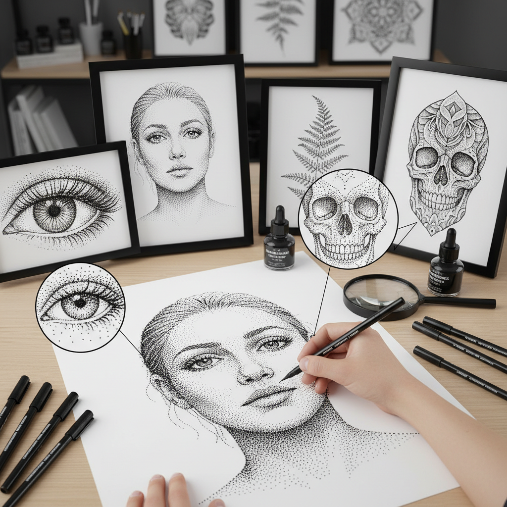

# Stippling 点画法

> "Stippling is the art of patience — thousands of dots, each placed with intention, building form from nothing but the accumulation of tiny marks." — Unknown

## 概述

点画法（Stippling）是一种仅使用点（dots）来创建图像的绘画和版画技法。艺术家通过控制点的密度、大小和间距来表现明暗、质感和形体。点越密集的区域越暗，点越稀疏的区域越亮。Stippling与Pointillism（点彩派）有关联但不同——Pointillism使用彩色点来混合颜色，而Stippling通常是单色的，专注于通过点的密度来表现调子（tonal value）。

Stippling需要极大的耐心和精确性——一幅作品可能包含数万甚至数十万个点。这种技法常用于科学插图、纹身设计、钢笔画和版画中。当代的Stippling艺术家将这种技法推向了极致的精细度。

## 核心特征

| 特征 | 描述 |
|------|------|
| 点 | 仅使用点构成图像 |
| 密度 | 通过密度表现明暗 |
| 单色 | 通常为单色 |
| 耐心 | 需要极大耐心 |
| 精确 | 每个点都需精确放置 |
| 调子 | 丰富的调子层次 |

## 视觉特征

- **点**：由无数个点构成
- **渐变**：通过密度变化实现渐变
- **质感**：独特的颗粒质感
- **精细**：极其精细的细节
- **单色**：通常为黑白
- **空间**：点的间距创造空间感

## 代表作品

| 作品 | 艺术家 | 年代 | 意义 |
|------|--------|------|------|
| *Scientific illustrations* | Various | 18-19世纪 | 科学插图中的点画 |
| *Stipple engravings* | Francesco Bartolozzi | 18世纪 | 点刻版画 |
| *Contemporary stippling* | Xavier Casalta | 当代 | 当代点画艺术 |
| *Dotwork tattoos* | Various | 当代 | 点画纹身 |
| *Stippled portraits* | Various | 当代 | 点画肖像 |

## 历史时间线

| 时期 | 事件 |
|------|------|
| 16世纪 | 点刻版画技法的出现 |
| 18世纪 | Stipple engraving的流行 |
| 19世纪 | 科学插图中的广泛应用 |
| 1880s | 新印象派点彩的影响 |
| 20世纪 | 漫画和插图中的应用 |
| 当代 | 当代点画艺术和纹身的复兴 |

## 中国语境

点画法在中国传统绘画中也有体现——中国画中的"点苔"技法用墨点表现苔藓和植被，是山水画的重要技法之一。米芾的"米点"山水更是以点为主要造型手段。当代中国的钢笔画和插画领域中，Stippling技法被广泛使用。一些中国当代艺术家如杨泳梁等在作品中运用了类似点画的数字技法。中国的纹身文化中，dotwork风格也越来越流行。

## AI生成概念图

## 与其他风格的关系

- **Pointillism** → 点彩派
- **Hatching** → 排线法
- **Pen and Ink** → 钢笔画
- **Engraving** → 版画
- **Dotwork Tattoo** → 点画纹身
- **Scientific Illustration** → 科学插图

---

*浮光艺志 | Chronicle of Artistry*
