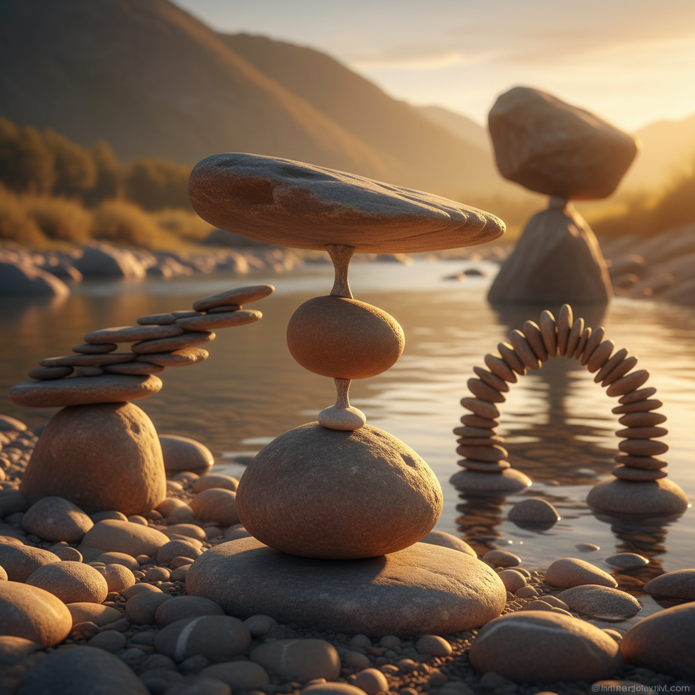

# Stone Balancing Art 石头平衡艺术

> "Stone balancing defies everything we think we know about gravity and stability. A massive boulder perched on a tiny point, a tower of rocks that seems to float in defiance of physics — these impossible arrangements reveal that balance is not about weight or size, but about finding the one point where all forces cancel out. It is meditation made visible, patience made physical, and impermanence made beautiful." — Unknown

## 概述

石头平衡艺术（Stone Balancing Art）是将天然石头以看似不可能的方式堆叠和平衡的艺术形式——不使用任何胶水、支架或人工辅助，仅依靠重力和精确的平衡点将石头叠放成令人惊叹的造型。这是一种极简主义的、冥想性的、短暂的艺术实践。

石头平衡艺术的实践包括：1）单点平衡——将大石头平衡在极小的接触点上；2）石塔（cairn）——将多块石头垂直堆叠；3）悬臂平衡——创造看似悬浮的横向延伸；4）拱形平衡——用石头搭建无支撑的拱形结构；5）水中平衡——在河流或海边进行的石头平衡；6）极限平衡——挑战物理极限的高难度平衡；7）环境平衡——与自然环境融合的石头平衡装置。

## 核心特征

| 特征 | 描述 |
|------|------|
| 平衡 | 精确的重力平衡 |
| 短暂 | 随时可能倒塌 |
| 冥想 | 冥想性的创作过程 |
| 极简 | 极简主义美学 |
| 自然 | 纯天然材料 |
| 不可能 | 看似不可能的造型 |

## 视觉特征

- **灰色**：石头的天然灰色调
- **垂直**：垂直堆叠的张力
- **对比**：大小石头的对比
- **空间**：石头间的空隙
- **环境**：与自然环境的融合
- **光影**：石头表面的光影

## 代表作品

| 作品 | 艺术家 | 年代 | 意义 |
|------|--------|------|------|
| *Gravity Glue* | Michael Grab | 2008至今 | 石头平衡先驱 |
| *Stone balancing* | Bill Dan | 1990年代至今 | 旧金山石头平衡 |
| *Rock stacking* | Various | 当代 | 全球石头平衡运动 |
| *Inukshuk* | 因纽特传统 | 古代至今 | 因纽特石堆 |
| *Cairns* | 各文化传统 | 古代至今 | 传统石堆 |

## 历史时间线

| 时期 | 事件 |
|------|------|
| 史前 | 石堆作为路标和纪念物 |
| 古代 | 各文化的石堆传统 |
| 1990年代 | 石头平衡作为艺术形式兴起 |
| 2000年代 | 社交媒体推动全球传播 |
| 当代 | 石头平衡比赛和节日 |

## 中国语境

石头平衡艺术在中国有独特的文化共鸣。中国传统文化中的"太湖石"审美——欣赏石头的"瘦、漏、透、皱"——与石头平衡艺术对石头形态的敏感性有深层联系。中国传统的"叠石"——园林中的假山堆叠——虽然使用了固定材料，但其美学追求与石头平衡艺术相通。中国的禅宗文化——强调当下、专注和无常——与石头平衡的冥想性质高度契合。中国当代有越来越多的石头平衡爱好者和艺术家，他们在中国的河流、海滩和山间进行创作，将这种艺术形式与中国的自然景观结合。

## AI生成概念图

## 与其他风格的关系

- **Land Art** → 大地艺术
- **Ephemeral Art** → 短暂艺术
- **Minimalism** → 极简主义
- **Meditation Art** → 冥想艺术
- **Nature Art** → 自然艺术
- **Sculpture** → 雕塑

---

*浮光艺志 | Chronicle of Artistry*
