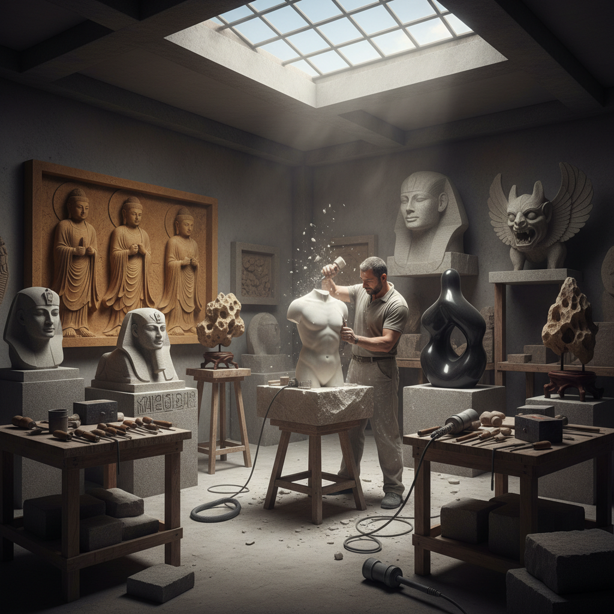

# Stone Carving Art 石雕艺术

> "Stone is the earth's memory — compressed time made solid, carrying within it the record of ancient seas and vanished mountains. The stone carver reads this memory with hammer and chisel, releasing forms that have waited millions of years to emerge. Unlike clay or wax, stone permits no second thoughts: each stroke is irreversible, each chip gone forever. This is what gives stone carving its gravity and its grandeur — the knowledge that every mark is permanent." — Unknown

## 概述

石雕艺术（Stone Carving Art）是以各种天然石材为材料，通过凿刻、雕琢、磨光等技法创造雕塑、建筑装饰和各种艺术品的造型艺术——是人类最古老的艺术形式之一，从史前的岩画到当代的石雕装置，石雕贯穿了整个人类文明史。

石雕艺术的实践包括：1）圆雕——完全立体的石雕作品；2）浮雕——附着在平面上的半立体雕刻；3）建筑石雕——建筑上的石雕装饰；4）墓碑石雕——墓碑和纪念碑的雕刻；5）石刻——在石面上的文字和图案雕刻；6）石窟雕塑——在岩壁上开凿的大型雕塑；7）当代石雕——将石材作为当代艺术媒介的创作。

## 核心特征

| 特征 | 描述 |
|------|------|
| 永恒 | 极其持久的材料 |
| 不可逆 | 每一刀都不可撤回 |
| 重量 | 物理上的重量感 |
| 纹理 | 天然的石材纹理 |
| 庄严 | 天然的庄严感 |
| 多样 | 石材种类极其丰富 |

## 视觉特征

- **质感**：不同石材的独特质感
- **纹理**：天然的石材纹理和色彩
- **光影**：雕刻面上的光影变化
- **体量**：从微型到巨型的体量感
- **肌理**：凿刻留下的工具痕迹
- **光泽**：抛光后的石材光泽

## 代表作品

| 作品 | 艺术家/文化 | 年代 | 意义 |
|------|-------------|------|------|
| *大卫像* | Michelangelo | 1504 | 文艺复兴石雕巅峰 |
| *龙门石窟* | 中国北魏-唐 | 493-907 | 中国石窟艺术 |
| *吴哥窟浮雕* | 高棉帝国 | 12世纪 | 东南亚石雕 |
| *复活节岛石像* | 拉帕努伊 | 1250-1500 | 巨石雕塑 |
| *Cloud Gate* | Anish Kapoor | 2006 | 当代石材/金属雕塑 |

## 历史时间线

| 时期 | 事件 |
|------|------|
| 史前 | 最早的石刻和岩画 |
| 古代 | 埃及、希腊、罗马石雕 |
| 中世纪 | 教堂和石窟雕塑 |
| 文艺复兴 | 石雕艺术的巅峰 |
| 当代 | 石雕的当代艺术实践 |

## 中国语境

石雕艺术在中国有极其辉煌的传统——中国的石雕艺术是世界石雕艺术的重要组成部分。中国的石窟艺术（敦煌、云冈、龙门、大足等）是世界文化遗产——代表了中国佛教石雕的最高成就。中国的石狮、石马、石人等陵墓石雕有悠久的传统——从汉代的霍去病墓石雕到明清的帝陵石雕。中国的寿山石雕、青田石雕、昌化石雕和巴林石雕是中国四大名石雕刻——以印章和摆件为主要形式。中国的石碑和摩崖石刻是独特的石雕形式——将书法和石雕结合在一起。中国当代的一些雕塑家将传统石雕技法与现代艺术理念相结合——创造出具有当代感的石雕作品。中国的石雕产业在惠安、曲阳等地形成了完整的产业集群。

## AI生成概念图

## 与其他风格的关系

- **Sculpture** → 雕塑
- **Jade Carving** → 玉雕艺术
- **Architecture** → 建筑艺术
- **Relief Art** → 浮雕艺术
- **Monumental Art** → 纪念碑艺术
- **Buddhist Art** → 佛教艺术

---

*浮光艺志 | Chronicle of Artistry*
