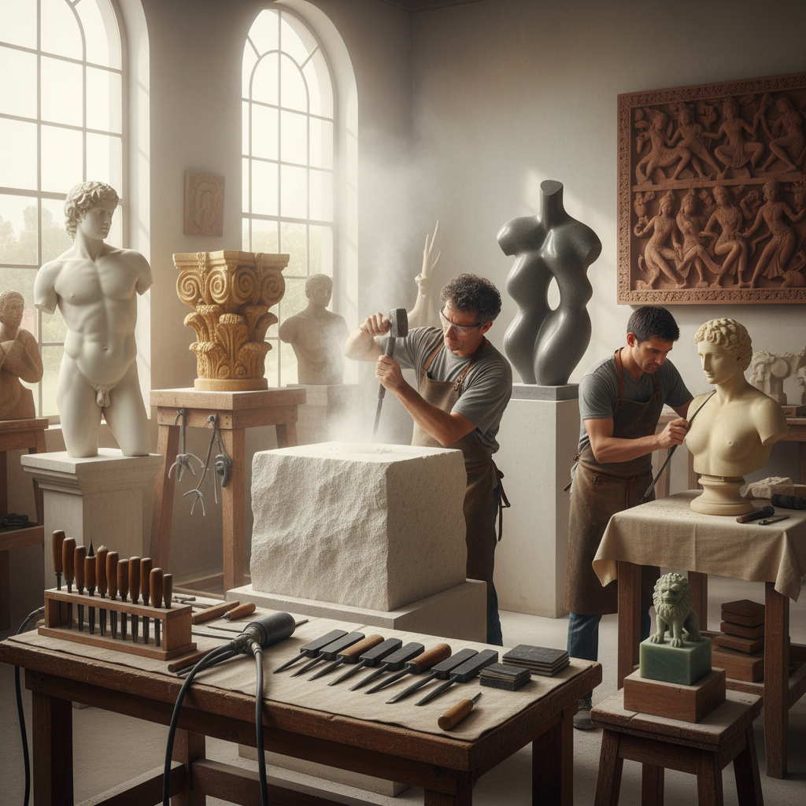

# Stone Carving Technique 石雕技法

> "Stone carving is a conversation with eternity — each strike of the chisel a question asked of the stone, each chip removed an answer revealed, until the form that was always hidden within the block finally stands free in the light." — Unknown

## 概述

石雕技法（Stone Carving Technique）是使用锤子、凿子和其他工具从石材中去除多余部分，创造出三维形态的雕刻艺术。石雕是人类最古老的艺术形式之一——从旧石器时代的石器到古埃及的狮身人面像，从古希腊的大理石雕像到米开朗基罗的大卫像。石雕的核心理念是"减法"——从一块完整的石材中去除不需要的部分，露出隐藏在石头中的形态。

石雕使用的石材包括：大理石（质地细腻，适合精细雕刻）、花岗岩（坚硬耐久）、石灰石（较软，适合初学者）、砂岩（纹理丰富）、皂石（最软，适合手工雕刻）等。石雕工具从传统的锤子和凿子发展到现代的气动工具和金刚石切割工具。石雕技法包括：点雕（pointing）、直接雕刻（direct carving）、打磨抛光等。

## 核心特征

| 特征 | 描述 |
|------|------|
| 减法 | 去除多余材料 |
| 永久 | 极其永久耐久 |
| 石材 | 使用天然石材 |
| 工具 | 锤子和凿子 |
| 古老 | 最古老的艺术形式 |
| 力量 | 需要体力和技巧 |

## 视觉特征

- **坚实**：坚实的质感
- **永恒**：永恒的感觉
- **光滑**：抛光的光滑表面
- **纹理**：石材的自然纹理
- **体量**：强烈的体量感
- **光影**：形体上的光影变化

## 代表作品

| 作品 | 艺术家 | 年代 | 意义 |
|------|--------|------|------|
| *David* | Michelangelo | 1504 | 文艺复兴石雕巅峰 |
| *Venus de Milo* | Unknown | 公元前 | 古希腊雕塑 |
| *The Kiss* | Rodin | 1882 | 现代雕塑 |
| *Moai statues* | 拉帕努伊人 | 古代 | 复活节岛石像 |
| *Contemporary stone sculpture* | Various | 当代 | 当代石雕 |

## 历史时间线

| 时期 | 事件 |
|------|------|
| 旧石器时代 | 最早的石器制作 |
| 古埃及 | 大型石雕的发展 |
| 古希腊 | 大理石雕塑的黄金时代 |
| 文艺复兴 | 米开朗基罗等大师 |
| 19-20世纪 | 罗丹和现代雕塑 |
| 当代 | 当代石雕的多样化 |

## 中国语境

石雕在中国有极其悠久和辉煌的历史——从秦始皇兵马俑到龙门石窟、云冈石窟的佛教造像，从传统的石狮子到寿山石雕。中国的石雕传统包括：建筑石雕（牌坊、石桥、石栏）、宗教石雕（佛像、石窟）、印章石雕（寿山石、青田石、昌化石）、园林石雕等。中国的惠安石雕、曲阳石雕等都是国家级非物质文化遗产。中国的当代雕塑教育中，石雕是重要的基础课程。

## AI生成概念图

## 与其他风格的关系

- **Wood Carving** → 木雕
- **Sculpture** → 雕塑
- **Architecture** → 建筑
- **Marble Sculpture** → 大理石雕塑
- **Monumental Art** → 纪念性艺术
- **Seal Carving** → 篆刻

---

*浮光艺志 | Chronicle of Artistry*
