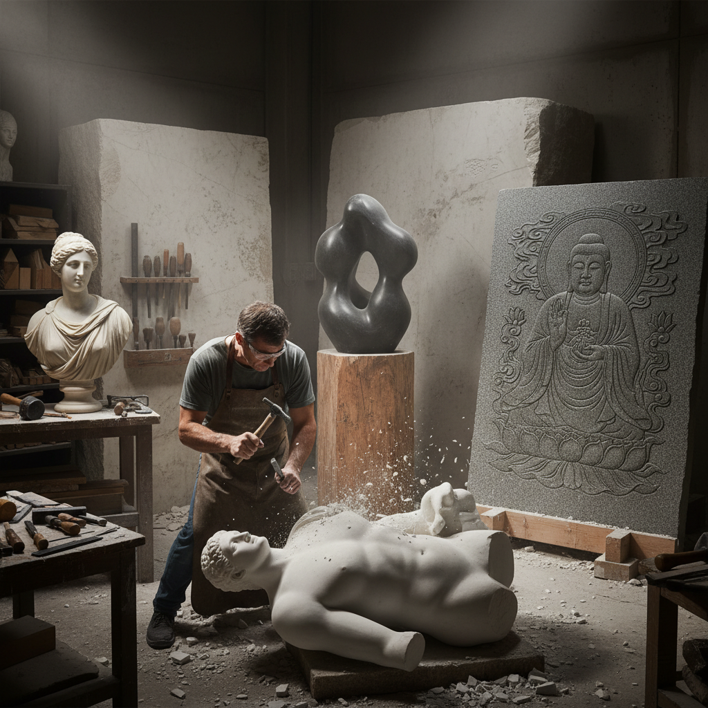

# Stone Carving 石雕

> "Stone carving is a conversation with eternity — the sculptor removes what is not the sculpture, revealing what the stone always wanted to be." — Unknown

## 概述

石雕（Stone Carving）是使用锤子、凿子和其他工具从石材中去除多余部分，揭示隐藏在石头中的形态的雕塑艺术。石雕是人类最古老的艺术形式之一——从旧石器时代的石器到古埃及的狮身人面像，从古希腊的大理石雕塑到米开朗基罗的大卫像。石雕的独特之处在于它的永恒性——石头是最持久的艺术材料，石雕作品可以保存数千年。

石雕的哲学在于：减法的艺术——如米开朗基罗所说："雕塑已经在石头里了，我只是去掉多余的部分。"每一锤每一凿都是不可逆的决定。

## 核心特征

| 特征 | 描述 |
|------|------|
| 减法 | 去除材料成型 |
| 石材 | 使用各种石材 |
| 永恒 | 极其持久的材料 |
| 不可逆 | 每一刀不可撤回 |
| 体力 | 需要体力和技巧 |
| 古老 | 最古老的艺术形式 |

## 视觉特征

- **质感**：石材的天然质感
- **体量**：厚重的体量感
- **光影**：光影在表面的变化
- **永恒**：永恒感的视觉效果
- **细节**：精细的雕刻细节
- **力量**：力量感的表达

## 代表作品

| 作品 | 艺术家 | 年代 | 意义 |
|------|--------|------|------|
| *Great Sphinx* | 匿名 | 公元前2500年 | 古埃及石雕 |
| *Parthenon sculptures* | Phidias | 公元前5世纪 | 古希腊巅峰 |
| *David* | Michelangelo | 1504 | 文艺复兴杰作 |
| *Angkor Wat reliefs* | 匿名 | 12世纪 | 吴哥窟浮雕 |
| *Henry Moore sculptures* | Henry Moore | 20世纪 | 现代石雕 |

## 历史时间线

| 时期 | 事件 |
|------|------|
| 旧石器时代 | 最早的石器和石雕 |
| 古埃及 | 巨型石雕的传统 |
| 古希腊 | 大理石雕塑的巅峰 |
| 中世纪 | 教堂石雕装饰 |
| 文艺复兴 | 米开朗基罗等大师 |
| 当代 | 当代石雕艺术 |

## 中国语境

中国有极其丰富的石雕传统——从秦始皇兵马俑到龙门石窟、云冈石窟的佛教造像，从汉代画像石到明清陵墓石刻，中国石雕艺术博大精深。中国的石雕材料丰富多样：青石、汉白玉、花岗岩、砂岩等。福建惠安石雕、浙江青田石雕、河北曲阳石雕等都是著名的石雕产地和流派。当代中国的石雕艺术家在传承传统的同时也在探索当代表达。

## AI生成概念图

## 与其他风格的关系

- **Sculpture** → 雕塑
- **Relief Sculpture** → 浮雕
- **Jade Carving** → 玉雕
- **Architecture** → 建筑石雕
- **Monumental Art** → 纪念碑艺术
- **Lapidary** → 宝石切割

---

*浮光艺志 | Chronicle of Artistry*
