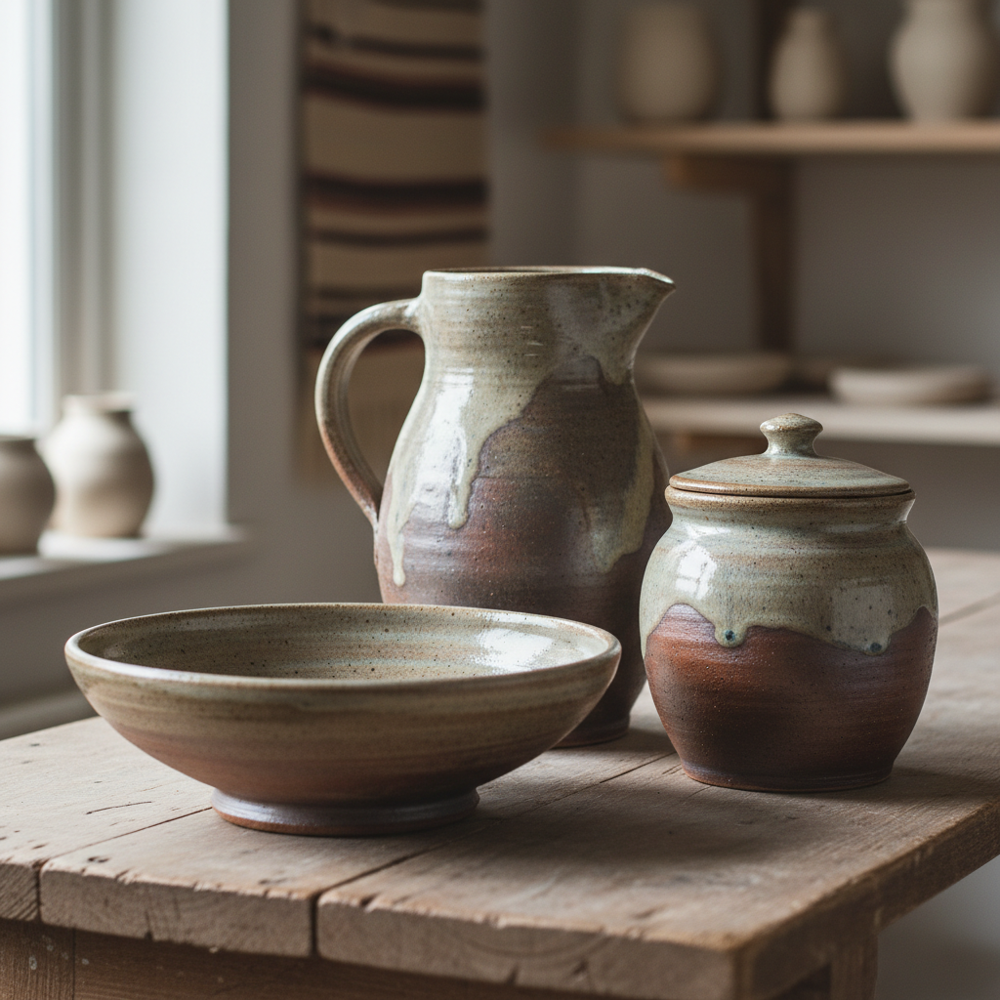

# Stoneware Art 炻器艺术

> "Stoneware is clay's middle kingdom — fired hot enough to vitrify into a dense, waterproof body that rings when struck, yet not so refined as porcelain, retaining an honest earthiness in its iron-flecked surface and toasted color, the workhorse ceramic that has carried salt and sauerkraut, ale and acid, surviving centuries of daily use because its very nature is endurance, the material equivalent of a stone wall built to last." — Unknown

## 概述

炻器艺术（Stoneware Art）是一种以高温烧制（1200-1300°C）的致密陶瓷艺术。炻器的坯体在高温下部分玻化，形成致密、坚硬、不透水的器壁——介于陶器的粗犷和瓷器的精致之间。炻器是人类日常生活中最实用的陶瓷类型，从储存容器到餐具，从建筑材料到艺术创作，炻器以其坚固耐用和质朴美感服务了人类数千年。

炻器艺术的核心要素包括：1）高温烧制——1200-1300°C的烧成温度；2）致密坯体——部分玻化的致密结构；3）不透水——无需施釉即可防水；4）坚硬耐用——极高的机械强度；5）质朴美感——自然的泥土色调；6）实用性——适合日常使用；7）多样性——从粗犷到精细的广泛范围。

## 核心特征

| 特征 | 描述 |
|------|------|
| 高温烧制 | 1200-1300°C烧成 |
| 致密坚硬 | 部分玻化的致密结构 |
| 不透水 | 无需施釉即防水 |
| 质朴美感 | 自然的泥土色调 |
| 极耐用 | 高机械强度和耐化学性 |
| 实用至上 | 最适合日常使用的陶瓷 |

## 视觉特征

- **泥土色调**：灰色、棕色、米色的自然色
- **致密质感**：紧密的坯体质感
- **铁斑点**：铁质矿物的自然斑点
- **厚实器壁**：坚实厚重的器壁
- **自然釉色**：灰釉、盐釉等自然色调
- **质朴造型**：实用为主的器形

## 代表作品

| 作品 | 艺术家/文化 | 年代 | 意义 |
|------|-------------|------|------|
| *中国原始青瓷* | 中国商代 | 前1600年 | 最早的炻器 |
| *德国盐釉炻器* | 莱茵地区 | 15-18世纪 | 欧洲炻器传统 |
| *日本备前烧* | 日本 | 12世纪起 | 日本炻器美学 |
| *Bernard Leach作品* | Bernard Leach | 20世纪 | 现代炻器运动 |
| *当代炻器艺术* | 各地陶艺家 | 当代 | 炻器的艺术化 |

## 历史时间线

| 时期 | 事件 |
|------|------|
| 前1600年 | 中国商代出现原始炻器 |
| 12世纪 | 日本备前烧等炻器传统形成 |
| 15世纪 | 德国莱茵地区盐釉炻器兴起 |
| 20世纪 | Bernard Leach推动现代炻器运动 |
| 当代 | 炻器在艺术与设计中的广泛应用 |

## 中国语境

中国是炻器的发源地——商代的原始青瓷实际上就是最早的炻器。中国的炻器传统极为丰富：宜兴紫砂壶是世界上最著名的炻器之一，其独特的透气性使其成为泡茶的理想器具。中国南方的各种缸、坛、罐——从酱缸到酒坛——都是炻器的日常应用。中国当代陶艺中，炻器因其质朴的美感和良好的可塑性而受到广泛欢迎——许多陶艺家选择炻器作为创作媒介，追求"返璞归真"的审美理想。中国的炻器传统证明了这种材料既可以是最日常的器物，也可以是最精致的艺术品。

## AI生成概念图

## 与其他风格的关系

- **Earthenware** → 陶器
- **Porcelain** → 瓷器
- **Salt Glaze** → 盐釉
- **Bizen Ware** → 备前烧
- **Yixing Zisha** → 宜兴紫砂
- **Studio Pottery** → 工作室陶艺

---

*浮光艺志 | Chronicle of Artistry*
