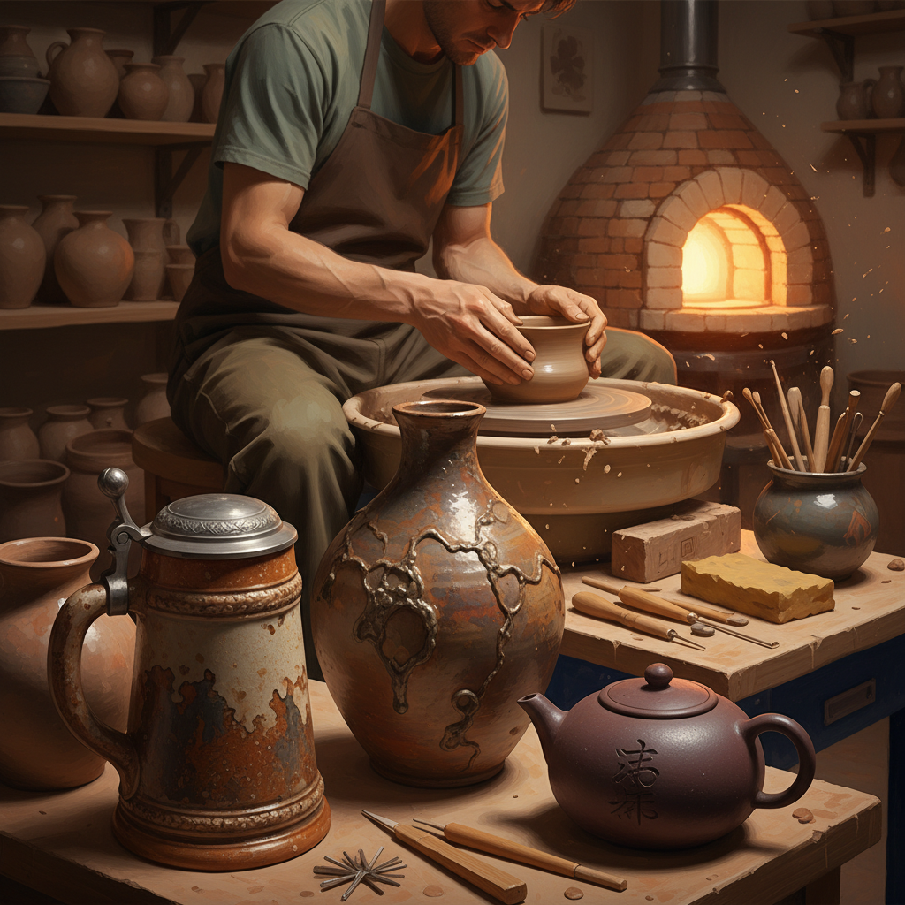

# Stoneware 炻器

> "Stoneware is clay's middle path — harder than earthenware, humbler than porcelain, it is the potter's honest workhorse." — Unknown

## 概述

炻器（Stoneware）是在1200-1300°C高温下烧制的陶瓷，介于低温陶器（earthenware）和高温瓷器（porcelain）之间。炻器的胎体在高温下部分�ite化，变得致密、坚硬、不透水——即使不施釉也能盛水。炻器是最实用的陶瓷类型——从中世纪德国的盐釉啤酒杯到日本的备前烧，从中国的紫砂壶到当代工作室陶艺，炻器以其质朴、耐用和多样性成为陶艺家最常用的材料。

炻器的哲学在于：质朴的力量——不追求瓷器的精致透明，而是以泥土本色的质朴和高温赋予的坚固，创造出既美观又实用的器物。

## 核心特征

| 特征 | 描述 |
|------|------|
| 高温 | 1200-1300°C烧制 |
| 致密 | 胎体致密不透水 |
| 质朴 | 质朴的泥土质感 |
| 实用 | 极其实用耐用 |
| 多样 | 釉色和技法多样 |
| 中间 | 介于陶和瓷之间 |

## 视觉特征

- **质朴**：泥土的质朴感
- **厚实**：厚实的器壁
- **釉色**：丰富的釉色变化
- **温暖**：温暖的色调
- **手感**：手工的触感
- **自然**：自然的窑变效果

## 代表作品

| 作品 | 艺术家 | 年代 | 意义 |
|------|--------|------|------|
| *German salt-glazed steins* | 匿名 | 15世纪+ | 德国盐釉炻器 |
| *Bizen ware* | 匿名 | 传统 | 日本备前烧 |
| *Yixing teapots* | 匿名 | 明代+ | 宜兴紫砂壶 |
| *Bernard Leach stoneware* | Bernard Leach | 20世纪 | 现代炻器先驱 |
| *Shoji Hamada works* | 濱田庄司 | 20世纪 | 民艺运动炻器 |

## 历史时间线

| 时期 | 事件 |
|------|------|
| 公元前1400年 | 中国最早的炻器 |
| 中世纪 | 德国盐釉炻器的发展 |
| 明代 | 宜兴紫砂的兴起 |
| 传统 | 日本各地炻器传统 |
| 20世纪 | 现代工作室炻器运动 |
| 当代 | 当代炻器艺术 |

## 中国语境

中国是炻器的发源地——商代就已经出现了原始瓷（实为高温炻器）。中国最著名的炻器是宜兴紫砂——用特殊的紫砂泥制作的茶壶，因其独特的透气性和泡茶效果而闻名世界。紫砂壶被列为国家级非物质文化遗产。此外，中国的建水紫陶、坭兴陶等也是著名的炻器品种。当代中国的陶艺家广泛使用炻器材料进行创作。

## AI生成概念图

## 与其他风格的关系

- **Pottery** → 陶艺（更广义）
- **Porcelain** → 瓷器（更高温）
- **Raku** → 乐烧（特殊烧制）
- **Salt Glazing** → 盐釉
- **Wood Firing** → 柴烧
- **Ceramics** → 陶瓷总称

---

*浮光艺志 | Chronicle of Artistry*
