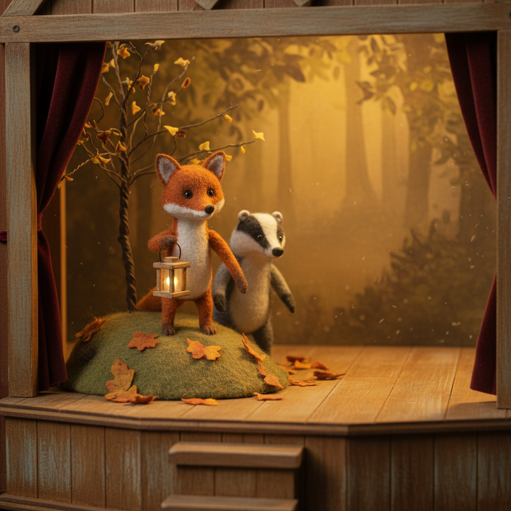

# Stop Motion Art 定格动画艺术

> **时期：** 1890年代–至今  
> **关键词：** 逐帧拍摄、实体偶动画、手工质感、时间雕塑、物质性

## 概述

Stop Motion（定格动画）是最古老的动画技术之一，通过逐帧移动实体物件并拍摄，创造出运动的幻觉。从早期的黏土动画到当代的精密偶动画，定格动画以其独特的手工质感、物质重量感和"不完美的完美"著称——每一帧都是一次微型雕塑的重新创作。

## 风格特征

- **实体质感**：真实材料的触感和重量
- **逐帧运动**：微妙的抖动赋予生命感
- **手工痕迹**：指纹、接缝等人工痕迹的魅力
- **微缩世界**：精密的小比例场景搭建
- **光影真实**：实体打光的自然效果

## 代表人物与作品

- 威利斯·奥布莱恩《金刚》(1933)
- 雷·哈里豪森《杰森与阿尔戈英雄》
- 尼克·帕克《超级无敌掌门狗》
- 韦斯·安德森《犬之岛》
- 莱卡工作室《鬼妈妈》《久保与二弦琴》

## 概念图

