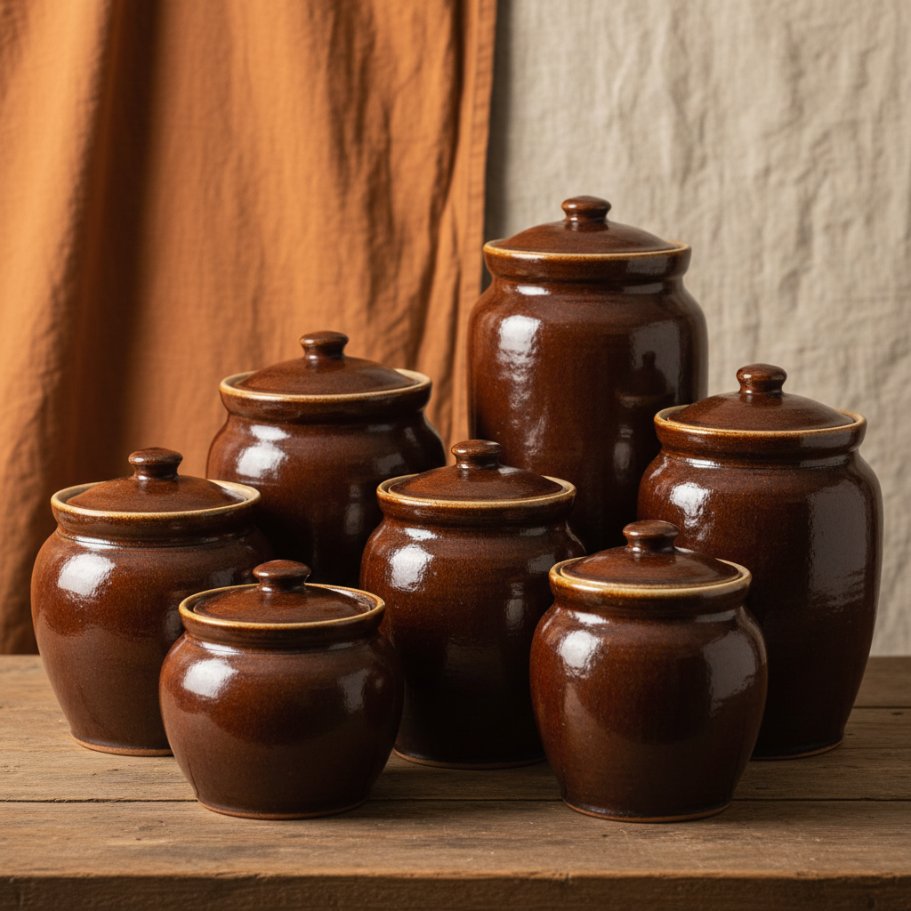

# Storage Jar Art 储物罐艺术

> "The storage jar is civilization's memory vessel — clay shaped to hold grain through winter, oil through drought, and seeds through seasons, each jar a promise that the future will be fed, the most fundamental of all ceramic forms because without it there is no surplus, without surplus no cities, without cities no art, the humble jar as the foundation upon which all culture is built." — Unknown

## 概述

储物罐艺术（Storage Jar Art）是一种以陶瓷材料制作储存容器的艺术形式，涵盖从远古的粮食储存罐到当代的装饰性储物器。储物罐是人类最早制作的陶瓷器物之一——它的出现标志着人类从游牧采集向定居农业的转变。储物罐将实用功能与装饰美学结合——从简单的素面罐到精美的彩绘罐，储物罐的发展反映了人类文明的进步。

储物罐艺术的核心要素包括：1）储存功能——保存食物和物品；2）密封设计——防潮防虫的设计；3）造型多样——各种尺寸和形态；4）装饰传统——各文化的装饰风格；5）文明基础——农业文明的基础器物；6）材质适宜——陶瓷的保鲜特性；7）文化载体——承载文化信息。

## 核心特征

| 特征 | 描述 |
|------|------|
| 储存功能 | 保存食物物品 |
| 密封设计 | 防潮防虫设计 |
| 造型多样 | 各种尺寸形态 |
| 装饰传统 | 各文化装饰风格 |
| 文明基础 | 农业文明基础 |
| 文化载体 | 承载文化信息 |

## 视觉特征

- **圆腹造型**：便于储存的圆腹形
- **窄口设计**：便于密封的窄口
- **厚实器壁**：保温隔热的厚壁
- **装饰纹样**：各种装饰图案
- **质朴美感**：功能导向的质朴美
- **尺度多样**：从小罐到大缸

## 代表作品

| 作品 | 艺术家/文化 | 年代 | 意义 |
|------|-------------|------|------|
| *仰韶彩陶罐* | 中国新石器 | 前5000年 | 中国最早的储物罐 |
| *埃及储物罐* | 古埃及 | 各时期 | 埃及储存传统 |
| *希腊储物罐* | 古希腊 | 各时期 | 希腊储存传统 |
| *日本储物罐* | 日本 | 各时期 | 日本储存传统 |
| *当代储物罐* | 各地陶艺家 | 当代 | 当代的诠释 |

## 历史时间线

| 时期 | 事件 |
|------|------|
| 前10000年 | 最早的陶制储物容器 |
| 新石器 | 农业革命与储物罐的普及 |
| 各时期 | 各文化储物罐的发展 |
| 工业化 | 金属和玻璃容器的替代 |
| 当代 | 陶瓷储物罐的艺术化复兴 |

## 中国语境

中国有世界上最悠久的陶瓷储物罐传统之一。仰韶文化的彩陶罐是中国最早的精美储物器——其上的鱼纹、人面纹等图案是中国最早的艺术创作。中国传统的米缸、面缸、油罐、茶叶罐等都是储物罐的日常应用。中国的紫砂茶叶罐以其良好的透气性和保鲜性著称——是储存茶叶的理想容器。中国传统的腌菜坛、泡菜坛也是储物罐的重要类型——其水封设计是中国陶瓷工艺的智慧结晶。中国当代陶艺家正在重新诠释储物罐的美学——将传统器形与当代设计结合，创造出既实用又美观的现代储物器。

## AI生成概念图

## 与其他风格的关系

- **Functional Ceramics** → 功能陶瓷
- **Neolithic Pottery** → 新石器陶器
- **Fermentation Vessel** → 发酵容器
- **Food Culture** → 食品文化
- **Container Design** → 容器设计
- **Traditional Craft** → 传统工艺

---

*浮光艺志 | Chronicle of Artistry*
