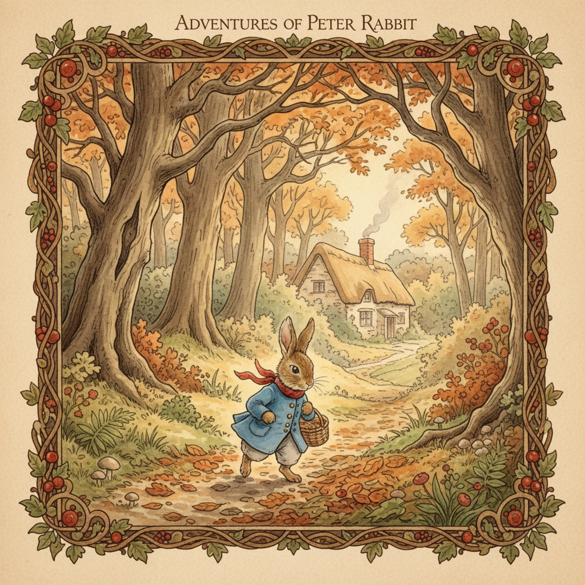

# Storybook Illustration 故事书插画



> **"水彩晕染、手绘线条、童话般的温暖——打开一本书就进入另一个世界。"**

## 概述

| 维度 | 描述 |
|------|------|
| 时期 | 1900s "黄金时代"–至今 |
| 别名 | Storybook Style, Children's Book Illustration, Picture Book Art |
| 核心色彩 | 柔和水彩色、暖黄、森林绿、天空蓝、奶油白 |
| 关键元素 | 水彩/水粉、手绘线条、叙事性构图、童话意象、装饰性边框 |
| 代表人物 | Arthur Rackham, Beatrix Potter, Maurice Sendak, Quentin Blake |
| 关联风格 | Naive Art, Fairycore, Cottagecore, Whimsical, Mid-Century Illustration |

---

## 历史脉络

| 年份 | 事件 |
|------|------|
| 1900-1914 | "黄金时代"——Arthur Rackham, Edmund Dulac, Kay Nielsen |
| 1902 | Beatrix Potter《彼得兔》——现代绘本诞生 |
| 1943 | 圣-埃克苏佩里《小王子》——水彩插画经典 |
| 1963 | Maurice Sendak《野兽国》——儿童绘本革命 |
| 1970s | Quentin Blake, Eric Carle——风格多元化 |
| 2000s | 独立绘本复兴——手工质感回归 |
| 2020s | AI时代——"Storybook Style"成为热门生成风格 |

### 核心哲学

故事书插画的精神是**"每一页都是一扇窗——打开它，你就进入了另一个世界"**：
- 叙事 = 核心（"图画在讲故事——不只是装饰"）
- 手绘 = 温度（"笔触里有人的呼吸"）
- 想象 = 无限（"在这里，兔子会穿衣服，树会说话"）
- 童真 = 力量（"用孩子的眼睛看世界——是一种超能力"）
- "好的绘本插画，大人看了也会流泪"

---

## 视觉语法

### 色彩系统

```
主色：
  暖黄 (#F5DEB3) — 纸张、阳光、温暖
  森林绿 (#228B22) — 自然、冒险
  天空蓝 (#87CEEB) — 梦幻、开阔
  奶油白 (#FFFDD0) — 纸张、纯净

辅色：
  玫瑰粉 (#FFB7C5) — 温柔
  赭石 (#CC7722) — 泥土、古典
  深蓝 (#191970) — 夜晚、神秘

规则：
  - 水彩质感（透明、晕染）
  - 留白重要
  - 暖色调为主
  - 手绘线条（不完美=有温度）

质感：
  水彩 — 透明、流动、晕染
  纸张 — 纹理、颗粒
  墨水 — 线条、细节
  铅笔 — 草稿感、柔和
```

### 标志性元素

| 类别 | 元素 |
|------|------|
| 技法 | 水彩、水粉、墨线、拼贴、铅笔 |
| 构图 | 叙事性、场景化、装饰边框、文图融合 |
| 意象 | 森林、动物、城堡、月亮、花园、小屋 |
| 角色 | 拟人动物、小孩、精灵、巫师 |
| 氛围 | 温暖、梦幻、冒险、神秘、幽默 |
| 态度 | 童真、想象力、叙事、手工、温度 |

---

## 风格谱系

### 黄金时代 (1900-1914)
- Arthur Rackham: 精细墨线+水彩，哥特童话
- Edmund Dulac: 东方主义+装饰性，华丽
- Kay Nielsen: 北欧神话+Art Nouveau

### 现代经典 (1940s-1970s)
- 《小王子》: 简笔水彩，哲学童话
- Maurice Sendak: 交叉线影+野性想象
- Eric Carle: 拼贴+鲜艳色块

### 当代复兴 (2000s-至今)
- 独立绘本: 手工质感、实验技法
- AI生成: "Storybook Style"成为流行prompt
- 跨媒介: 绘本美学进入动画、游戏、品牌

---

## 与千禧怀旧的关系

### 绘本美学的数字复兴
- 2020s "Storybook Style" = AI图像生成最热门风格之一
- Instagram/Pinterest 上的"绘本感"摄影和设计
- 独立游戏中的手绘绘本美学（如 Ori, Hollow Knight）
- "在数字时代，手绘的温度变得更加珍贵"

### 与其他 -core 的交叉
- Cottagecore + Storybook = 田园童话
- Fairycore + Storybook = 精灵绘本
- Dark Academia + Storybook = 古典文学插画

---

## 中国语境

- 中国绘本产业的快速发展
- 中国水墨画与故事书插画的融合
- 几米、蔡皋等中国绘本艺术家
- "绘本馆"文化在中国城市的兴起

---

## 设计应用

| 场景 | 应用方式 |
|------|----------|
| 出版 | 绘本+封面+内页+装帧 |
| 品牌 | 手绘+温暖+叙事+童真+自然 |
| 数字 | 插画风UI+手绘图标+叙事动画 |
| 空间 | 儿童空间+书店+咖啡馆+展览 |

---

## 相关风格

← [Fairycore 仙女核](fairycore.md) | [Naive Art 稚拙艺术](naive-art.md) →

↑ [返回千禧怀旧目录](README.md) | [返回总目录](../README.md)
