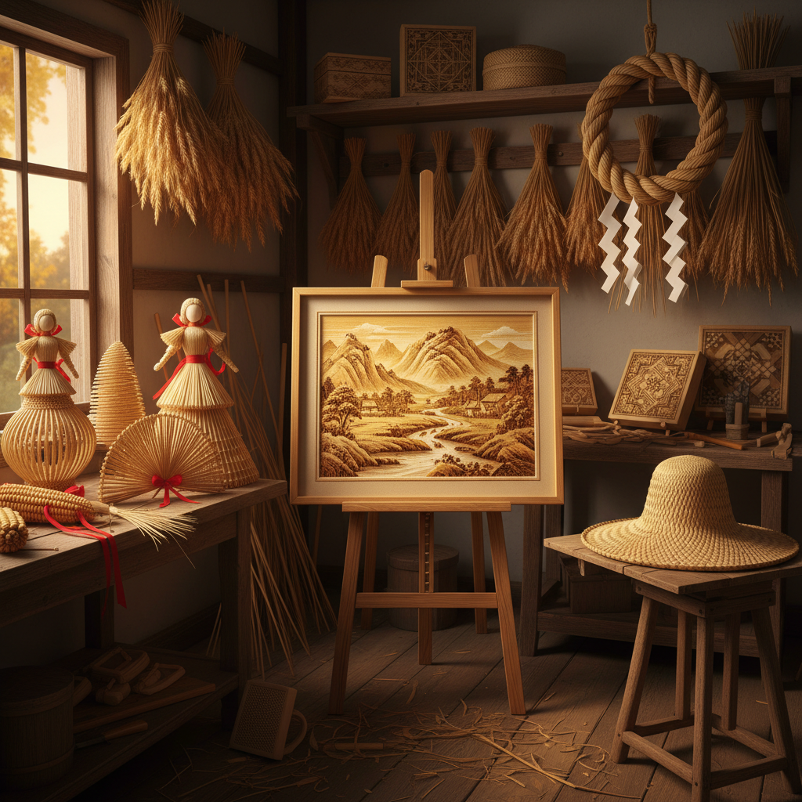

# Straw Art 草编艺术

> "Straw is the humblest of art materials — the leftover stems of grain after harvest, destined for animal bedding or mulch. Yet in skilled hands, these golden tubes become hats and baskets, dolls and ornaments, even entire buildings. Straw art celebrates the alchemy of transforming agricultural waste into objects of beauty, proving that art needs no precious materials, only vision and patience." — Unknown

## 概述

草编艺术（Straw Art）是以稻草、麦秆、玉米皮等农作物秸秆为材料进行编织和造型创作的艺术形式——利用秸秆的天然金色光泽、柔韧性和轻盈质感，创造出从日用品到装饰艺术品的广泛作品。草编是世界各地农耕文化中最普遍的传统工艺之一。

草编艺术的实践包括：1）草帽编织——用麦秆或稻草编织的帽子；2）草编篮筐——用草编织的容器；3）麦秆画——用麦秆拼贴的装饰画；4）草编人偶——用稻草制作的人偶和动物造型；5）草编建筑——用草编技法建造的结构（如茅草屋顶）；6）玉米皮编织——用玉米皮编织的工艺品；7）草编装饰——用草编制作的节日装饰品。

## 核心特征

| 特征 | 描述 |
|------|------|
| 天然 | 天然农作物材料 |
| 金色 | 天然的金色光泽 |
| 轻盈 | 极其轻盈 |
| 环保 | 废物利用的环保理念 |
| 季节 | 与农业季节相关 |
| 朴素 | 朴素的美学 |

## 视觉特征

- **金色**：麦秆的天然金色
- **光泽**：秸秆的丝绸般光泽
- **编织**：精细的编织纹理
- **轻盈**：轻盈的视觉感受
- **几何**：编织产生的几何图案
- **温暖**：温暖的色调

## 代表作品

| 作品 | 艺术家 | 年代 | 意义 |
|------|--------|------|------|
| *Straw hats* | 传统 | 古代至今 | 草帽编织 |
| *Corn dollies* | 英国传统 | 古代至今 | 麦秆人偶 |
| *Straw marquetry* | 传统 | 17世纪至今 | 麦秆镶嵌 |
| *麦秆画* | 中国传统 | 古代至今 | 中国麦秆画 |
| *Straw sculptures* | Various | 当代 | 大型草编雕塑 |

## 历史时间线

| 时期 | 事件 |
|------|------|
| 新石器时代 | 最早的草编遗存 |
| 古代 | 各文化的草编传统 |
| 中世纪 | 草编作为重要手工业 |
| 近代 | 草编的工业化 |
| 当代 | 草编的艺术化和环保复兴 |

## 中国语境

草编艺术在中国有极其悠久的传统。中国各地有丰富的草编文化——山东的草编（特别是草帽辫）是重要的出口产品，浙江的草编以精细著称，河南的麦秆画是国家级非物质文化遗产。中国的麦秆画艺术独具特色——将麦秆剖开、烫平、染色后拼贴成精美的画面，利用麦秆天然的光泽产生独特的视觉效果。中国的草编产业在国际市场上占有重要地位——中国是世界上最大的草编产品出口国之一。中国当代的一些艺术家在探索草编的现代化——将传统草编技法与当代设计结合，创造出环保且美观的产品。中国农村的大型稻草雕塑（如稻草人艺术节）也成为了新的文化旅游亮点。

## AI生成概念图

## 与其他风格的关系

- **Basket Weaving** → 编篮艺术
- **Folk Art** → 民间艺术
- **Eco Art** → 生态艺术
- **Textile Art** → 纺织艺术
- **Agricultural Art** → 农业艺术
- **Natural Material Art** → 天然材料艺术

---

*浮光艺志 | Chronicle of Artistry*
