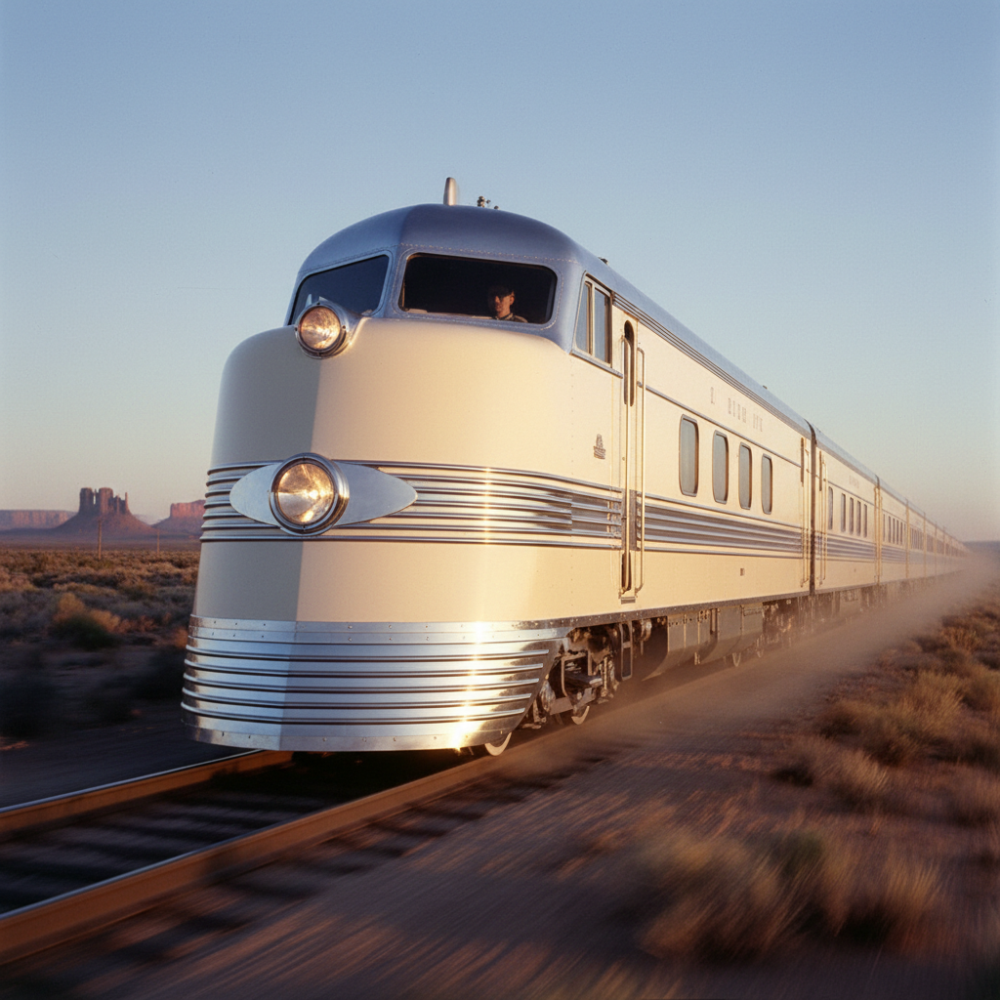

# Streamline Moderne 流线型现代



> **"速度的形状——即使静止的物体也应该看起来在飞。"**

## 概述

| 维度 | 描述 |
|------|------|
| 时期 | 1930s–1950s |
| 别名 | Streamline Moderne, Art Moderne, 流线型现代, 摩登流线 |
| 核心色彩 | 铬银、象牙白、海军蓝、深红、黑色 |
| 关键元素 | 圆角、水平线条、流线造型、铬装饰、速度感 |
| 代表人物 | Raymond Loewy, Norman Bel Geddes, Walter Dorwin Teague |
| 关联风格 | Art Deco, Googie, Mid-Century Modern, Industrial Design |

---

## 历史脉络

| 年份 | 事件 |
|------|------|
| 1930s | 大萧条时期——流线型设计代表"进步"和"希望" |
| 1934 | Chrysler Airflow——第一辆流线型量产汽车 |
| 1936 | Raymond Loewy的铅笔削尖器——"一切都可以流线型" |
| 1939 | 纽约世博会"明日世界"——流线型的巅峰展示 |
| 1940s | 流线型从交通工具扩展到家电、建筑、家具 |
| 1950s | 流线型逐渐让位于Googie和国际风格 |

### 核心哲学

流线型现代的精神是**"速度是美——即使冰箱也应该看起来能飞"**：
- Raymond Loewy："丑的东西卖不出去"(MAYA原则)
- Norman Bel Geddes："未来是流线型的"
- "空气动力学 = 美学 = 商业成功"
- "圆角 = 现代 = 进步 = 希望"
- "大萧条中——流线型是对未来的信仰"

---

## 视觉语法

### 色彩系统

```
主色：
  铬银 (#C0C0C0) — 金属、速度、现代
  象牙白 (#FFFFF0) — 纯净、流线
  海军蓝 (#000080) — 航海、速度
  深红 (#8B0000) — 力量、奢华

辅色：
  黑色 (#000000) — 对比、精致
  薄荷绿 (#98FB98) — 清新、30年代
  奶油黄 (#FFFDD0) — 温暖、家用

造型语言：
  圆角 — 一切尖角都被磨圆
  水平线 — 强调速度和运动
  泪滴形 — 空气动力学的完美形状
  铬条 — 装饰性速度线
  玻璃砖 — 透明+流线

规则：
  - 没有尖角——一切都是圆的
  - 水平线条 > 垂直线条
  - 铬金属是必须的装饰
  - 即使静止也要暗示运动
  - 简洁但不极简——仍有装饰
```

### 标志性元素

| 类别 | 元素 |
|------|------|
| 交通 | 流线型火车、轮船、飞机、汽车 |
| 建筑 | 圆角、水平窗带、玻璃砖、铬装饰 |
| 产品 | 流线型收音机、冰箱、吸尘器、铅笔削 |
| 材料 | 铬、搪瓷、电木、玻璃 |
| 线条 | 水平、流动、泪滴、圆弧 |
| 态度 | 乐观、进步、商业、大众 |

---

## 与千禧怀旧/当代的关系

### Apple设计的祖先
- 初代iMac的圆角 = 流线型精神的数字复兴
- Jony Ive的"圆角矩形" = 流线型现代的DNA
- "圆角 = 友好 = 现代" = 流线型建立的等式

### 对当代设计的影响
- 汽车设计中的"流线型" = 永恒的设计语言
- 复古家电(SMEG等) = 流线型现代的商业延续
- "Retro-Futurism" = 流线型 + 当代技术

---

## 设计应用

| 场景 | 应用方式 |
|------|----------|
| 产品 | 圆角+铬+流线+复古未来 |
| 建筑 | 圆角+水平线+玻璃砖 |
| 品牌 | 复古+进步+乐观+速度 |
| 交通 | 高铁+飞机+流线造型 |

---

## 相关风格

← [Art Deco 装饰艺术](art-deco.md) | [Googie 古吉风格](googie.md) →

↑ [返回千禧怀旧目录](README.md) | [返回总目录](../README.md)
