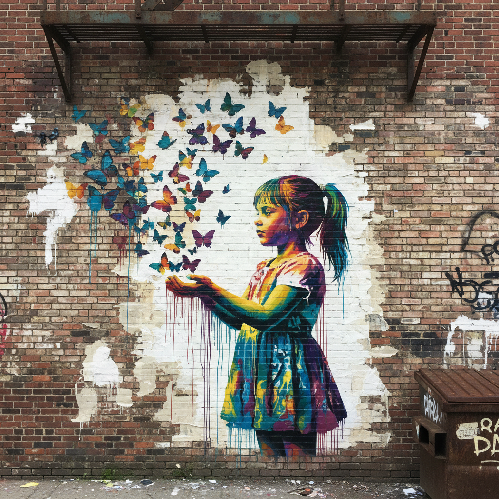

# Street Art 街头艺术

> "The people who run our cities don't understand graffiti because they think nothing has the right to exist unless it makes a profit." — Banksy

## 概述

街头艺术（Street Art）是1970年代从纽约涂鸦文化发展而来的公共艺术形式，包括喷漆涂鸦（graffiti）、模板喷绘（stencil）、小麦糊海报（wheatpaste）、马赛克、装置和壁画等多种形式。它将艺术从画廊和博物馆的精英空间带到城市街道——任何人都可以看到，不需要门票。

从纽约地铁的涂鸦到班克西的政治讽刺，从巴西的巨型壁画到柏林墙的自由表达，街头艺术是21世纪最具活力和民主性的艺术形式。

## 核心特征

| 特征 | 描述 |
|------|------|
| 公共空间 | 在城市公共空间中创作——墙壁、桥梁、火车 |
| 非法/灰色 | 常在未经许可的情况下创作 |
| 民主性 | 任何人都可以看到——不需要门票 |
| 政治性 | 常包含社会批判和政治信息 |
| 短暂性 | 可能被覆盖、清除或风化 |
| 匿名性 | 许多艺术家使用化名 |

## 视觉特征

- **媒介**：喷漆、模板、海报、马赛克、贴纸
- **色彩**：鲜艳的喷漆色彩——荧光色、金属色
- **字体**：独特的涂鸦字体（wildstyle、bubble、throw-up）
- **图像**：从抽象字母到写实肖像到政治讽刺
- **规模**：从小型贴纸到整栋建筑的巨型壁画
- **环境**：与城市环境互动——利用墙面裂缝、管道等

## 代表人物

| 艺术家 | 代表作 | 特点 |
|--------|--------|------|
| Banksy | *Girl with Balloon*, 政治讽刺 | 匿名的模板喷绘大师 |
| Jean-Michel Basquiat | 新表现主义涂鸦 | 从街头到画廊 |
| Keith Haring | 地铁粉笔画 | 简洁的线条人物 |
| Shepard Fairey | *OBEY*, Obama *Hope* 海报 | 模板和海报 |
| Os Gêmeos | 巴西巨型壁画 | 黄色人物的梦幻世界 |
| Invader | 马赛克像素艺术 | 城市中的像素入侵 |
| JR | 巨型摄影海报 | 将人脸贴满城市 |

## 与其他风格的关系

- **Pop Art** → 波普艺术的大众性和图像语言
- **Dada** → 达达的反体制态度
- **Expressionism** → 表现主义的情感直接性
- **Hip-Hop Culture** → 嘻哈文化的视觉组成部分
- **Pixel Art** → Invader 的马赛克连接了像素美学
- **Political Art** → 社会批判和政治表达的传统

## 概念图

---

*浮光艺志 | Chronicle of Artistry*
