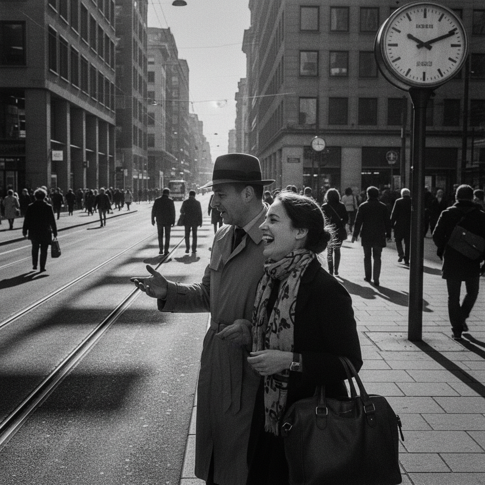

# Street Photography 街头摄影

> **时期：** 1890年代–至今  
> **关键词：** 决定性瞬间、城市观察、偶然美学、纪实诗意、人文关怀

## 概述

Street Photography（街头摄影）是在公共空间中捕捉未经安排的日常瞬间的摄影艺术。从亨利·卡蒂埃-布列松的"决定性瞬间"理论到当代街拍文化，街头摄影以敏锐的观察力、快速的反应和对偶然性的拥抱著称——在混乱的城市生活中发现秩序、幽默、诗意和人性。

## 风格特征

- **决定性瞬间**：精确捕捉转瞬即逝的完美构图
- **未经安排**：拒绝摆拍的真实记录
- **城市背景**：街道、人群、建筑的都市舞台
- **黑白传统**：经典的黑白影调和对比
- **人文视角**：对普通人日常生活的关注

## 代表人物与作品

- 亨利·卡蒂埃-布列松《决定性瞬间》
- 薇薇安·迈尔（被发现的街头大师）
- 加里·维诺格兰德（美国街头）
- 森山大道（日本街头摄影）

## 概念图

