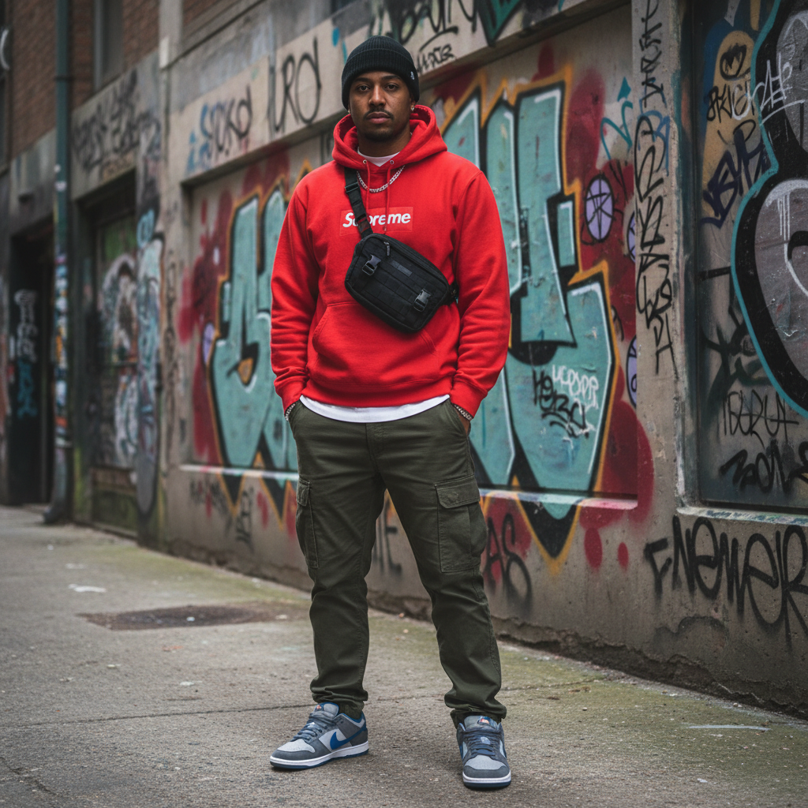

# Streetwear 街头服饰



> **"Supreme Box Logo、限量球鞋、排队文化——当街头变成了奢侈品。"**

## 概述

| 维度 | 描述 |
|------|------|
| 时期 | 1980s 起源 / 2015–至今 主流化 |
| 别名 | Streetwear, Hype Culture, Drop Culture |
| 核心色彩 | 黑色、白色、红色、迷彩、品牌色 |
| 关键元素 | Box Logo、限量球鞋、Oversized、联名 |
| 代表人物 | Supreme、Off-White、Virgil Abloh、藤原浩 |
| 关联风格 | Hip-Hop, Skatepunk, Gorpcore, Techwear |

---

## 历史脉络

### 从滑板店到巴黎时装周

| 年份 | 事件 |
|------|------|
| 1984 | Stüssy 创立——街头服饰雏形 |
| 1994 | Supreme 纽约开店 |
| 2002 | A Bathing Ape 全球扩张 |
| 2013 | Virgil Abloh 创立 Off-White |
| 2017 | Louis Vuitton × Supreme 联名 |
| 2018 | Virgil Abloh 成为 LV 男装总监 |
| 2020s | 街头服饰与高级时装完全融合 |

### 核心哲学

Streetwear 的精神是**"稀缺性创造价值——排队本身就是文化"**：
- 限量 = 价值（"如果人人都有，就不酷了"）
- 社区 > 品牌（"你懂的人才懂"）
- 街头 = 真实（"不是T台决定什么酷"）
- 联名 = 文化对话
- "我穿的不是衣服——是身份"

---

## 视觉语法

### 色彩系统

```
主色：
  黑色 (#000000) — 基础、酷
  白色 (#FFFFFF) — 对比、干净
  红色 (#FF0000) — Supreme、能量
  迷彩 — 军事遗产
  品牌色 — 取决于品牌

辅色：
  灰色 (#808080) — 运动灰
  橙色 (#FF8C00) — 警示、能量
  紫色 (#800080) — 稀有

规则：
  - Logo 是核心
  - 黑白为基础
  - 品牌色作为身份标识
  - 大胆图形
  - "少即是多"或"多即是多"——取决于品牌

质感：
  棉 — 卫衣、T恤
  尼龙 — 外套、包
  皮革 — 球鞋
  网眼 — 运动元素
```

### 标志性元素

| 类别 | 元素 |
|------|------|
| 上装 | Box Logo 卫衣、Oversized T恤、工装外套 |
| 下装 | 工装裤、直筒牛仔裤、运动裤 |
| 鞋 | Air Jordan、Yeezy、Dunk、New Balance |
| 配饰 | 棒球帽、腰包、链条 |
| 文化 | 排队、抽签、二级市场、联名 |
| 品牌 | Supreme、Off-White、Stüssy、Palace |

---

## 与千禧怀旧的关系

### 2015–2020 的"Hype"时代
- 千禧/Z世代的身份表达
- 球鞋文化 = 当代收藏
- "我排了3天队买这件卫衣"= 社交货币
- Virgil Abloh = 一代人的精神领袖

### 街头 × 奢侈的融合
- LV × Supreme (2017) = 分水岭
- 从"街头 vs 高级"到"街头 = 高级"
- Virgil 进入 LV = 街头文化的最终胜利
- 但也被批评为"失去了灵魂"

---

## 中国语境

- "潮牌"/"潮流"在中国的巨大市场
- 得物/POIZON = 中国球鞋文化平台
- 中国独立街头品牌的崛起
- 与"国潮"的交叉
- 《中国有嘻哈》推动街头文化主流化

---

## 设计应用

| 场景 | 应用方式 |
|------|----------|
| 品牌 | 大胆Logo+限量策略+社区+联名 |
| 零售 | Drop模式+排队+稀缺性+社交 |
| 数字 | 大字体+黑白+品牌色+动态 |
| 空间 | 工业风+品牌展示+限量陈列 |

---

## 相关风格

← [Hip-Hop 嘻哈美学](hip-hop-aesthetic.md) | [Gorpcore 户外核](gorpcore.md) →

↑ [返回千禧怀旧目录](README.md) | [返回总目录](../README.md)
