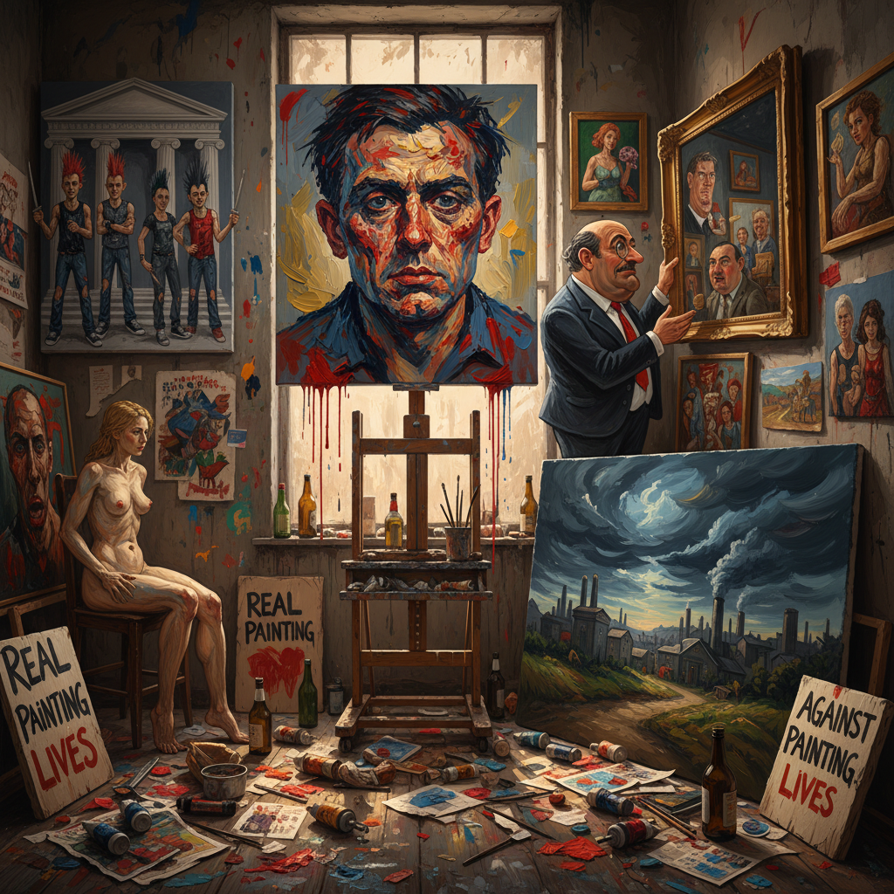

# Stuckism Art 卡住主义艺术

> "Stuckism declares that conceptual art has become the new academy — that a pickled shark is no more radical than a Victorian salon painting, that the Turner Prize has become a predictable machine for generating pseudo-controversy, that real artistic courage now lies not in shocking the bourgeoisie but in the unfashionable act of picking up a brush and painting from authentic emotion, that figurative painting is not dead but merely suppressed by an art establishment addicted to novelty, and that being stuck is better than being unstuck from all meaning, feeling, and craft." — Billy Childish & Charles Thomson

## 概述

卡住主义（Stuckism）是1999年由比利·柴尔迪什（Billy Childish）和查尔斯·汤姆森（Charles Thomson）在英国创立的一个国际艺术运动，作为对YBAs和概念艺术主导地位的直接反抗。"Stuckism"这个名字来自翠西·艾敏对前男友柴尔迪什的嘲讽——说他"stuck"（卡住了）在绘画上——但柴尔迪什和汤姆森将这个贬义词转化为运动的名称和旗帜。

卡住主义的核心主张是：具象绘画（figurative painting）是艺术的核心，概念艺术已经变成了新的学院派，真正的前卫不是追求新奇而是回归真诚的情感表达和手工技艺。卡住主义者每年在特纳奖颁奖期间举行抗议示威，批评当代艺术体制对绘画的边缘化。到2020年代，卡住主义已发展为一个拥有全球200多个分支的国际运动。

## 核心特征

| 特征 | 描述 |
|------|------|
| 绘画 | 具象绘画的捍卫 |
| 真诚 | 真诚的情感表达 |
| 反概念 | 反对概念艺术 |
| 手工 | 手工技艺的价值 |
| 抗议 | 对艺术体制的抗议 |
| 宣言 | 宣言和运动 |

## 视觉特征

- **具象**：具象和人物绘画
- **表现**：表现主义的笔触
- **情感**：强烈的情感表达
- **色彩**：大胆的色彩运用
- **粗糙**：故意的粗糙和直接
- **肖像**：肖像和自画像

## 代表作品

| 作品 | 艺术家 | 年代 | 意义 |
|------|--------|------|------|
| *Stuckist paintings* | Billy Childish | 1999起 | 柴尔迪什的绘画 |
| *Sir Nicholas Serota Makes an Acquisition Decision* | Charles Thomson | 2000 | 讽刺泰特馆长 |
| *The Stuckists Punk Victorian* | Group show | 2004 | 沃克美术馆展览 |
| *Anti-Turner Prize demos* | Stuckists | 1999起 | 特纳奖抗议 |
| *International Stuckism* | Various | 2000年代 | 全球分支的作品 |

## 历史时间线

| 时期 | 事件 |
|------|------|
| 1999 | 卡住主义宣言发布 |
| 1999 | 首次特纳奖抗议 |
| 2004 | 沃克美术馆展览 |
| 2006 | 全球100+分支 |
| 当代 | 持续的国际运动 |

## 中国语境

卡住主义在中国的直接影响有限，但其核心关切——绘画在当代艺术中的地位——在中国艺术界有广泛的共鸣。中国有深厚的绘画传统（水墨画、油画），许多中国艺术家和批评家也对概念艺术的过度主导表示担忧。中国的一些"新绘画"运动和回归具象的趋势与卡住主义有类似的精神——主张绘画的不可替代性和手工技艺的价值。中国的美术学院体系仍然以绘画训练为核心，这在某种程度上保持了绘画传统的延续性。中国也有自己的"反当代艺术"声音，质疑西方当代艺术体制的价值标准。

## AI生成概念图

## 与其他风格的关系

- **Expressionism** → 表现主义
- **Figurative Painting** → 具象绘画
- **Neo-Expressionism** → 新表现主义
- **Outsider Art** → 局外人艺术
- **Punk Art** → 朋克艺术
- **Anti-Art** → 反艺术

---

*浮光艺志 | Chronicle of Artistry*
