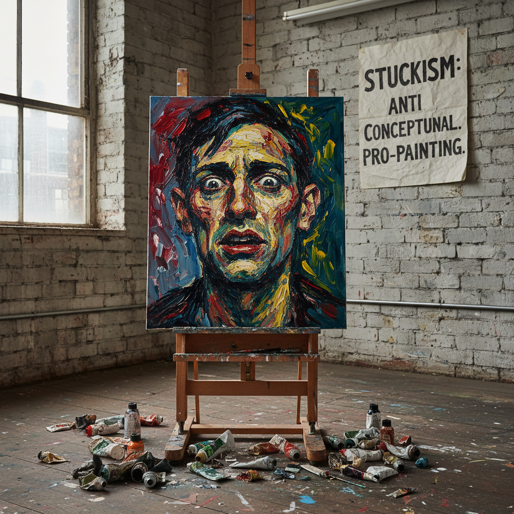

# Stuckism 卡住主义

> "Artists who don't paint aren't artists." — Billy Childish & Charles Thomson

## 概述

卡住主义（Stuckism）是1999年由比利·柴尔迪什（Billy Childish）和查尔斯·汤姆森（Charles Thomson）在英国创立的国际艺术运动，主张回归具象绘画，反对概念艺术和YBA（英国青年艺术家）所代表的"反艺术"倾向。

Stuckism的名字来自翠西·艾敏（Tracey Emin）对柴尔迪什的嘲讽——"你的艺术卡住了（stuck）"。Stuckists将这个贬义词转化为旗帜，宣称真正"卡住"的是那些依赖噱头而不会画画的概念艺术家。

## 核心特征

| 特征 | 描述 |
|------|------|
| 具象绘画 | 坚持绘画是艺术的核心 |
| 反概念 | 反对概念艺术的去物质化 |
| 真诚表达 | 追求情感的真诚而非讽刺 |
| 反体制 | 反对Turner Prize和Tate的权力 |
| 宣言驱动 | 大量宣言和公开抗议 |
| 国际网络 | 全球200+个Stuckist团体 |

## 视觉特征

- **媒介**：油画、丙烯——传统绘画媒介
- **风格**：具象的、表现主义的、有时粗糙的
- **主题**：人物、肖像、日常场景、情感状态
- **笔触**：可见的、有力的、不追求完美
- **色彩**：强烈的、情感化的
- **态度**：真诚的、直接的、不装腔作势

## 代表作品

| 作品 | 艺术家 | 年代 | 意义 |
|------|--------|------|------|
| *Sir Nicholas Serota Makes an Acquisition Decision* | Stuckists | 2000 | 讽刺Tate馆长的集体创作 |
| *Painting* | Billy Childish | 1990s-2000s | 粗犷的表现主义自画像 |
| *The Stuckists Punk Victorian* | Group show | 2004 | Walker Art Gallery展览 |
| *Dead Dad* | Charles Thomson | 2003 | 对Hirst的回应——用绘画而非标本 |
| *Clown series* | Ella Guru | 2000s | 小丑作为艺术家的隐喻 |

## 历史时间线

| 时期 | 事件 |
|------|------|
| 1999 | Stuckism宣言发表——运动正式成立 |
| 1999-2003 | 每年在Turner Prize颁奖时举行抗议 |
| 2000 | "The Real Turner Prize Show"——对抗展览 |
| 2004 | Walker Art Gallery展出Stuckist作品——首次进入公共美术馆 |
| 2005 | 全球Stuckist团体超过100个 |
| 2006 | Billy Childish退出运动 |
| 2007 | "Go West"——Stuckism进入美国 |
| 2010s | 运动活力减弱但继续存在 |
| 2019 | 20周年——回顾与反思 |

## 子类型

| 子类型 | 特征 |
|--------|------|
| 英国Stuckism | Thomson、Childish——原始核心 |
| 国际Stuckism | 全球各地的分支团体 |
| Remodernism | Stuckism的理论延伸——重新现代主义 |
| 摄影Stuckism | 反数字操纵的直接摄影 |
| 文学Stuckism | 反后现代的文学写作 |

## 中国语境

Stuckism在中国没有直接的分支，但其精神在中国当代艺术中有回响。中国的"新具象"画家、坚持架上绘画的艺术家群体、以及对当代艺术"去技术化"趋势的批评，都与Stuckism的立场相似。中国美术学院体系对绘画基本功的强调，在某种程度上天然地与Stuckism的价值观一致。

## 争议与遗产

- **争议**：Stuckism是严肃的艺术运动还是只是一场公关活动？
- **保守主义**：回归绘画是进步还是倒退？
- **内部分裂**：Childish的退出暴露了运动的内部矛盾
- **遗产**：为"绘画已死"的叙事提供了有力的反驳
- **当代回响**：当代具象绘画的复兴、反概念艺术的情绪

## AI生成概念图

## 与其他风格的关系

- **YBA** → Stuckism是对YBA的直接反叛
- **Expressionism** → 表现主义是Stuckism的美学先驱
- **Figurative Art** → 具象艺术传统是Stuckism的根基
- **Conceptual Art** → Stuckism的主要对立面
- **Neo-Expressionism** → 新表现主义与Stuckism共享回归绘画的冲动
- **Metamodernism** → 元现代主义的真诚转向与Stuckism相通

---

*浮光艺志 | Chronicle of Artistry*
