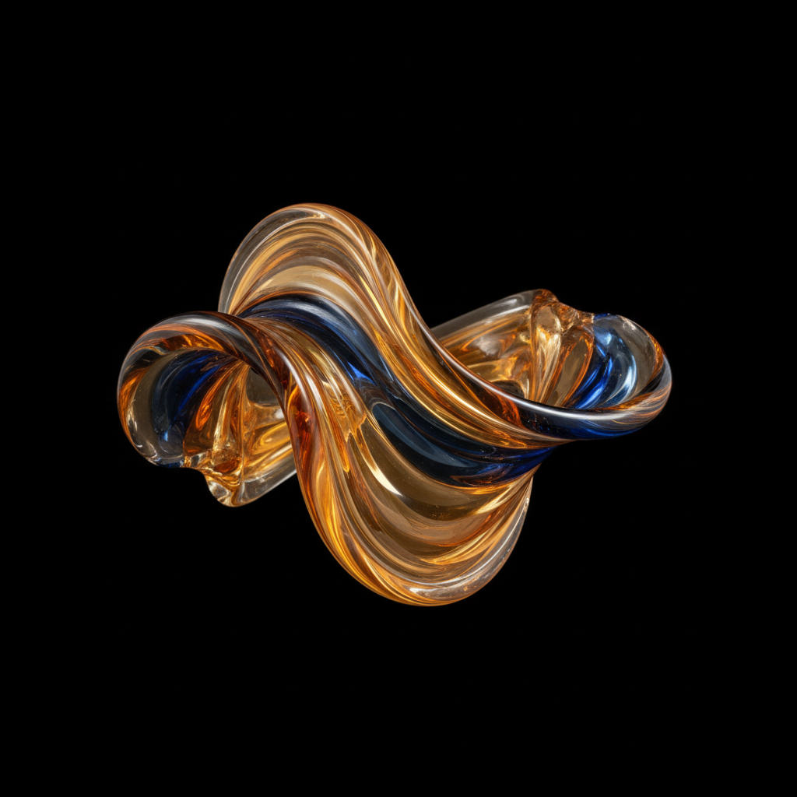

# Studio Glass 工作室玻璃运动

> **时期：** 1962–至今  
> **关键词：** 玻璃吹制、个人表达、工艺与艺术、光与色、熔融雕塑

## 概述

工作室玻璃运动始于1962年Harvey Littleton和Dominick Labino在托莱多艺术博物馆的实验工作坊——他们证明了玻璃吹制可以在个人工作室中完成，而不必依赖工厂。这场运动将玻璃从工业产品转变为个人艺术表达的媒介，艺术家们探索光线穿透、色彩融合和形态流动的无限可能。

## 风格特征

- **光的媒介**：利用玻璃的透明和折射特性
- **色彩融合**：多层色彩在熔融状态下的交融
- **有机形态**：流动的、自然生长般的造型
- **大尺度**：从器物走向纪念碑式雕塑
- **技术创新**：不断开发新的玻璃处理工艺

## 代表人物与作品

- Dale Chihuly 大型玻璃装置
- Harvey Littleton 工作室玻璃先驱
- Lino Tagliapietra 威尼斯传统与当代融合
- Toots Zynsky 玻璃纤维编织

## 概念图

