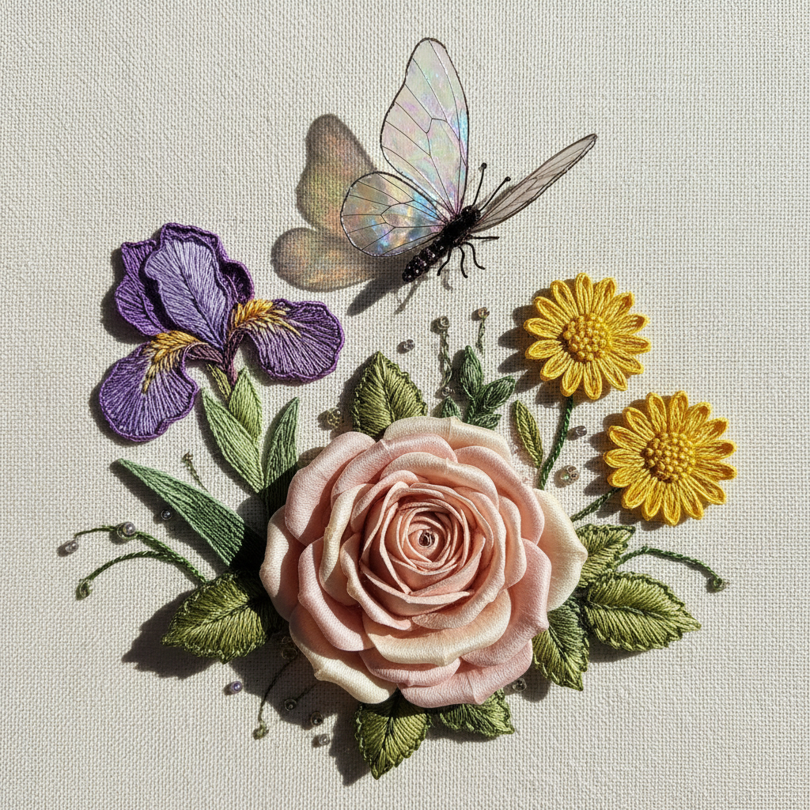

# Stumpwork Art 立体绣艺术

> "Stumpwork is embroidery that refuses to stay flat — figures, flowers, insects, and animals are built up from the fabric surface using wire frames, padding, and detached stitches to create three-dimensional sculptures in thread. A stumpwork butterfly lifts its wings from the fabric; a rose opens its petals into real space. It is miniature textile sculpture, combining the skills of embroiderer, sculptor, and jeweler." — Unknown

## 概述

立体绣艺术（Stumpwork Art）是一种创造三维立体效果的刺绣技法——使用金属丝框架、填充物和分离式针法将刺绣元素从织物表面抬起，形成真正的三维雕塑效果。立体绣起源于17世纪的英国，最初用于装饰珠宝盒和镜框，以其精致的微型雕塑效果著称。

立体绣艺术的实践包括：1）金属丝框架——用细金属丝制作形状框架；2）填充——使用毛毡或棉花填充立体形状；3）分离式针法——在框架上绣制不与底布连接的部分；4）包缠——对金属丝进行丝线包缠；5）珠饰——添加珠子和亮片装饰；6）组合——将各部分组装成完整的立体场景；7）当代立体绣——将传统技法与现代设计结合的创作。

## 核心特征

| 特征 | 描述 |
|------|------|
| 立体 | 真正的三维效果 |
| 微型 | 微型雕塑的精致 |
| 复合 | 多种技法的组合 |
| 叙事 | 常包含叙事场景 |
| 精密 | 极其精密的制作 |
| 英式 | 英国刺绣传统 |

## 视觉特征

- **立体**：从平面抬起的三维效果
- **精致**：微型雕塑般的精致
- **丰富**：多层次的视觉丰富性
- **生动**：栩栩如生的动植物
- **光影**：立体形态的光影效果
- **华丽**：珠饰和金线的华丽感

## 代表作品

| 作品 | 艺术家/文化 | 年代 | 意义 |
|------|-------------|------|------|
| *17th century caskets* | 英国 | 17世纪 | 珠宝盒装饰 |
| *Stuart period mirrors* | 英国 | 17世纪 | 斯图亚特镜框 |
| *Biblical scenes* | 英国 | 17世纪 | 圣经场景 |
| *Jane Nicholas works* | 澳大利亚 | 当代 | 当代立体绣大师 |
| *Contemporary stumpwork* | 当代 | 当代 | 当代立体绣 |

## 历史时间线

| 时期 | 事件 |
|------|------|
| 17世纪 | 立体绣在英国的兴起 |
| 17世纪中期 | 立体绣的黄金时代 |
| 18-19世纪 | 立体绣的衰落 |
| 20世纪末 | 立体绣的复兴 |
| 当代 | 立体绣的全球传播和创新 |

## 中国语境

立体绣艺术在中国有独特的发展。中国传统刺绣中的"凸绣"和"堆绣"与立体绣有相似之处——都追求从平面到立体的效果。中国藏族的"堆绣"是一种独特的立体刺绣形式——使用布料堆叠和填充创造浮雕效果。中国的一些当代刺绣艺术家开始探索西方立体绣技法——将其与中国传统刺绣结合创造新的表达。中国的刺绣教育中，立体绣作为一种高级技法正在获得关注——因为其对技术和创意的双重要求。中国的手工艺市场中，立体绣作品因其独特的视觉效果而受到收藏者的青睐——特别是花卉和昆虫主题的作品。

## AI生成概念图

## 与其他风格的关系

- **Crewelwork** → 毛线绣
- **Goldwork** → 金线绣
- **Ribbon Embroidery** → 丝带绣
- **Textile Sculpture** → 纺织雕塑
- **Miniature Art** → 微型艺术
- **Mixed Media** → 混合媒介

---

*浮光艺志 | Chronicle of Artistry*
