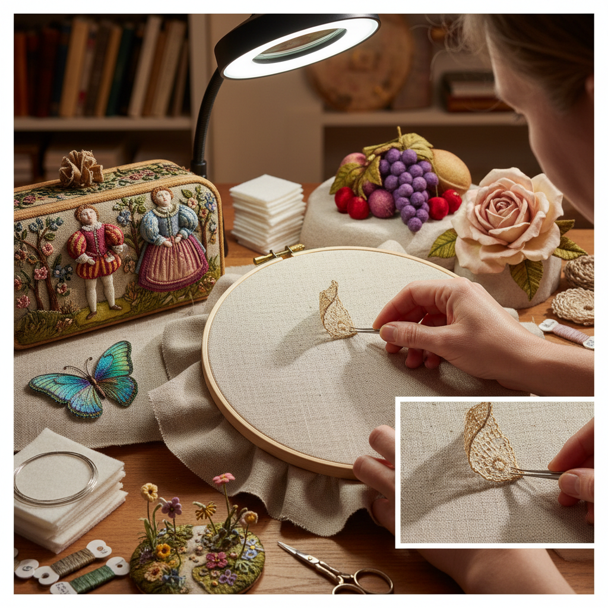

# Stumpwork 立体刺绣

> "Stumpwork is embroidery that refuses to lie flat — figures padded and wired to stand free from the fabric, flowers with petals that lift and curl, insects with detached wings that cast real shadows, creating miniature three-dimensional worlds on a two-dimensional ground, where needlework becomes sculpture." — Unknown

## 概述

立体刺绣（Stumpwork），也称为浮雕刺绣（Raised Embroidery）或独立元素刺绣（Detached Embroidery），是一种创造三维立体效果的刺绣技法。Stumpwork的核心特征是：刺绣元素不完全贴附在基底织物上——花瓣、翅膀、人物等可以部分或完全脱离背景，形成真正的三维效果。

Stumpwork通过多种技法实现立体效果：填充（padding with felt or cotton）使元素凸起、金属丝骨架（wire framework）使元素可以独立站立、分离式针法（detached stitches worked over wire）创造可以弯曲的花瓣和翅膀。Stumpwork在17世纪的英国达到鼎盛——用于装饰镜框、首饰盒和壁挂，通常描绘圣经故事、花园场景和人物。当代Stumpwork在艺术刺绣中有活跃的复兴。

## 核心特征

| 特征 | 描述 |
|------|------|
| 立体 | 三维立体效果 |
| 填充 | 填充使元素凸起 |
| 金属丝 | 金属丝骨架支撑 |
| 分离 | 元素脱离背景 |
| 微型 | 微型雕塑般的精细 |
| 叙事 | 叙事性的场景 |

## 视觉特征

- **立体**：真正的三维立体
- **阴影**：元素投射真实阴影
- **精细**：微型雕塑般的精细
- **生动**：栩栩如生的效果
- **层次**：多层次的空间感
- **华丽**：华丽的装饰效果

## 代表作品

| 作品 | 艺术家 | 年代 | 意义 |
|------|--------|------|------|
| *Stuart period caskets* | 英国少女 | 17世纪 | 斯图亚特时期首饰盒 |
| *Mirror frames* | 英国工匠 | 17世纪 | 立体刺绣镜框 |
| *Biblical scenes* | Various | 17世纪 | 圣经场景立体刺绣 |
| *Contemporary stumpwork* | Various | 当代 | 当代立体刺绣 |
| *Botanical stumpwork* | Various | 当代 | 植物立体刺绣 |

## 历史时间线

| 时期 | 事件 |
|------|------|
| 16世纪末 | 立体刺绣在英国的出现 |
| 17世纪 | 立体刺绣的鼎盛时期 |
| 18-19世纪 | 立体刺绣的衰落 |
| 20世纪后期 | 立体刺绣的复兴 |
| 当代 | 立体刺绣的艺术化发展 |

## 中国语境

立体刺绣在中国有相关的传统——中国的"双面绣"和"立体绣"追求类似的三维效果。苏绣中的"双面异色绣"和一些立体花卉绣法与Stumpwork有相似的追求。当代中国的刺绣艺术家开始学习和融合西方Stumpwork技法。中国的一些高端刺绣工作室将立体刺绣应用于艺术创作和高端定制。中国的刺绣教育中开始引入Stumpwork课程。

## AI生成概念图

## 与其他风格的关系

- **Embroidery** → 刺绣
- **Goldwork** → 金线刺绣
- **Crewel** → 毛线刺绣
- **Miniature Art** → 微型艺术
- **Sculpture** → 雕塑
- **Textile Art** → 纺织艺术

---

*浮光艺志 | Chronicle of Artistry*
