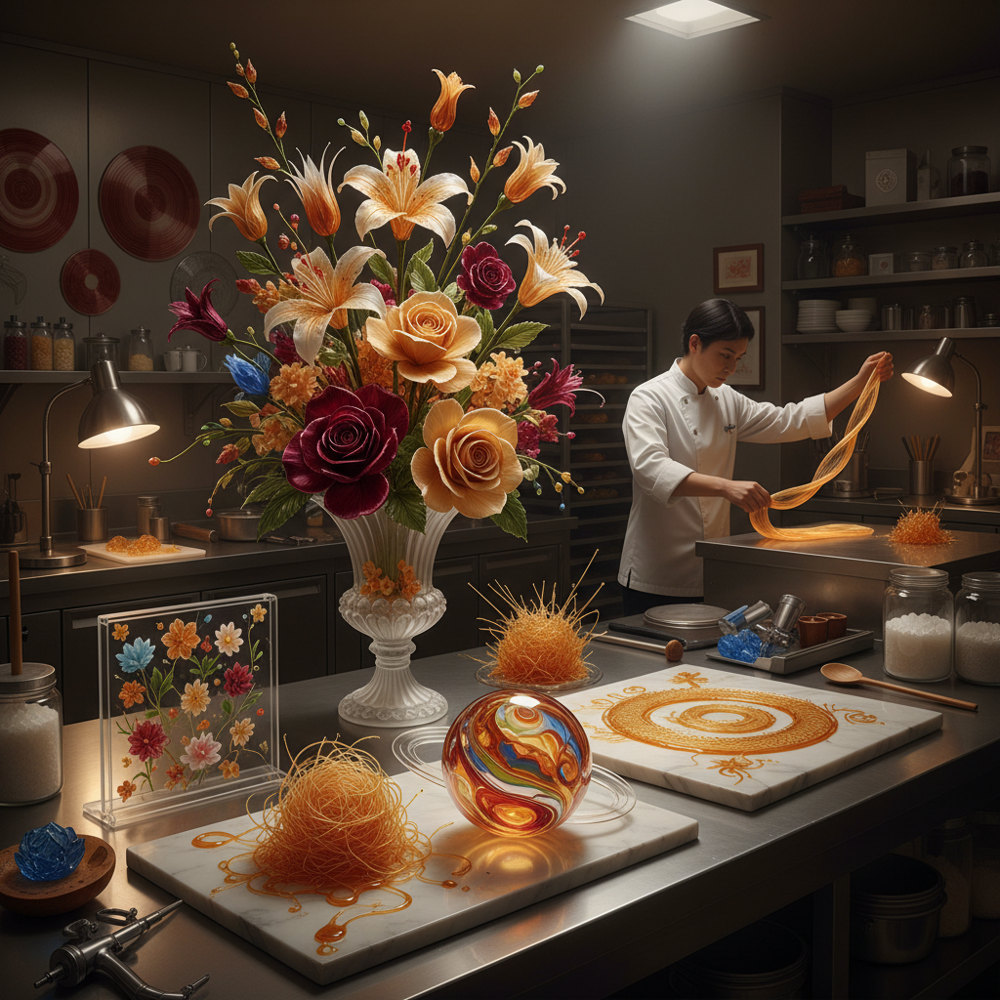

# Sugar Art 糖艺术

> "Sugar is alchemy made edible — it transforms from crystal to liquid to glass to thread to foam, each state offering different artistic possibilities. Pulled sugar catches light like blown glass, spun sugar floats like spider silk, cast sugar stands like architecture, and blown sugar inflates like a balloon into impossible shapes. It is the most versatile and the most fragile of culinary art materials." — Unknown

## 概述

糖艺术（Sugar Art）是以糖为主要材料进行艺术创作的实践——利用糖在不同温度下的物理状态变化（结晶、液态、玻璃态、拉丝态）创造精美的可食用艺术品。糖艺术是西点和烹饪艺术中技术要求最高的领域之一。

糖艺术的实践包括：1）拉糖——将热糖拉伸成花朵、丝带等形态；2）吹糖——像吹玻璃一样将热糖吹成空心造型；3）浇糖——将糖浆浇注成透明的装饰片；4）糖雕——用糖块雕刻造型；5）翻糖——用翻糖（fondant）覆盖和装饰蛋糕；6）糖画——用融化的糖浆绘画（中国传统）；7）棉花糖艺术——用棉花糖创造造型；8）等压糖——用等压技法制作糖花。

## 核心特征

| 特征 | 描述 |
|------|------|
| 透明 | 玻璃般的透明感 |
| 温敏 | 对温度和湿度极敏感 |
| 多态 | 多种物理状态 |
| 光泽 | 宝石般的光泽 |
| 脆弱 | 极其脆弱 |
| 可食 | 可食用的艺术 |

## 视觉特征

- **透明**：浇糖的玻璃般透明
- **光泽**：拉糖的丝绸光泽
- **色彩**：可调配任何颜色
- **轻盈**：吹糖的轻盈感
- **流动**：糖丝的流动线条
- **精细**：极精细的花瓣和细节

## 代表作品

| 作品 | 艺术家 | 年代 | 意义 |
|------|--------|------|------|
| *Pulled sugar flowers* | Various | 当代 | 拉糖花 |
| *Blown sugar sculptures* | Various | 当代 | 吹糖雕塑 |
| *Sugar showpieces* | Various | 当代 | 糖艺展示品 |
| *Chinese sugar painting* | 中国传统 | 古代至今 | 中国糖画 |
| *Cake decorating* | Various | 当代 | 翻糖蛋糕装饰 |

## 历史时间线

| 时期 | 事件 |
|------|------|
| 古代 | 糖的发现和早期使用 |
| 中世纪 | 欧洲糖雕的出现 |
| 17-18世纪 | 宫廷糖艺的黄金时代 |
| 20世纪 | 现代糖艺技法的发展 |
| 当代 | 糖艺比赛和专业化 |

## 中国语境

糖艺术在中国有独特而悠久的传统。中国的"糖画"是一种独特的民间艺术——艺人用小铜勺舀起融化的糖浆，在石板上快速浇注出龙、凤、花鸟等图案，凝固后用竹签挑起。糖画是中国非物质文化遗产，至今仍活跃在庙会和街头。中国的"糖人"——用吹糖技法制作的小型糖塑——也是著名的民间艺术。中国传统的"翻糖"（糖塑）在节庆时用于制作寿桃、动物等造型。中国当代的糖艺师在国际糖艺比赛中表现出色，将中国传统元素（如京剧脸谱、中国龙、传统建筑）融入现代糖艺创作。

## AI生成概念图

## 与其他风格的关系

- **Chocolate Art** → 巧克力艺术
- **Glass Art** → 玻璃艺术
- **Culinary Art** → 烹饪艺术
- **Ephemeral Art** → 短暂艺术
- **Food Art** → 食物艺术
- **Performance Art** → 表演艺术

---

*浮光艺志 | Chronicle of Artistry*
