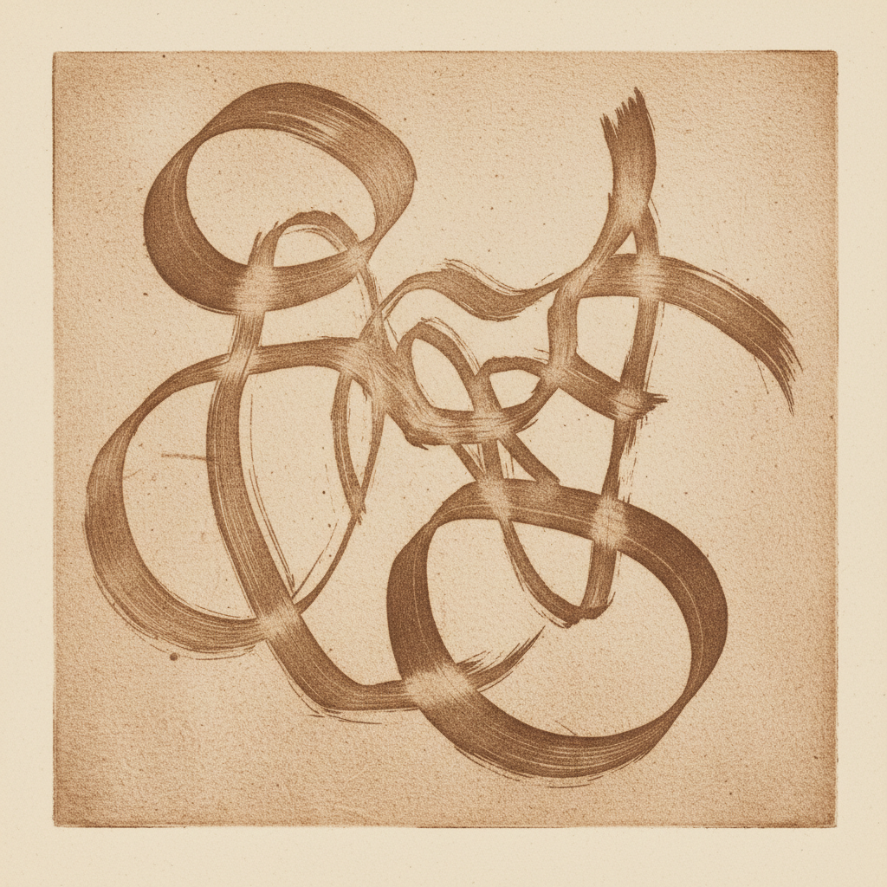

# Sugar Lift Art 糖水腐蚀版画艺术

> "Sugar lift is drawing directly on metal — the artist paints a design in sugar solution onto a copper plate, then covers everything with a thin ground. When the plate is soaked in warm water, the sugar swells and lifts the ground away from the drawn areas, exposing bare metal for etching. The result preserves the spontaneous gesture of the brush in the permanent language of etched line." — Unknown

## 概述

糖水腐蚀版画艺术（Sugar Lift Art）是一种凹版印刷技法——允许艺术家直接在金属版上用糖水溶液绘画，然后通过一系列化学步骤将绘画的笔触转化为蚀刻图案。糖水腐蚀保留了画笔的自发性和流动性，使凹版印刷能够再现绘画般的笔触效果。

糖水腐蚀版画艺术的实践包括：1）糖水绘画——用糖水墨水在铜版上直接绘画；2）涂布防腐层——在整个版面涂布薄防腐层；3）糖水膨胀——在温水中使糖水膨胀脱落；4）蚀刻——在暴露的金属区域进行蚀刻；5）水粉效果——结合水粉蚀刻创造色调；6）印刷——在凹版印刷机上印刷；7）当代糖水腐蚀——将传统技法与现代创作结合。

## 核心特征

| 特征 | 描述 |
|------|------|
| 直接 | 直接在版上绘画 |
| 笔触 | 保留画笔笔触 |
| 糖水 | 使用糖水溶液 |
| 自发 | 自发性的创作 |
| 凹版 | 凹版印刷方式 |
| 绘画 | 绘画般的效果 |

## 视觉特征

- **笔触**：保留的画笔笔触
- **流动**：流动的线条质感
- **自发**：自发性的创作痕迹
- **色调**：丰富的色调变化
- **绘画**：绘画般的视觉效果
- **质感**：蚀刻的金属质感

## 代表作品

| 作品 | 艺术家/文化 | 年代 | 意义 |
|------|-------------|------|------|
| *Pablo Picasso sugar lifts* | 西班牙/法国 | 1930-60年代 | 毕加索的糖水腐蚀 |
| *Joan Miró etchings* | 西班牙 | 1940-70年代 | 米罗的蚀刻版画 |
| *Henry Moore prints* | 英国 | 1960-80年代 | 摩尔的版画 |
| *Contemporary sugar lift* | 国际 | 当代 | 当代糖水腐蚀 |
| *Experimental sugar lift* | 国际 | 当代 | 实验性糖水腐蚀 |

## 历史时间线

| 时期 | 事件 |
|------|------|
| 18世纪 | 糖水腐蚀技法的早期发展 |
| 19世纪 | 技法的改进和传播 |
| 20世纪 | 现代艺术家的广泛使用 |
| 1940-60年代 | 毕加索和米罗的经典作品 |
| 当代 | 糖水腐蚀的持续实践 |

## 中国语境

糖水腐蚀在中国的版画教育和创作中有一定的应用。中国的版画教育中，糖水腐蚀作为凹版技法的重要组成部分——在各大美术院校教授。中国当代的版画艺术家对糖水腐蚀的绘画性有所关注——将其用于表现中国水墨画般的笔触效果。中国的版画创作中，糖水腐蚀因其能保留画笔的自发性——特别适合表现中国书画的笔墨韵味。中国的版画工作坊中，糖水腐蚀——作为进阶凹版技法在专业课程中教授。中国的版画展览中，使用糖水腐蚀技法的作品——因其绘画性和表现力而受到关注。

## AI生成概念图

## 与其他风格的关系

- **Aquatint** → 水粉蚀刻
- **Etching** → 蚀刻版画
- **Intaglio** → 凹版印刷
- **Painting** → 绘画
- **Printmaking** → 版画
- **Gestural Art** → 姿态艺术

---

*浮光艺志 | Chronicle of Artistry*
