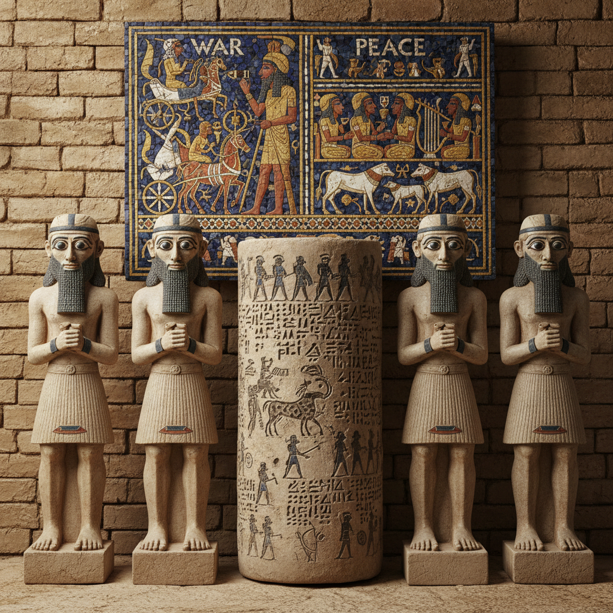

# 苏美尔艺术 · Sumerian Art

> "我们在泥板上刻下文明的第一行文字，在神庙上筑起通天的阶梯。" —— 苏美尔史诗

## 概述

苏美尔艺术（Sumerian Art）是人类最早的城市文明——苏美尔（约前4500年–前1900年）在美索不达米亚南部（今伊拉克南部）发展出的视觉艺术体系。作为文字、城市和国家的发源地，苏美尔人创造了最早的纪念性建筑（塔庙/ziggurat）、最早的叙事性浮雕、最早的圆筒印章和最早的青铜铸造传统。苏美尔艺术奠定了整个古代近东艺术的基础，其影响延续至巴比伦、亚述和波斯帝国。

## 核心特征

| 特征 | 描述 |
|------|------|
| 时期 | 约前4500年–前1900年 |
| 地域 | 美索不达米亚南部（今伊拉克南部） |
| 媒介 | 泥砖建筑、石灰岩/雪花石膏雕塑、圆筒印章、金银工艺 |
| 核心理念 | 以视觉艺术服务神庙崇拜与王权合法性 |
| 色彩 | 青金石蓝、金色、白色（贝壳）、红色（玛瑙） |

## 视觉特征

- **大眼祈祷者**：雕像以巨大的眼睛表达对神的虔诚凝视
- **圆筒印章**：微型浮雕叙事，滚动印出连续图案
- **分层叙事**：浮雕以水平带状分层讲述故事
- **镶嵌工艺**：贝壳、青金石、红玛瑙的精密镶嵌
- **塔庙建筑**：层层退台的阶梯式神庙（ziggurat）

## 代表作品

| 作品 | 出土地 | 年代 | 类型 |
|------|--------|------|------|
| 乌尔军旗 | 乌尔 | 约前2600 | 镶嵌板 |
| 乌尔王陵金头盔 | 乌尔 | 约前2500 | 金工 |
| 古地亚坐像 | 拉格什 | 约前2120 | 闪长岩雕塑 |
| 乌尔塔庙 | 乌尔 | 约前2100 | 建筑 |
| 瓦尔卡花瓶 | 乌鲁克 | 约前3200 | 雪花石膏浮雕 |

## 发展时间线

| 时期 | 事件 |
|------|------|
| 前4500-3100 | 乌鲁克时期，最早的城市和文字出现 |
| 前3100-2900 | 杰姆代特·纳斯尔时期，圆筒印章发展 |
| 前2900-2350 | 早王朝时期，乌尔王陵的辉煌 |
| 前2350-2150 | 阿卡德帝国，苏美尔艺术与闪族传统融合 |
| 前2112-2004 | 乌尔第三王朝，苏美尔文艺复兴 |
| 前2004-1900 | 苏美尔城邦衰落，文化遗产被巴比伦继承 |

## 中国语境

苏美尔艺术与中国新石器时代晚期至夏商时期大致同期。两者都独立发展出了早期城市文明和文字系统（楔形文字与甲骨文）；都以青铜器作为权力和宗教的核心媒介；都发展出了层级化的纪念性建筑（塔庙与宫殿台基）。苏美尔圆筒印章的微型叙事与中国商代玉器上的微雕纹饰在工艺精密度上可以比较。当代中国考古学界对两河流域文明的研究日益深入。

## AI 概念图

*AI 生成概念图：苏美尔艺术风格*

## 关联词条

- [[egyptian-art]] - 古埃及艺术
- [[greek-art]] - 古希腊艺术
- [[persian-miniature-art]] - 波斯细密画

---

*浮光艺志 · Chronicle of Artistry*
