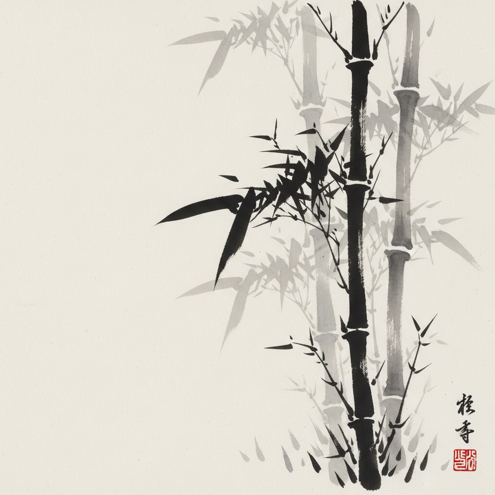

# Sumi-e 墨绘

> "In ink painting, the spirit of the brush is everything." — Sesshū Tōyō

## 概述

墨绘（Sumi-e，すみえ）是日本对中国水墨画的继承和发展，使用墨（sumi）和水在和纸上创作。与中国水墨画共享"墨分五色"的哲学，但发展出了独特的日本审美——更强调"侘寂"（wabi-sabi）的不完美之美和禅宗的即兴性。

墨绘追求的是"一笔入魂"——每一笔都不可修改，画家必须在落笔前已经在心中完成了整幅画。

## 核心特征

| 特征 | 描述 |
|------|------|
| 纯墨表现 | 仅用墨的浓淡干湿表现一切 |
| 一笔不改 | 禅宗式的即兴——不可修正 |
| 余白 | 留白即空间、即气、即无 |
| 气韵生动 | 追求生命力的流动感 |
| 简约 | 最少的笔触表达最多的意境 |
| 禅意 | 绘画即修行——心手合一 |

## 视觉特征

- **色彩**：纯黑白——墨的五种浓度
- **笔触**：从极细到极粗的变化
- **留白**：大面积的空白空间
- **主题**：竹、梅、兰、菊、山水、禅僧
- **质感**：墨在和纸上的渗透效果
- **构图**：不对称的、留有呼吸空间的

## 代表作品

| 作品 | 年代 | 意义 |
|------|------|------|
| *秋冬山水図* (雪舟) | 1495 | 日本水墨画的巅峰 |
| *松林図屏風* (長谷川等伯) | 1590s | 墨的极致——雾中松林 |
| *瓢鮎図* (如拙) | 1415 | 禅画的经典 |
| *六柿図* (牧谿) | 13世纪 | 极简的六个柿子 |
| *仙厓の○△□* (仙厓) | 19世纪 | 禅的幽默 |

## 真实作品（公共领域）

| 作品 | 来源 |
|------|------|
| *秋冬山水図* | [東京国立博物館](https://www.tnm.jp/) |
| *松林図屏風* | [東京国立博物館](https://www.tnm.jp/) |
| *六柿図* | [大徳寺龍光院](https://www.daitokuji.or.jp/) |

## AI生成概念图

## 与其他风格的关系

- **Chinese Ink Painting** → 源自中国水墨画传统
- **Zen Art** → 禅宗美学的视觉表达
- **Minimalism** → 东方极简影响了西方极简主义
- **Abstract Expressionism** → 抽象表现主义受墨绘启发
